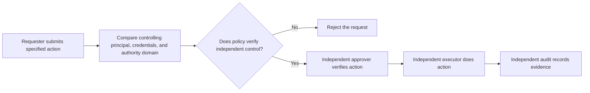

# P052 — Separation of Duties

## Definition

Separation of Duties assigns parts of a high-impact process to independent roles, actors,
conditions, or components. A compromised or mistaken actor cannot complete the process without an
independent condition. Independence must apply to identity, authority, and control path.

**Aliases:** segregation of duties, dual control, two-person rule.

## Provenance

**Classification:** established principle.

The principle has a long organizational history. Computer security models, for example Clark-Wilson,
include the principle in a formal model. No one paper is the source of the organizational practice.

## Decision rule

If one actor makes an error or is compromised, find the possible impact. When the impact is more
than policy limits, use a second independent condition or role. Select the number and type of
divisions from the risk. Do not use the same process for all actions.

## How to apply

- Find actions with confidentiality, integrity, safety, or availability risks for which a division
  of duties is necessary.
- If role independence decreases risk, divide request, approval, execution, custody, and audit
  roles.
- Bind approvals to the specified operation, target, parameters, and applicable revision.
- Make sure that inherited privilege does not give one identity control of all roles without
  detection.
- Keep an auditable record of the condition that each independent actor satisfied.
- Give rules for controlled emergency access and a subsequent review. Do not use informal bypass
  paths.

## Diagram



## Language examples

Before release, the two examples use policy to verify different controlling principals, credential
sets, and authority domains.

### Python

```python
def release(change, approver):
    authority_policy.require_independent_control(
        change.authority, approver.authority
    )
    approver.verify(change.digest, change.target)
    deploy(change.artifact, change.target)
```

### Rust

```rust
fn release(change: &Change, approver: &Approver) -> Result<(), Error> {
    authority_policy::require_independent_control(
        &change.authority, &approver.authority,
    )?;
    approver.verify(change.digest, &change.target)?;
    deploy(&change.artifact, &change.target)
}
```

## Boundaries and tensions

Separation of Duties is different from Saltzer and Schroeder's **separation of privilege**.
Separation of Duties assigns responsibilities to actors or roles. For one access, separation of
privilege makes two or more conditions or keys necessary.

The two principles can help each other, but one does not include the other. Low-risk work can use
one-party approval. Two roles with one credential do not have independent control.

## Examples

### Positive

A developer submits a production release. A different release identity verifies the approved
artifact digest and deployment target. The release identity then authorizes deployment.

### Misuse

A system gives one account the “requester” role. The system gives a second account the
“approver” role. One automation credential controls the passwords and recovery channels for the
two accounts.

### Athena and agent workflows

One agent implements a high-risk security change. An independent reviewer uses evidence from a
different source. Approval does not authorize the reviewer to deploy.

## Related principles

- [P050 — Least Privilege](./p050-least-privilege.md)
- [P051 — Complete Mediation](./p051-complete-mediation.md)
- [P058 — Bounded Agent Authority](./p058-bounded-agent-authority.md)
- [P060 — Constrain Sub-Agents](./p060-constrain-sub-agents.md)

## References

### Source information

- [Clark and Wilson, *A Comparison of Commercial and Military Computer Security Policies*](https://doi.org/10.1109/SP.1987.10001)
  includes separation of duty in a formal integrity model.

### Applicable information

- [NIST SP 800-53 Release 5.2.0, control AC-5](https://csrc.nist.gov/Pubs/sp/800/53/r5/upd1/Final)
  makes different duties and related access authorizations necessary.

### More information

- [Saltzer and Schroeder, *The Protection of Information in Computer Systems*](https://doi.org/10.1109/PROC.1975.9939)
  gives the different separation-of-privilege principle, which makes two or more conditions or keys
  necessary.

[Back to the principles catalog](../README.md#p052)
