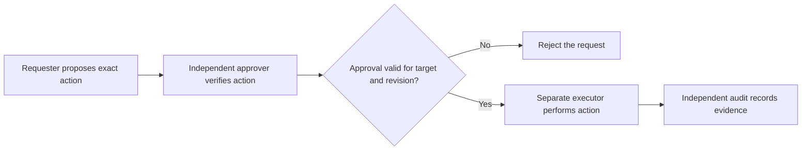

# P052 — Separation of Duties

## Definition

Separation of Duties divides a high-impact process among independent roles, actors, conditions, or
components. One compromised or mistaken actor cannot complete the process alone. Independence must
apply to identity, authority, and control path.

**Aliases:** segregation of duties, dual control, two-person rule.

## Provenance

**Classification:** established principle.

The principle has long-established organizational roots. Computer security models, such as
Clark-Wilson, formalized it. No single paper originated the broader organizational practice.

## Decision rule

Require another independent condition or role when one actor could cause unacceptable impact through
error or compromise. Select the number and type of divisions from the risk. Do not apply the same
process to all actions.

## How to apply

- Identify actions with confidentiality, integrity, safety, or availability risks that require a
  division of duties.
- Split request, approval, execution, custody, and audit roles where their independence reduces risk.
- Bind approvals to the exact operation, target, parameters, and current revision.
- Prevent one identity from silent control of all separate roles through inherited privilege.
- Preserve an auditable record of which condition each independent actor satisfied.
- Define controlled emergency access with a later review. Do not use informal bypass paths.

## Diagram



## Language examples

The two examples require different identities for the proposal and approval before release.

### Python

```python
def release(change, approver):
    if change.author == approver.id:
        raise DutyConflict()
    approver.verify(change.digest, change.target)
    deploy(change.artifact, change.target)
```

### Rust

```rust
fn release(change: &Change, approver: &Approver) -> Result<(), Error> {
    if change.author == approver.id {
        return Err(Error::DutyConflict);
    }
    approver.verify(change.digest, &change.target)?;
    deploy(&change.artifact, &change.target)
}
```

## Boundaries and tensions

Separation of Duties differs from Saltzer and Schroeder's **separation of privilege**. Separation of
Duties divides responsibilities among actors or roles. Separation of privilege makes one access
depend on multiple conditions or keys.

The two principles can support each other, but neither one implies the other. Routine low-risk work
does not need approval from multiple parties. Two roles under one credential are not independent.

## Examples

### Positive

A developer proposes a production release. A separate release identity verifies the approved
artifact digest and deployment target before it permits deployment.

### Misuse

A system labels one account “requester” and another “approver.” One automation credential controls
the passwords and recovery channels for the two accounts.

### Athena and agent workflows

One agent implements a high-risk security change. An independent reviewer uses separate evidence.
The reviewer cannot execute a deployment only because it approved the change.

## Related principles

- [P050 — Least Privilege](./p050-least-privilege.md)
- [P051 — Complete Mediation](./p051-complete-mediation.md)
- [P058 — Bounded Agent Authority](./p058-bounded-agent-authority.md)
- [P060 — Constrain Sub-Agents](./p060-constrain-sub-agents.md)

## References

### Origin and history

- [Clark and Wilson, *A Comparison of Commercial and Military Computer Security Policies*](https://doi.org/10.1109/SP.1987.10001)
  formalizes separation of duty in an influential integrity model.

### Current guidance

- [NIST SP 800-53 Release 5.2.0, control AC-5](https://csrc.nist.gov/Pubs/sp/800/53/r5/upd1/Final)
  requires organizations to identify separate duties and define related access authorizations.

### Further reading

- [Saltzer and Schroeder, *The Protection of Information in Computer Systems*](https://doi.org/10.1109/PROC.1975.9939)
  defines the distinct separation-of-privilege principle, which requires multiple conditions or keys.

[Back to the principles catalog](../README.md#p052)
