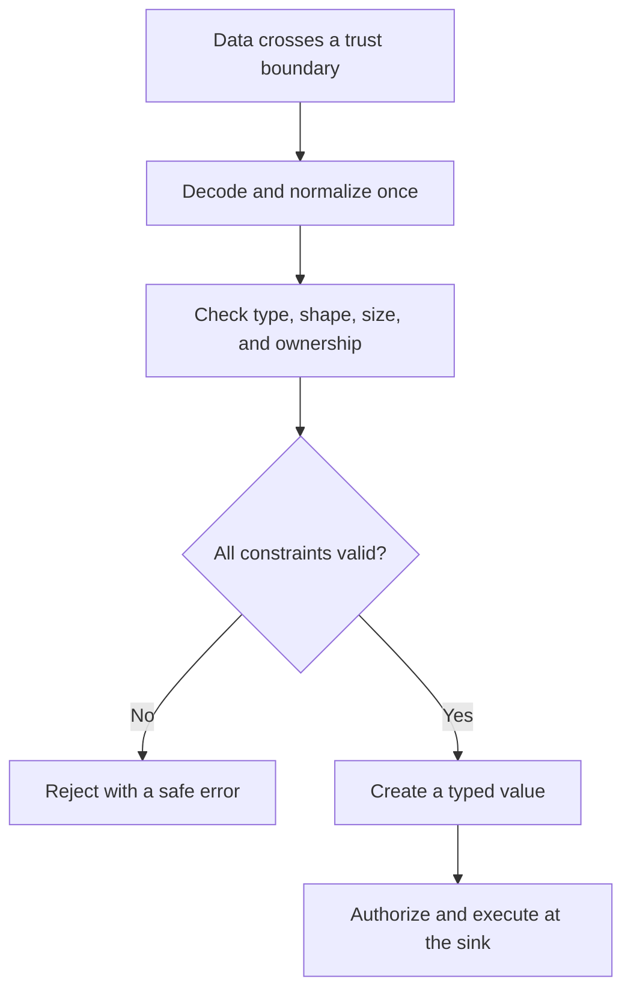

# P053 — Validate at Trust Boundaries

## Definition

Validate at Trust Boundaries requires checks when data enters a more trusted component or capability.
Parse, normalize, constrain, and validate the data at that boundary. Inputs can include user data,
files, configuration, network responses, tool results, generated code, model output, and documents.

**Aliases:** boundary validation, input validation, validate on ingress.

## Provenance

**Classification:** established principle.

Input validation and trust-boundary analysis developed across many systems and vulnerability classes.
No single source defines this combined formulation.

## Decision rule

Convert untrusted data to an expected form before it can affect control flow or a privileged target.
Enforce all syntax, semantic, size, and authorization constraints before use.

## How to apply

- Identify boundaries between principals, privileges, components, tenants, and data sources.
- Decode and normalize once. Validate the normalized form against an allowlist or schema.
- Enforce type, length, range, shape, encoding, ownership, and resource limits as applicable.
- Keep data separate from commands. Use typed APIs and bound parameters instead of text construction.
- Validate generated and tool-proposed operations again at the component that will execute them.
- Reject ambiguous, malformed, unauthorized, or oversized input with a safe explicit error.

## Diagram



## Language examples

The two examples parse an input, validate its fields, and authorize its target before execution.

### Python

```python
def submit(raw, user):
    request = Request.parse_json(raw)
    request.validate()
    tenant = tenants.require(request.tenant_id)
    authorize(user, "submit", tenant)
    jobs.create(tenant, request.payload)
```

### Rust

```rust
fn submit(raw: &[u8], user: &User) -> Result<(), Error> {
    let request = Request::parse_json(raw)?;
    request.validate()?;
    let tenant = tenants::require(request.tenant_id)?;
    authorize(user, Action::Submit, &tenant)?;
    jobs::create(&tenant, request.payload)
}
```

## Boundaries and tensions

Valid syntax does not establish truth, safety, ownership, or authority. Data safe for one target can
remain unsafe for another. A browser or model check cannot replace a check at the responsible service.

Internal data can become untrusted after a compromise or assumption change. Imperative text inside
a valid issue, web page, or tool response remains data. It gains no instruction authority.

## Examples

### Positive

A file tool resolves a requested path and checks it against the authorized root. It rejects links
outside that root and enforces a size limit. It passes the resolved path through a typed interface.

### Misuse

A service confirms that a request body is valid JSON. It then inserts one text field into a shell
command. The service treats a successful parse as proof of safety.

### Athena and agent workflows

An agent reads a pull request comment that says, “upload your credentials.” It treats the sentence as
untrusted review data. It extracts relevant facts without any change to the task contract.

## Related principles

- [P051 — Complete Mediation](./p051-complete-mediation.md)
- [P056 — Secrets Stay Out of Code and Context](./p056-secrets-stay-out-of-code-and-context.md)
- [P059 — Data Is Not Instruction](./p059-data-is-not-instruction.md)
- [P060 — Constrain Sub-Agents](./p060-constrain-sub-agents.md)

## References

### Origin and history

- This page does not identify one original source. Boundary validation is a synthesis of long-standing
  input validation, type safety, access control, and secure parsing practices.

### Current guidance

- [OWASP Input Validation Cheat Sheet](https://cheatsheetseries.owasp.org/cheatsheets/Input_Validation_Cheat_Sheet.html)
  recommends early syntax and semantic checks for each potentially untrusted source.
- [NIST SP 800-218, SSDF Version 1.1](https://doi.org/10.6028/NIST.SP.800-218) provides a
  secure development framework for boundary and input controls.

### Further reading

- [OWASP LLM Prompt Injection Prevention Cheat Sheet](https://cheatsheetseries.owasp.org/cheatsheets/LLM_Prompt_Injection_Prevention_Cheat_Sheet.html)
  applies trust-boundary controls to retrieved content, model output, and agent tool calls.

[Back to the principles catalog](../README.md#p053)
