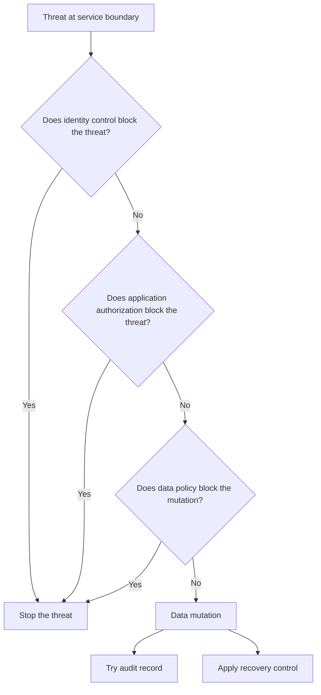

# P054 — Defense in Depth

## Definition

Defense in Depth uses independent controls for prevention, detection, limitation, and recovery. One
control failure does not compromise the protected asset. Each layer must control a
different failure mode.

**Aliases:** layered defense, layered security, independent layered controls.

## Provenance

**Classification:** established principle.

The phrase has a military history and different meanings in computer security. No one software
source is the source of the principle. NIST and related standards give formal information security
definitions.

## Decision rule

For an important threat, select the primary control. Give the methods that prevent, detect, contain,
and recover from a failure of the primary control. If a different boundary or mechanism decreases
residual risk, add a layer.

## How to apply

- Start with assets, threats, and trust boundaries. Do not start with a general control checklist.
- Use controls at different layers, for example identity, application, data, runtime, and network.
- Do not use shared credentials, configuration, or libraries that make different layers fail
  together.
- Use detection and recovery, not only prevention.
- Do bypass tests of each layer. Verify that the other controls limit the result.
- Record ownership and maintenance for each control. This record prevents incorrect assurance from
  stale layers.

## Diagram



## Language examples

The two examples apply application and data controls before mutation, then apply audit and backup
controls so audit failure does not prevent backup.

### Python

```python
def update_record(user, record, value):
    policy.authorize(user, "update", record)
    database.update_with_tenant_policy(record, value)
    audit_result = audit.try_append(user.id, "update", record.id)
    backup_result = backups.try_mark_required(record.id)
    require_success(audit_result, backup_result)
```

### Rust

```rust
fn update_record(user: &User, record: &Record, value: Value) -> Result<(), Error> {
    policy::authorize(user, Action::Update, record)?;
    database::update_with_tenant_policy(record, value)?;
    let audit_result = audit::try_append(user.id, Action::Update, record.id);
    let backup_result = backups::try_mark_required(record.id);
    require_success(audit_result, backup_result)
}
```

## Boundaries and tensions

More controls are not always better. If redundant mechanisms do not give independent protection,
they increase complexity and attack surface. Defense in Depth does not remove the requirement for a
strong primary control.

Detection with no response does not contain an incident. Use the minimum layer set for the specified
threat model. All layers must operate correctly.

## Examples

### Positive

A sensitive write uses service authorization, tenant-specific database policy, an append-only audit
event, and encrypted backups. If a route has no authorization check, the independent data barrier
also blocks the write.

### Misuse

Three gateways use the same copied allowlist and administrator credential. One bad rule or
compromised credential defeats all three layers. The gateways also cause three times the maintenance
work.

### Athena and agent workflows

Task instructions, tool allowlists, a filesystem sandbox, parameter checks, and an approval gate
limit a write-capable agent. The gate prevents unauthorized irreversible actions.

## Related principles

- [P048 — Secure by Design](./p048-secure-by-design.md)
- [P050 — Least Privilege](./p050-least-privilege.md)
- [P053 — Validate at Trust Boundaries](./p053-validate-at-trust-boundaries.md)
- [P055 — Minimize Attack Surface](./p055-minimize-attack-surface.md)

## References

### Source information

- The term has a history with different meanings in computer security. It inherits older
  layered-defense concepts. This page gives no one inventor or paper as its source.

### Applicable information

- [NIST CSRC definition of defense in depth](https://csrc.nist.gov/glossary/term/defense_in_depth)
  gives formal definitions from NIST, CNSSI, and ISA/IEC security guidance.
- [NIST SP 800-53 Release 5.2.0](https://csrc.nist.gov/Pubs/sp/800/53/r5/upd1/Final) gives a
  catalog of complementary organizational, technical, and operational security controls.

### More information

- [OWASP Secure Cloud Architecture Cheat Sheet](https://cheatsheetseries.owasp.org/cheatsheets/Secure_Cloud_Architecture_Cheat_Sheet.html)
  shows the interactions between trust boundaries and two or more controls in application
  architecture.

[Back to the principles catalog](../README.md#p054)
