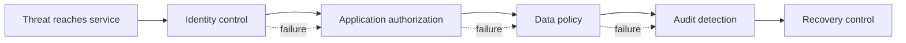

# P054 — Defense in Depth

## Definition

Defense in Depth uses independent prevention, detection, limiting, and recovery controls. One control
failure does not cause immediate compromise of the protected asset. Each layer must address a
different failure mode.

**Aliases:** layered defense, layered security, multiple independent controls.

## Provenance

**Classification:** established principle.

The phrase has an older military use and a varied history in computer security. No single software
source originated it. NIST and related standards provide formal information security definitions.

## Decision rule

For an important threat, identify the primary control. Define how the system prevents, detects,
contains, and recovers from failure of the primary control. Add a layer only when a different
boundary or mechanism reduces residual risk.

## How to apply

- Start with assets, threats, and trust boundaries rather than a generic control checklist.
- Combine controls at distinct layers, such as identity, application, data, runtime, and network.
- Avoid shared credentials, configuration, or libraries that make nominally separate layers fail together.
- Use detection and recovery, not only prevention.
- Test bypass of each layer and verify that remaining controls limit the result.
- Record ownership and maintenance for every control so stale layers do not create false assurance.

## Diagram



## Language examples

The two examples combine application authorization, an independent data policy, and an audit event.

### Python

```python
def update_record(user, record, value):
    policy.authorize(user, "update", record)
    database.update_with_tenant_policy(record, value)
    audit.append(user.id, "update", record.id)
    backups.mark_required(record.id)
```

### Rust

```rust
fn update_record(user: &User, record: &Record, value: Value) -> Result<(), Error> {
    policy::authorize(user, Action::Update, record)?;
    database::update_with_tenant_policy(record, value)?;
    audit::append(user.id, Action::Update, record.id)?;
    backups::mark_required(record.id)
}
```

## Boundaries and tensions

More controls are not always better. Redundant mechanisms increase complexity and attack surface
when they do not provide independent protection. Defense in Depth does not excuse a weak primary
control.

Detection without a response does not contain an incident. Use the smallest effective layer set
that addresses the demonstrated threat model. The full set must remain operable.

## Examples

### Positive

A sensitive write requires service authorization, tenant-specific database policy, an append-only
audit event, and encrypted backups. If a route omits its check, the independent data barrier still
blocks the write.

### Misuse

Three gateways use the same copied allowlist and administrator credential. One bad rule or compromised
credential defeats every nominal layer. The gateways also triple maintenance work.

### Athena and agent workflows

Task instructions, tool allowlists, a filesystem sandbox, parameter checks, and an approval gate limit
a write-capable agent. The gate covers unauthorized irreversible actions.

## Related principles

- [P048 — Secure by Design](./p048-secure-by-design.md)
- [P050 — Least Privilege](./p050-least-privilege.md)
- [P053 — Validate at Trust Boundaries](./p053-validate-at-trust-boundaries.md)
- [P055 — Minimize Attack Surface](./p055-minimize-attack-surface.md)

## References

### Origin and history

- The term has a varied history in computer security and inherits older layered-defense use. This page
  does not assign it to one inventor or paper.

### Current guidance

- [NIST CSRC definition of defense in depth](https://csrc.nist.gov/glossary/term/defense_in_depth)
  traces formal definitions to NIST, CNSSI, and ISA/IEC security guidance.
- [NIST SP 800-53 Release 5.2.0](https://csrc.nist.gov/Pubs/sp/800/53/r5/upd1/Final) provides a
  catalog of complementary organizational, technical, and operational security controls.

### Further reading

- [OWASP Secure Cloud Architecture Cheat Sheet](https://cheatsheetseries.owasp.org/cheatsheets/Secure_Cloud_Architecture_Cheat_Sheet.html)
  shows interactions between trust boundaries and multiple controls in application architecture.

[Back to the principles catalog](../README.md#p054)
