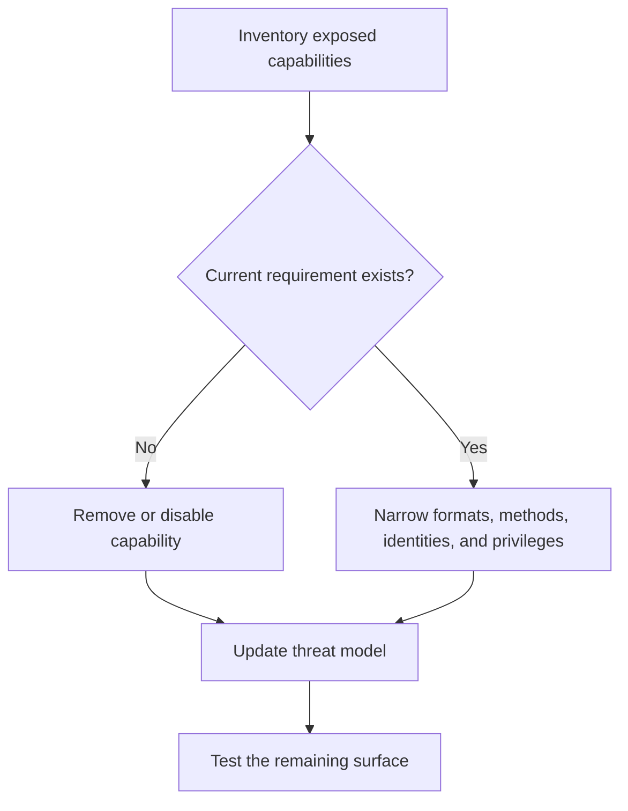

# P055 — Minimize Attack Surface

## Definition

Minimize Attack Surface exposes only the capabilities that supported behavior requires. These
capabilities include entry points, exit paths, protocols, identities, permissions, tools,
interpreters, dependencies, and features. Each exposed capability can let an attacker influence the
system or extract value.

**Aliases:** attack-surface reduction, exposure minimization, remove unnecessary entry points.

## Provenance

**Classification:** established principle.

Attack-surface analysis developed across security engineering. Manadhata and Wing provided an
influential formal metric. The broader practice has no single uncontested origin.

## Decision rule

Before a capability becomes externally accessible, identify its required consumer and security
controls. Remove or disable the capability when no current requirement justifies its exposure. Assess
the threat model again after each surface change.

## How to apply

- List all data and command paths that enter or leave the system. Include internal privileged paths.
- Remove unused endpoints, listeners, tools, plugins, protocols, dependencies, and administrative paths.
- Narrow accepted formats, methods, destinations, identities, and permissions.
- Keep privileged management surfaces isolated from routine product interfaces.
- Track surface changes during design and code review. Apply focused security tests.
- Preserve required compatibility until evidence shows removal is safe.

## Diagram



## Language examples

The two examples expose only the required health and report routes and reject all other routes.

### Python

```python
ROUTES = {
    ("GET", "/health"): health,
    ("GET", "/reports"): reports,
}

def dispatch(method, path):
    route = ROUTES.get((method, path))
    if route is None:
        raise NotFound()
    return route()
```

### Rust

```rust
fn dispatch(method: Method, path: &str) -> Result<Response, Error> {
    match (method, path) {
        (Method::Get, "/health") => health(),
        (Method::Get, "/reports") => reports(),
        _ => Err(Error::NotFound),
    }
}
```

## Boundaries and tensions

Attack surface is not source line count. A small interpreter or broad privileged endpoint can expose
more capability than a large pure library. Do not remove a necessary defense only to reduce component
count.

Saltzer and Schroeder's **economy of mechanism** favors security mechanisms that are small and simple
enough to inspect. It supports attack-surface reduction, but the two principles are not equivalent.

## Examples

### Positive

A service removes an unused administration protocol and restricts supported API methods. It places
the required administrative endpoint behind a separate authenticated network boundary.

### Misuse

A team deletes input validation to reduce code size. It retains the public endpoint and dangerous
operation. Complexity decreases, but exploitable exposure increases.

### Athena and agent workflows

A documentation task receives file read and link check capabilities. It receives no arbitrary shell,
message, deployment, or credential tools. The task must demonstrate a need for each new capability.

## Related principles

- [P048 — Secure by Design](./p048-secure-by-design.md)
- [P050 — Least Privilege](./p050-least-privilege.md)
- [P054 — Defense in Depth](./p054-defense-in-depth.md)
- [P057 — Supply-Chain Integrity](./p057-supply-chain-integrity.md)

## References

### Origin and history

- [Manadhata and Wing, *An Attack Surface Metric*](https://doi.org/10.1109/TSE.2010.60) formalizes
  attack surface through system methods, channels, data, and related privileges.

### Current guidance

- [OWASP Attack Surface Analysis Cheat Sheet](https://cheatsheetseries.owasp.org/cheatsheets/Attack_Surface_Analysis_Cheat_Sheet.html)
  provides a practical process to map, review, reduce, and monitor surface changes.

### Further reading

- [Saltzer and Schroeder, *The Protection of Information in Computer Systems*](https://doi.org/10.1109/PROC.1975.9939)
  defines economy of mechanism, a related but distinct requirement for simple protection design.

[Back to the principles catalog](../README.md#p055)
