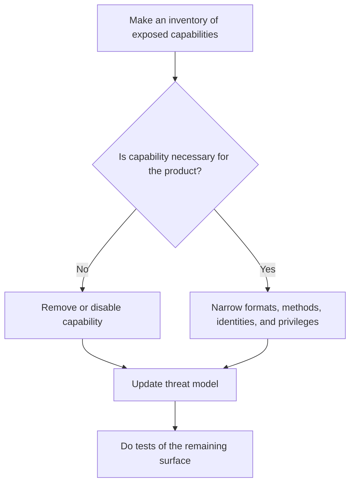

# P055 — Minimize Attack Surface

## Definition

Minimize Attack Surface makes available only the capabilities that are necessary for product
behavior. These capabilities include entry points, exit paths, protocols, identities, permissions,
tools, interpreters, dependencies, and features. Each available capability can let an attacker
control the system or get value.

**Aliases:** attack-surface reduction, exposure minimization, removal of entry points that are not
necessary.

## Provenance

**Classification:** established principle.

Attack-surface analysis has sources in security engineering. Manadhata and Wing gave an important
formal metric. The general practice has no one verified source.

## Decision rule

Before a capability becomes available to external users or systems, find its necessary consumer and
security controls. If it is not necessary for specified product behavior, remove or disable the
capability. After each surface change, examine the threat model again.

## How to apply

- Record all input and output data paths and command paths. Include internal privileged paths.
- Remove endpoints, listeners, tools, plugins, protocols, dependencies, and administrative paths
  that no consumer uses.
- Narrow accepted formats, methods, destinations, identities, and permissions.
- Keep privileged management surfaces isolated from standard product interfaces.
- Record surface changes during design and code review. Do security tests for changed surfaces.
- Until evidence shows that removal is safe, keep necessary compatibility.

## Diagram



## Language examples

The two examples make available only the necessary health and report routes and reject all other
routes.

### Python

```python
ROUTES = {
    ("GET", "/health"): health,
    ("GET", "/reports"): reports,
}

def dispatch(method, path):
    route = ROUTES.get((method, path))
    if route is None:
        raise NotFound()
    return route()
```

### Rust

```rust
fn dispatch(method: Method, path: &str) -> Result<Response, Error> {
    match (method, path) {
        (Method::Get, "/health") => health(),
        (Method::Get, "/reports") => reports(),
        _ => Err(Error::NotFound),
    }
}
```

## Boundaries and tensions

Attack surface is not source line count. A small interpreter or high-privilege endpoint can make
more capability available than a large pure library. Do not remove a necessary defense only to
decrease component count.

Saltzer and Schroeder's **economy of mechanism** makes small and simple security mechanisms
necessary for inspection. It helps attack-surface reduction, but the two principles are not
equivalent.

## Examples

### Positive

A service removes an administration protocol that no consumer uses. It accepts only supported API
methods. It keeps the necessary administrative endpoint in a different authenticated network
boundary.

### Misuse

A team deletes input validation to decrease code size. It keeps the public endpoint and dangerous
operation. Complexity decreases, but exploitable exposure increases.

### Athena and agent workflows

A documentation task receives file read and link check capabilities. It receives no shell, message,
deployment, or credential tools. Evidence must show that each new capability is necessary.

## Related principles

- [P048 — Secure by Design](./p048-secure-by-design.md)
- [P050 — Least Privilege](./p050-least-privilege.md)
- [P054 — Defense in Depth](./p054-defense-in-depth.md)
- [P057 — Supply-Chain Integrity](./p057-supply-chain-integrity.md)

## References

### Source information

- [Manadhata and Wing, *An Attack Surface Metric*](https://doi.org/10.1109/TSE.2010.60) gives
  information about an attack-surface metric for system methods, channels, data, and related
  privileges.

### Applicable information

- [OWASP Attack Surface Analysis Cheat Sheet](https://cheatsheetseries.owasp.org/cheatsheets/Attack_Surface_Analysis_Cheat_Sheet.html)
  gives a process to map, review, decrease, and monitor surface changes.

### More information

- [Saltzer and Schroeder, *The Protection of Information in Computer Systems*](https://doi.org/10.1109/PROC.1975.9939)
  gives economy of mechanism, a related requirement for simple protection design.

[Back to the principles catalog](../README.md#p055)
