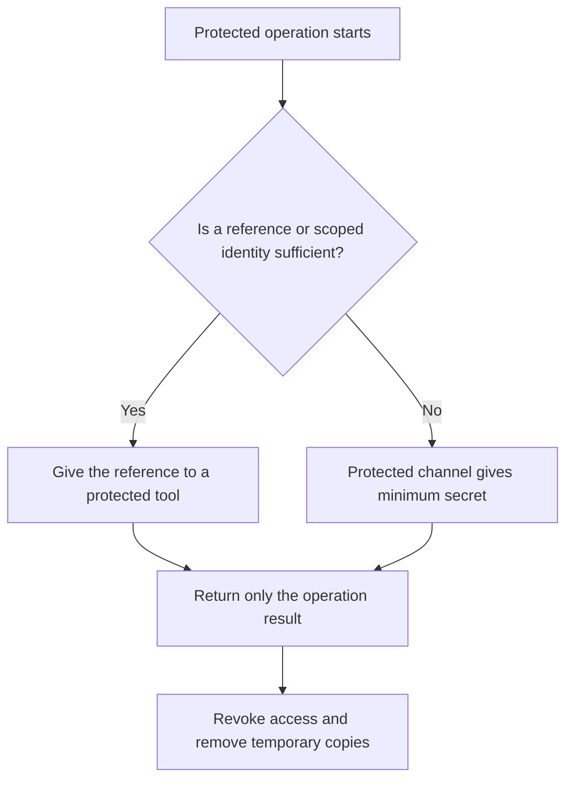

# P056 — Secrets Stay Out of Code and Context

## Definition

Do not include credentials, private keys, tokens, production secrets, or sensitive customer data in
source code or context that has no protection. This context includes fixtures, prompts, logs,
generated artifacts, and agent memory. If sensitive data is necessary for a task, use a protected
channel.

Classify exposure as a security event without a requirement for evidence of abuse.

**Aliases:** secret hygiene, credential isolation, context minimization.

## Provenance

**Classification:** Athena synthesis.

This synthesis applies security practice to agent context. Secret isolation and credential
management have many sources. No one source gives this rule for code, telemetry, artifacts, and AI
context.

## Decision rule

If a reference, narrow identity, derived value, or redacted record is sufficient, do not show a
secret.
If a secret is necessary for the task, give the minimum necessary value to the minimum number of
principals.
Limit the exposure time. Prevent secondary copies.

## How to apply

- Keep secrets in a managed secret facility, not repository or configuration files that have no
  protection.
- When the operation starts, get short-lived, task-specific identities and access. Do not use static
  shared credentials.
- Do not include secret values in command arguments, prompts, exceptions, telemetry, diffs, or test
  output.
- Redact sensitive fields before context transfer to models, tools, sub-agents, or external
  services.
- Scan source and artifacts. Use the scan as a secondary control, not as permission to embed
  secrets.
- If there is evidence of exposure or if you think that exposure occurred, revoke the secret.
- If continued access is necessary after revocation, replace the secret.
- Deletion of the copy that users can see is not sufficient.

## Diagram



## Language examples

The two examples give a secret reference to a protected signer and log only a safe request ID.

### Python

```python
def sign_release(request_id, artifact):
    key_ref = SecretRef("release-key")
    signature = signer.sign(key_ref, artifact.digest)
    log.info("release_signed", request_id=request_id)
    return signature
```

### Rust

```rust
fn sign_release(request_id: &str, artifact: &Artifact) -> Result<Signature, Error> {
    let key_ref = SecretRef::new("release-key");
    let signature = signer::sign(key_ref, artifact.digest)?;
    log::info("release_signed", request_id);
    Ok(signature)
}
```

## Boundaries and tensions

Environment variables are transport, not a full secret management system. Process inspection or
debug tools can show them. Encoding cannot protect a secret. Encryption with a committed key also
cannot protect the secret.

For an authorized operation, a sensitive value can be necessary. Use a protected tool boundary that
does the operation with no disclosure of the value. Do not log secrets for diagnosis.

## Examples

### Positive

A deployment runner gets a short-lived credential from the platform identity service. It uses the
credential only at the deployment boundary and masks output. The credential expires after the task.

### Misuse

A fixture contains a production-like access token because the repository is private. A prompt and
CI artifact then contain the same fixture.

### Athena and agent workflows

An agent uses a credential-aware tool to do an authorized operation without token disclosure.
Before delegation, it removes file content, identifiers, and tool output that do not apply to the
child task.

## Related principles

- [P047 — Observability Is Part of Correctness](./p047-observability-is-part-of-correctness.md)
- [P050 — Least Privilege](./p050-least-privilege.md)
- [P053 — Validate at Trust Boundaries](./p053-validate-at-trust-boundaries.md)
- [P058 — Bounded Agent Authority](./p058-bounded-agent-authority.md)

## References

### Source information

- No one historical source gives this principle. This principle applies credential management
  practice to risks from telemetry, build artifacts, model context, and persistent memory.

### Applicable information

- [OWASP Secrets Management Cheat Sheet](https://cheatsheetseries.owasp.org/cheatsheets/Secrets_Management_Cheat_Sheet.html)
  gives information about central storage, short lifetimes, rotation, audits, source exposure, and
  log redaction.
- [NIST SP 800-218, SSDF Version 1.1](https://doi.org/10.6028/NIST.SP.800-218) gives requirements for
  software, credentials, and development environments during the secure development life cycle.

### More information

- [OWASP AI Agent Security Cheat Sheet](https://cheatsheetseries.owasp.org/cheatsheets/AI_Agent_Security_Cheat_Sheet.html)
  uses data classification, redaction, memory isolation, and non-sensitive logs for agent systems.

[Back to the principles catalog](../README.md#p056)
