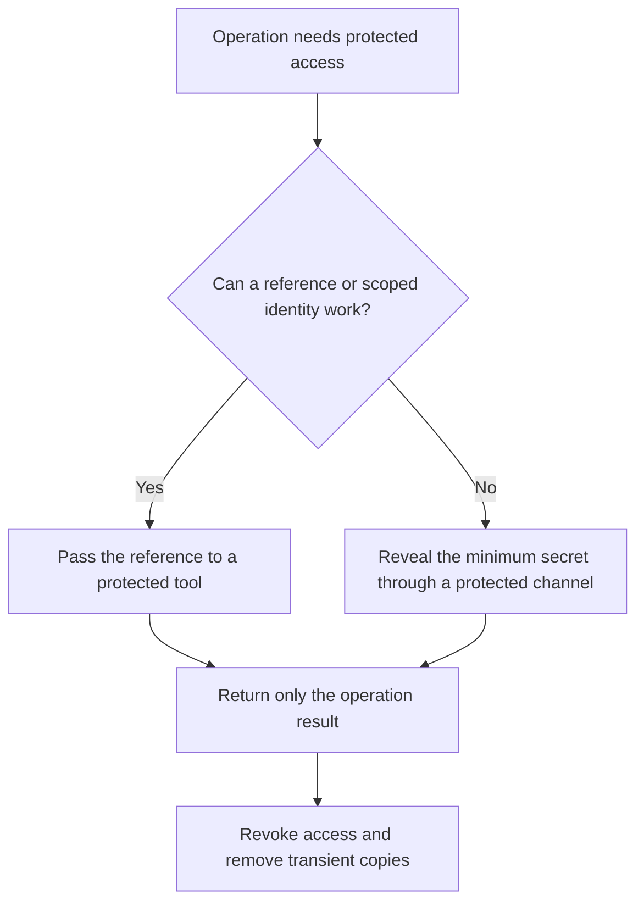

# P056 — Secrets Stay Out of Code and Context

## Definition

Do not put credentials, private keys, tokens, production secrets, or sensitive customer data in source
code or ordinary context. This context includes fixtures, prompts, logs, generated artifacts, and
agent memory. Use sensitive data only when the task requires it and a protected channel exists.

Treat exposure as a security event even without evidence of abuse.

**Aliases:** secret hygiene, credential isolation, context minimization.

## Provenance

**Classification:** Athena synthesis.

This synthesis extends established security practice to agent context. Secret isolation and
credential management have diffuse histories. No single source defines this combined rule for code,
telemetry, artifacts, and AI context.

## Decision rule

Do not expose a secret when a reference, narrow identity, derived value, or redacted record can support
the task. When secret use is necessary, reveal the minimum value to the fewest principals for the
shortest time. Prevent secondary copies.

## How to apply

- Store secrets in a managed secret facility, not repository or ordinary configuration files.
- Prefer short-lived, task-specific identities and access at use time over static shared credentials.
- Keep secret values out of command arguments, prompts, exceptions, telemetry, diffs, and test output.
- Redact sensitive fields before context transfer to models, tools, sub-agents, or external services.
- Scan source and artifacts. Use the scan as a backstop, not as permission to embed secrets.
- Revoke or rotate a secret promptly after suspected exposure. Deletion of the visible copy is not
  sufficient.

## Diagram



## Language examples

The two examples pass a secret reference to a protected signer and log only a safe request ID.

### Python

```python
def sign_release(request_id, artifact):
    key_ref = SecretRef("release-key")
    signature = signer.sign(key_ref, artifact.digest)
    log.info("release_signed", request_id=request_id)
    return signature
```

### Rust

```rust
fn sign_release(request_id: &str, artifact: &Artifact) -> Result<Signature, Error> {
    let key_ref = SecretRef::new("release-key");
    let signature = signer::sign(key_ref, artifact.digest)?;
    log::info("release_signed", request_id);
    Ok(signature)
}
```

## Boundaries and tensions

Environment variables are transport, not a full secret management system. Process inspection or
debug tools can expose them. Encoding cannot protect a secret. Encryption with a committed key also
cannot protect it.

Some authorized operations require sensitive values. Prefer a protected tool boundary that performs
the operation without disclosure of the value. Diagnostic value does not justify logs that contain
secrets.

## Examples

### Positive

A deployment runner obtains a short-lived credential from the platform identity service. It uses the
credential inside the deployment boundary and masks output. The credential expires after the task.

### Misuse

A test puts a production-like access token in a fixture because the repository is private. The same
fixture then enters a prompt and CI artifact.

### Athena and agent workflows

An agent asks a credential-aware tool to perform an authorized operation without token disclosure.
Before delegation, it removes unrelated file content, identifiers, and tool output from the child
context.

## Related principles

- [P047 — Observability Is Part of Correctness](./p047-observability-is-part-of-correctness.md)
- [P050 — Least Privilege](./p050-least-privilege.md)
- [P053 — Validate at Trust Boundaries](./p053-validate-at-trust-boundaries.md)
- [P058 — Bounded Agent Authority](./p058-bounded-agent-authority.md)

## References

### Origin and history

- No single historical source defines this principle. This principle combines established credential
  management practice with risks from telemetry, build artifacts, model context, and persistent memory.

### Current guidance

- [OWASP Secrets Management Cheat Sheet](https://cheatsheetseries.owasp.org/cheatsheets/Secrets_Management_Cheat_Sheet.html)
  covers central storage, short lifetimes, rotation, audits, source exposure, and log redaction.
- [NIST SP 800-218, SSDF Version 1.1](https://doi.org/10.6028/NIST.SP.800-218) requires protection of
  software, credentials, and development environments across the secure development life cycle.

### Further reading

- [OWASP AI Agent Security Cheat Sheet](https://cheatsheetseries.owasp.org/cheatsheets/AI_Agent_Security_Cheat_Sheet.html)
  applies data classification, redaction, memory isolation, and non-sensitive logs to agent systems.

[Back to the principles catalog](../README.md#p056)
