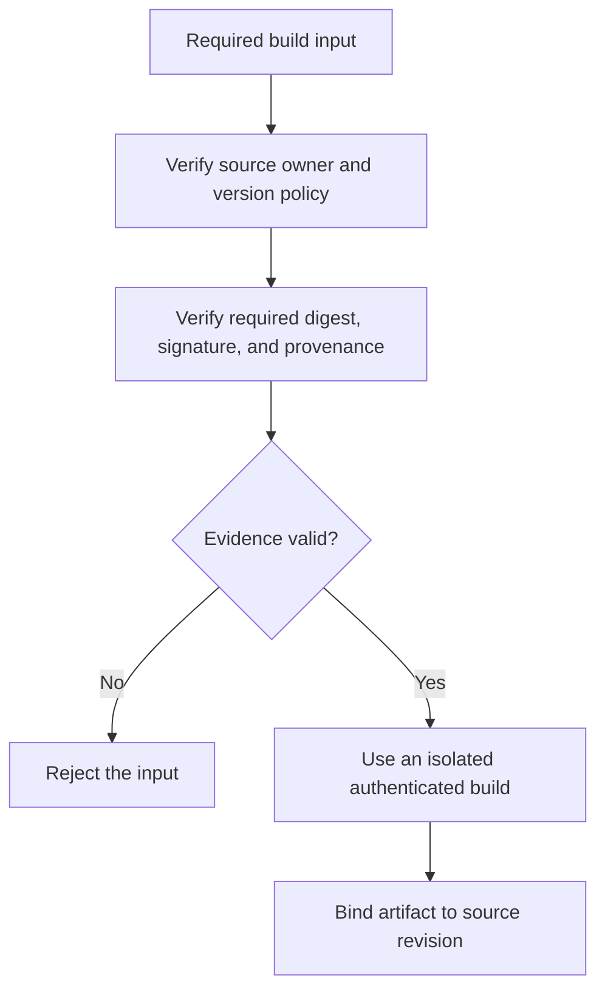

# P057 — Supply-Chain Integrity

## Definition

Supply-Chain Integrity preserves justified trust in software sources, dependencies, tools, build
inputs, processes, and artifacts. Consumers can identify each build input, its source, its
transformation, and any unexpected change.

**Aliases:** software supply-chain security, build integrity, artifact provenance.

## Provenance

**Classification:** established principle.

Thompson's compiler backdoor lecture is an early primary demonstration that source review alone
cannot establish trust in delivered software. Modern frameworks add provenance, protected builds,
dependency controls, and attestations.

## Decision rule

Each new build input or dependency must have a necessary purpose and an accountable source. It also
needs a bounded version policy and risk-based identity and integrity checks. Protect the full path
from reviewed source to distributed artifact.

## How to apply

- Prefer existing or standard-library capability. Add a third-party component only when necessary.
- Obtain inputs from trusted sources. Review ownership, maintenance, license, and security posture.
- Preserve the project lockfile. For each required build input, verify the digest, signature,
  provenance, and attestation.
- Isolate and authenticate build systems, minimize their credentials, and keep builds reproducible.
- Record component and artifact provenance. Scan for known risks, but do not treat a scan as proof.
- Define update, vulnerability-response, removal, and compromise-recovery paths before adoption.

## Diagram



## Language examples

The two examples use the project lockfile to verify each required build input digest, signature, and
provenance before package installation.

### Python

```python
def install(package, project_lock):
    build_input = registry.fetch(package, project_lock.version)
    verify_digest(build_input, project_lock.sha256)
    verify_signature(build_input, project_lock.signer)
    verify_provenance(build_input, project_lock.builder)
    sandbox.install(build_input)
```

### Rust

```rust
fn install(package: &Package, project_lock: &Lock) -> Result<(), Error> {
    let build_input = registry::fetch(package, &project_lock.version)?;
    verify_digest(&build_input, &project_lock.sha256)?;
    verify_signature(&build_input, &project_lock.signer)?;
    verify_provenance(&build_input, &project_lock.builder)?;
    sandbox::install(build_input)
}
```

## Boundaries and tensions

A version pin prevents surprise changes, but it can preserve known vulnerabilities. Integrity and
freshness are separate properties. A signed artifact proves control of an identity. It does not prove
that the software is safe or correct.

An inventory without an operational consumer does not reduce risk. Match controls to impact. Do not
add supply-chain tools when their costs and trust dependencies exceed their value.

## Examples

### Positive

A project reviews a required dependency and commits the project lockfile. CI verifies each build
input digest, signature, and provenance. An isolated build binds the release artifact to an attested
source revision.

### Misuse

A build downloads an unversioned installer at run time. It executes the installer with release
credentials and signs the result. The signature authenticates the compromised output, not the build
inputs.

### Athena and agent workflows

An agent verifies that a plugin dependency originates in the canonical repository at the expected
revision. Skill text remains untrusted data unless the host explicitly gives it instruction authority.

## Related principles

- [P053 — Validate at Trust Boundaries](./p053-validate-at-trust-boundaries.md)
- [P055 — Minimize Attack Surface](./p055-minimize-attack-surface.md)
- [P056 — Secrets Stay Out of Code and Context](./p056-secrets-stay-out-of-code-and-context.md)
- [P059 — Data Is Not Instruction](./p059-data-is-not-instruction.md)

## References

### Origin and history

- [Ken Thompson, *Reflections on Trusting Trust*](https://doi.org/10.1145/358198.358210) demonstrates
  how a compromised compiler can subvert output without visible malicious source.

### Current guidance

- [NIST SP 800-218, SSDF Version 1.1](https://doi.org/10.6028/NIST.SP.800-218) includes practices for
  software component protection and third-party software risk controls.
- [SLSA Specification 1.2](https://slsa.dev/spec/v1.2/) defines source and build integrity
  levels and standard provenance attestations.

### Further reading

- [NIST SP 800-161 Revision 1](https://doi.org/10.6028/NIST.SP.800-161r1-upd1) addresses cybersecurity
  supply-chain risk management across systems and organizations.

[Back to the principles catalog](../README.md#p057)
