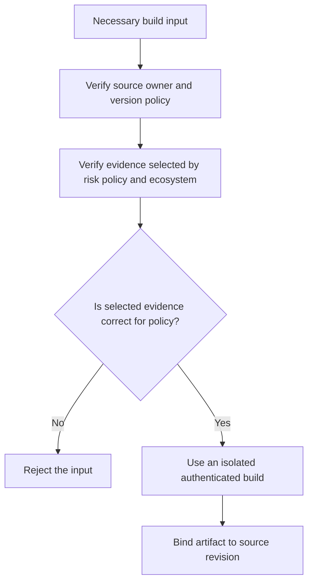

# P057 — Supply-Chain Integrity

## Definition

Supply-Chain Integrity keeps justified trust in software sources, dependencies, tools, build
inputs, processes, and artifacts. Consumers can find each build input, its source, its
transformation, and an unexpected change.

**Aliases:** software supply-chain security, build integrity, artifact provenance.

## Provenance

**Classification:** established principle.

Thompson's compiler backdoor lecture shows that source review cannot show trust in delivered
software. Frameworks include provenance, protected builds,
dependency controls, and attestations.

## Decision rule

Each new build input or dependency must be necessary and must have an identified source owner. The
input or dependency also must have a bounded version policy. Policy must select identity and
integrity checks for the risk and ecosystem. Protect the full path from reviewed source to
distributed artifact.

## How to apply

- If a standard-library capability is sufficient, use it. If a third-party component is necessary,
  add it.
- Get inputs from trusted sources. Examine ownership, maintenance, license, and security posture.
- Keep the project lockfile. Policy must select evidence for the risk from mechanisms available in
  the ecosystem.
  Evidence can include a digest, signature, provenance, or attestation.
- Isolate and authenticate build systems, limit their credentials, and keep builds reproducible.
- Record component and artifact provenance. Scan for known risks. A scan is not proof.
- Before adoption, record update, vulnerability-response, removal, and compromise-recovery paths.

## Diagram



## Language examples

Before installation, the two examples apply the evidence checks that project policy selects for
each package.

### Python

```python
def install(package, project_lock):
    rule = project_lock.rule_for(package)
    build_input = registry.fetch(package, rule.version)
    for verifier in rule.required_verifiers:
        verifier.verify(build_input)
    sandbox.install(build_input)
```

### Rust

```rust
fn install(package: &Package, project_lock: &Lock) -> Result<(), Error> {
    let rule = project_lock.rule_for(package)?;
    let build_input = registry::fetch(package, &rule.version)?;
    for verifier in &rule.required_verifiers {
        verifier.verify(&build_input)?;
    }
    sandbox::install(build_input)
}
```

## Boundaries and tensions

A version pin prevents unexpected changes, but it can keep known vulnerabilities. Integrity and
freshness are different properties. A signed artifact shows control of an identity. It does not show
that the software is safe or correct.

An inventory with no operational consumer does not decrease risk. Select controls for the possible
impact. If supply-chain tool costs and trust dependencies are greater than their value, do not add
the tools.

## Examples

### Positive

A project examines a necessary dependency and commits the project lockfile. Policy selects evidence
for the risk from mechanisms available in the ecosystem. CI verifies that evidence. An isolated
build binds the release artifact to an attested source revision.

### Misuse

A build downloads an unversioned installer during execution. It starts the installer with release
credentials and signs the result. The signature authenticates the compromised output, not the build
inputs.

### Athena and agent workflows

An agent verifies that a plugin dependency has the canonical repository as its source at the
expected revision. Unless the host gives skill text instruction authority, the skill text is
untrusted data.

## Related principles

- [P053 — Validate at Trust Boundaries](./p053-validate-at-trust-boundaries.md)
- [P055 — Minimize Attack Surface](./p055-minimize-attack-surface.md)
- [P056 — Secrets Stay Out of Code and Context](./p056-secrets-stay-out-of-code-and-context.md)
- [P059 — Data Is Not Instruction](./p059-data-is-not-instruction.md)

## References

### Source information

- [Ken Thompson, *Reflections on Trusting Trust*](https://doi.org/10.1145/358198.358210) shows
  how a compromised compiler can subvert output without malicious source that a reviewer can see.

### Applicable information

- [NIST SP 800-218, SSDF Version 1.1](https://doi.org/10.6028/NIST.SP.800-218) gives practices for
  software component protection and third-party software risk controls.
- [SLSA Specification 1.2](https://slsa.dev/spec/v1.2/) gives source and build integrity
  levels and standard provenance attestations.

### More information

- [NIST SP 800-161 Revision 1](https://doi.org/10.6028/NIST.SP.800-161r1-upd1) gives cybersecurity
  supply-chain risk management across systems and organizations.

[Back to the principles catalog](../README.md#p057)
