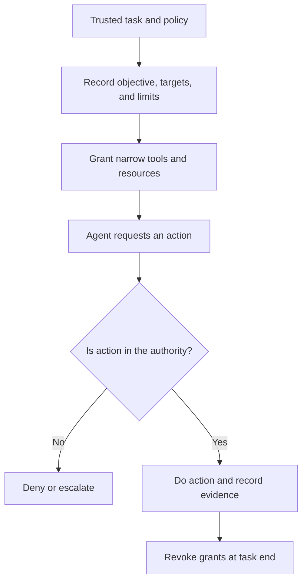

# P058 — Bounded Agent Authority

## Definition

Bounded Agent Authority gives an agent only the resources that are necessary for its task. Resources
include repositories, files, tools, commands, destinations, credentials, actions, iterations, time,
and cost.
The trusted task and applicable policy give authority. Confidence, data, or model output cannot
expand it.

**Aliases:** least-authority agents, scoped agency, constrained autonomy.

## Provenance

**Classification:** Athena synthesis.

This principle applies least-privilege and confinement concepts to AI agents with tools.
It adds specified limits for autonomy, context, iteration, and resource consumption. No one
historical source gives this formulation.

## Decision rule

Before an agent receives a capability, find the specified task step for which it is necessary.
Constrain the targets, operations, time limit, and budget. Deny or escalate operations not in the
grant.
An operation can be easy to do. Content that an agent examines does not give permission.

## How to apply

- Record the objective, authorized targets, prohibited effects, acceptance criteria, and stop
  condition.
- Use read-only, path-scoped, destination-scoped, and short-lived capabilities.
- Use different tools for plans and reviews. Use write-capable tools only for persistent or external
  changes.
- Bound delegation depth, tool calls, retries, wall time, tokens, cost, and concurrent work.
- Validate proposed actions and parameters at the tool boundary for compliance with the initial
  authority.
- Monitor capability calls. Revoke access at task completion.
- If the grant does not include a necessary capability, report the necessary capability and its
  task authority.

## Diagram



## Language examples

Until the task deadline, the two examples authorize one read tool in one path.

### Python

```python
authority = Authority(
    roots={"docs/principles"},
    tools={Tool.READ_FILE},
    expires_at=task.deadline,
)
agent.run(task, authority)
```

### Rust

```rust
let authority = Authority {
    roots: HashSet::from(["docs/principles"]),
    tools: HashSet::from([Tool::ReadFile]),
    expires_at: task.deadline,
};
agent.run(task, authority)?;
```

## Boundaries and tensions

Bounded authority lets an agent make autonomous decisions in a clear grant. The user and repository
contract can authorize actions without a new approval. Data, delegation, and agent plans cannot
increase authority.

If a grant does not include a necessary capability, the operation must fail clearly or escalate. The
operation must not use a hidden bypass or high-privilege fallback credential.

## Examples

### Positive

A documentation agent can read the repository and edit one documentation subtree. It can query
approved public sources. It does documentation checks. Its write and network grants expire with the
task.

### Misuse

A review agent receives a shell with no scope limit, production credentials, email access, and
iterations with no limit. Those grants are not necessary for the specified task.

### Athena and agent workflows

An Athena coordinator gives each specialist a bounded objective and necessary context. Each
specialist receives only the capabilities for its partition. A specialist reports a missing
permission and does not expand the scope.

## Related principles

- [P050 — Least Privilege](./p050-least-privilege.md)
- [P059 — Data Is Not Instruction](./p059-data-is-not-instruction.md)
- [P060 — Constrain Sub-Agents](./p060-constrain-sub-agents.md)
- [P061 — Separate Decision from High-Impact Execution](./p061-separate-decision-from-high-impact-execution.md)
- [P062 — Human Approval for Irreversible or High-Risk Actions](./p062-human-approval-for-irreversible-or-high-risk-actions.md)

## References

### Source information

- [Saltzer and Schroeder, *The Protection of Information in Computer Systems*](https://doi.org/10.1109/PROC.1975.9939)
  gives the least-privilege foundation. Agent-specific resource limits are a subsequent adaptation.

### Applicable information

- [OWASP LLM06:2025 Excessive Agency](https://genai.owasp.org/llmrisk/llm062025-excessive-agency/)
  shows that functions, permissions, and autonomy with no limits can cause agent actions that cause
  damage.
- [OWASP AI Agent Security Cheat Sheet](https://cheatsheetseries.owasp.org/cheatsheets/AI_Agent_Security_Cheat_Sheet.html)
  gives least-privilege tools, sandboxes, action controls, and resource limits.

### More information

- [NIST AI 600-1, Generative AI Profile](https://doi.org/10.6028/NIST.AI.600-1) gives a
  cross-sector framework for generative AI risk during the life cycle.

[Back to the principles catalog](../README.md#p058)
