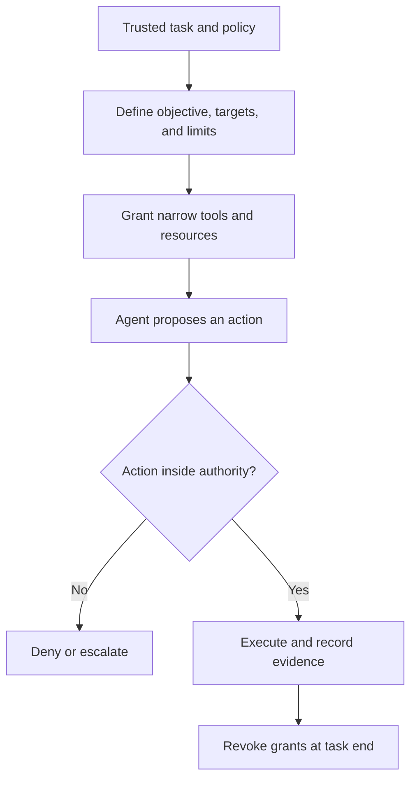

# P058 — Bounded Agent Authority

## Definition

Bounded Agent Authority gives an agent only the resources that its task requires. Resources include
repositories, files, tools, commands, destinations, credentials, actions, iterations, time, and cost.
The trusted task and governing policy define authority. Confidence, data, or model output cannot
expand it.

**Aliases:** least-authority agents, scoped agency, constrained autonomy.

## Provenance

**Classification:** Athena synthesis.

This principle applies established least-privilege and confinement concepts to AI agents with tools.
It adds explicit limits for autonomy, context, iteration, and resource use. No single historical
source defines the combined formulation.

## Decision rule

Before an agent receives a capability, identify the exact task step that requires it. Constrain the
targets, operations, duration, and budget. Deny or escalate operations outside the grant. Do not infer
permission from convenience or inspected content.

## How to apply

- State the objective, allowed targets, prohibited effects, acceptance criteria, and stop condition.
- Prefer read-only, path-scoped, destination-scoped, and short-lived capabilities.
- Separate plan and review tools from tools that execute persistent or externally visible changes.
- Bound delegation depth, tool calls, retries, wall time, tokens, cost, and concurrent work.
- Validate proposed actions and parameters at the tool boundary against the original authority.
- Monitor use, revoke access at task completion, and report when the allowed capability is insufficient.

## Diagram



## Language examples

The two examples permit one read tool in one path until the task deadline.

### Python

```python
authority = Authority(
    roots={"docs/principles"},
    tools={Tool.READ_FILE},
    expires_at=task.deadline,
)
agent.run(task, authority)
```

### Rust

```rust
let authority = Authority {
    roots: HashSet::from(["docs/principles"]),
    tools: HashSet::from([Tool::ReadFile]),
    expires_at: task.deadline,
};
agent.run(task, authority)?;
```

## Boundaries and tensions

Bounded authority permits autonomous choices inside a clear grant. The user and repository contract
can authorize actions without an extra approval. Data, delegation, and agent plans cannot create new
authority.

An insufficient grant must cause an explicit failure or escalation. It must not cause a hidden bypass
or broad fallback credential.

## Examples

### Positive

A documentation agent can read the repository and edit one documentation subtree. It can query approved
public sources and run documentation checks. Its write and network grants expire with the task.

### Misuse

A review agent receives an unrestricted shell, production credentials, email access, and unlimited
iterations. A possible future need serves as the only justification.

### Athena and agent workflows

An Athena coordinator gives each specialist a bounded objective and required context. Each specialist
receives only the capabilities for its partition. A specialist reports an absent permission instead
of a scope expansion.

## Related principles

- [P050 — Least Privilege](./p050-least-privilege.md)
- [P059 — Data Is Not Instruction](./p059-data-is-not-instruction.md)
- [P060 — Constrain Sub-Agents](./p060-constrain-sub-agents.md)
- [P061 — Separate Decision from High-Impact Execution](./p061-separate-decision-from-high-impact-execution.md)
- [P062 — Human Approval for Irreversible or High-Risk Actions](./p062-human-approval-for-irreversible-or-high-risk-actions.md)

## References

### Origin and history

- [Saltzer and Schroeder, *The Protection of Information in Computer Systems*](https://doi.org/10.1109/PROC.1975.9939)
  supplies the least-privilege foundation. Agent-specific resource limits are a later adaptation.

### Current guidance

- [OWASP LLM06:2025 Excessive Agency](https://genai.owasp.org/llmrisk/llm062025-excessive-agency/)
  identifies excessive functions, permissions, and autonomy as causes of harmful agent actions.
- [OWASP AI Agent Security Cheat Sheet](https://cheatsheetseries.owasp.org/cheatsheets/AI_Agent_Security_Cheat_Sheet.html)
  recommends least-privilege tools, sandboxes, action controls, and resource limits.

### Further reading

- [NIST AI 600-1, Generative AI Profile](https://doi.org/10.6028/NIST.AI.600-1) provides a
  cross-sector framework for generative AI risk across the life cycle.

[Back to the principles catalog](../README.md#p058)
