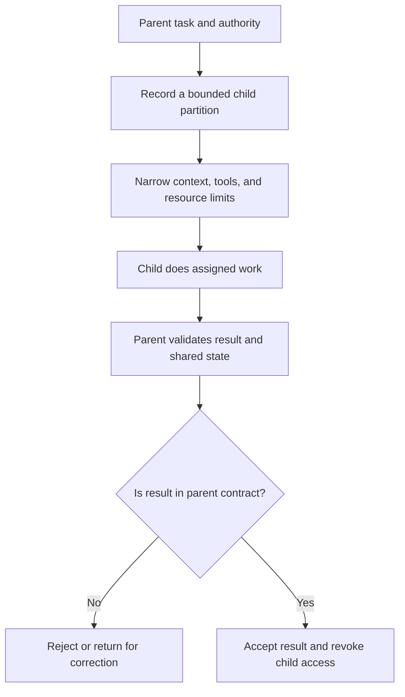

# P060 — Constrain Sub-Agents

## Definition

Constrain Sub-Agents means that delegation keeps or narrows the parent task scope and authority. A
child receives only its necessary objective, context, permissions, credentials, tools, and resource
budget. The parent classifies child output as untrusted input and validates it.

**Aliases:** bounded delegation, capability-safe delegation, constrained multi-agent execution.

## Provenance

**Classification:** Athena synthesis.

This principle adapts confinement, least-privilege, and secure delegation concepts to workflows with
two or more agents. Historical confinement literature did not give this rule.

## Decision rule

Delegate only a specified, bounded partition with no more authority than the parent. Before the
parent accepts a child result, verify the result provenance, scope, and evidence. Verify requested
effects against the parent contract.

## How to apply

- Give the child a specified objective, inputs, authorized outputs, constraints, and stop condition.
- Give the child the minimum necessary context. Do not copy full histories, secrets, or customer
  data that does not apply.
- Give the child narrower, short-lived capabilities. Do not give the child the parent's credentials
  or tools.
- Limit recursion, child count, concurrency, retries, time, tokens, cost, and persistent memory.
- When identity is important, authenticate inter-agent messages and validate their structured
  contents.
- Examine outputs and reconcile shared-state changes. When the task ends, revoke access and cancel
  descendants.

## Diagram



## Language examples

The two examples give a child one page, read-only research access, and a fixed time limit.

### Python

```python
task = ChildTask(
    paths={"docs/principles/details/p060-constrain-sub-agents.md"},
    tools={Tool.READ_SOURCE},
    deadline=clock.now() + MINUTES_10,
)
result = child.run(task)
validate_result(result, parent.authority)
```

### Rust

```rust
let task = ChildTask {
    paths: HashSet::from(["docs/principles/details/p060-constrain-sub-agents.md"]),
    tools: HashSet::from([Tool::ReadSource]),
    deadline: clock::now() + MINUTES_10,
};
let result = child.run(task)?;
validate_result(&result, &parent.authority)?;
```

## Boundaries and tensions

A sub-agent can make decisions in its assigned partition. The parent does not control each small
decision. Delegation cannot authorize an action that the parent cannot do. A child
recommendation cannot expand authority.

Agents from one team do not automatically share one trust domain. Concurrent children must have
specified file or state ownership. Specified ownership prevents accidental replacement of correct
work.

## Examples

### Positive

A documentation coordinator assigns one child a fixed page set, read-only source access, and a time
limit. The child cannot commit, publish, access credentials, or edit a different child's partition.

### Misuse

A parent sends its full conversation, production token, and filesystem access with no scope limits
to a child. The parent also gives delegation authority with no limit. The child has a one-file
research task.

### Athena and agent workflows

Each Athena specialist receives an actor-owned deliverable and specified write paths. Before
integration, the coordinator examines the returned change and evidence. It does not execute
embedded commands.

## Related principles

- [P050 — Least Privilege](./p050-least-privilege.md)
- [P058 — Bounded Agent Authority](./p058-bounded-agent-authority.md)
- [P059 — Data Is Not Instruction](./p059-data-is-not-instruction.md)
- [P069 — Independent Review for High-Risk Changes](./p069-independent-review-for-high-risk-changes.md)

## References

### Source information

- [Lampson, *A Note on the Confinement Problem*](https://doi.org/10.1145/362375.362389) is an
  important analysis of limits on a program's information effects. It gives related information,
  not requirements for AI delegation.

### Applicable information

- [OWASP AI Agent Security Cheat Sheet](https://cheatsheetseries.owasp.org/cheatsheets/AI_Agent_Security_Cheat_Sheet.html)
  gives context isolation, least privilege, bounded recursion, and checks between agents.
- [OWASP Top 10 for Agentic Applications 2026](https://genai.owasp.org/resource/owasp-top-10-for-agentic-applications-for-2026/)
  shows identity, privilege, context, communication, and cascade failure risks in agent systems.

### More information

- [NIST AI 600-1, Generative AI Profile](https://doi.org/10.6028/NIST.AI.600-1) gives a larger
  life cycle risk framework for generative AI systems and human oversight.

[Back to the principles catalog](../README.md#p060)
