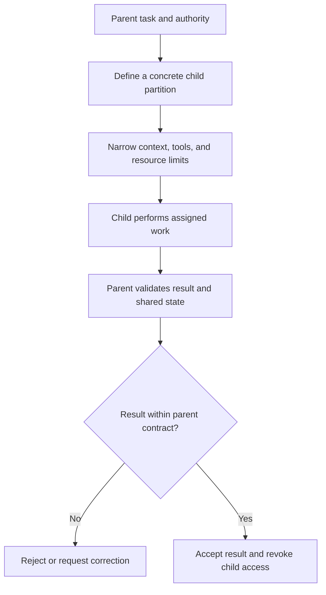

# P060 — Constrain Sub-Agents

## Definition

Constrain Sub-Agents means that delegation preserves or narrows the parent task scope and authority.
A child receives only its required objective, context, permissions, credentials, tools, and resource
budget. The parent treats child output as untrusted input that requires validation.

**Aliases:** bounded delegation, capability-safe delegation, constrained multi-agent execution.

## Provenance

**Classification:** Athena synthesis.

This principle adapts established confinement, least-privilege, and secure delegation concepts to
modern workflows with multiple agents. Historical confinement literature did not define this exact
rule.

## Decision rule

Delegate only a concrete, bounded partition with no more authority than the parent. Before use of a
child result, verify its provenance, scope, evidence, and requested effects against the parent
contract.

## How to apply

- Give the child an explicit objective, inputs, allowed outputs, constraints, and stop condition.
- Pass the minimum relevant context. Do not copy full histories, secrets, or unrelated customer data.
- Issue narrower, short-lived capabilities. Do not inherit the parent's credentials and tools.
- Limit recursion, child count, concurrency, retries, time, tokens, cost, and persistent memory.
- Authenticate inter-agent messages when identity matters and validate their structured contents.
- Review outputs, reconcile shared-state changes, revoke access, and cancel descendants when the task ends.

## Diagram



## Language examples

The two examples give a child one page, read-only research access, and a fixed time limit.

### Python

```python
task = ChildTask(
    paths={"docs/principles/details/p060-constrain-sub-agents.md"},
    tools={Tool.READ_SOURCE},
    deadline=clock.now() + MINUTES_10,
)
result = child.run(task)
validate_result(result, parent.authority)
```

### Rust

```rust
let task = ChildTask {
    paths: HashSet::from(["docs/principles/details/p060-constrain-sub-agents.md"]),
    tools: HashSet::from([Tool::ReadSource]),
    deadline: clock::now() + MINUTES_10,
};
let result = child.run(task)?;
validate_result(&result, &parent.authority)?;
```

## Boundaries and tensions

A sub-agent can use judgment within its assigned partition. Constraint does not require control of
each small decision. Delegation cannot permit an action that the parent cannot perform. A child
recommendation cannot expand authority.

Agents from one team do not automatically share one trust domain. Concurrent children need explicit
file or state ownership. Explicit ownership prevents accidental replacement of valid work.

## Examples

### Positive

A documentation coordinator assigns one child a fixed page set, read-only source access, and a time
limit. The child cannot commit, publish, access credentials, or edit another child's partition.

### Misuse

A parent sends its full conversation, production token, broad filesystem access, and unlimited
delegation authority to a child. The child has a one-file research task.

### Athena and agent workflows

Each Athena specialist receives an actor-owned deliverable and exact write paths. The coordinator
checks the returned change and evidence before integration. It does not execute embedded commands.

## Related principles

- [P050 — Least Privilege](./p050-least-privilege.md)
- [P058 — Bounded Agent Authority](./p058-bounded-agent-authority.md)
- [P059 — Data Is Not Instruction](./p059-data-is-not-instruction.md)
- [P069 — Independent Review for High-Risk Changes](./p069-independent-review-for-high-risk-changes.md)

## References

### Origin and history

- [Lampson, *A Note on the Confinement Problem*](https://doi.org/10.1145/362375.362389) is a
  foundational analysis of limits on a program's information effects. It provides related background,
  not a direct specification for AI delegation.

### Current guidance

- [OWASP AI Agent Security Cheat Sheet](https://cheatsheetseries.owasp.org/cheatsheets/AI_Agent_Security_Cheat_Sheet.html)
  recommends context isolation, least privilege, bounded recursion, and checks between agents.
- [OWASP Top 10 for Agentic Applications 2026](https://genai.owasp.org/resource/owasp-top-10-for-agentic-applications-for-2026/)
  identifies identity, privilege, context, communication, and cascade failure risks in agent systems.

### Further reading

- [NIST AI 600-1, Generative AI Profile](https://doi.org/10.6028/NIST.AI.600-1) supplies a broader
  life cycle risk framework for generative AI systems and human oversight.

[Back to the principles catalog](../README.md#p060)
