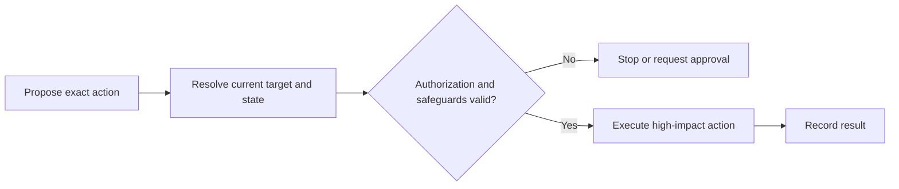

# P061 — Separate Decision from High-Impact Execution

## Definition

Keep the decision for a high-impact action separate from the mechanism that executes the action.
At execution, check authorization, scope, target, parameters, and required approval again. Complete
these checks before any destructive, privileged, persistent, financial, administrative, or public
effect.

**Aliases:** decision/execution separation, execution-time authorization, two-stage action.

## Provenance

**Classification:** Athena synthesis.

No verified source defines this exact rule. The rule combines separation-of-duties controls,
transaction authorization, and current human-AI oversight guidance. The rule does not require two
people for every operation.

## Decision rule

A proposal does not give sufficient authority for a high-impact action. Immediately before
execution, resolve the exact action. Validate its authority and safeguards against the current state.

## How to apply

- Create a reviewable action description before the side effect.
- Bind validation to the resolved target, operation, parameters, identity, and current revision.
- Remove the high-impact capability from plan and dry-run phases when practical.
- Detect state changes between the decision and execution. Validate the action again after a change.
- Record the actor, authorization basis, action, and result when an audit trail is appropriate.

## Diagram



## Language examples

The two examples validate the resolved target and authorization at the execution boundary.

```python
def execute(plan, current, authorized):
    if plan.target != current.target or not authorized(plan):
        raise PermissionError("execution rejected")
    current.apply(plan)
```

```rust
fn execute(plan: &Plan, current: &mut State) -> Result<(), Error> {
    if plan.target != current.target || !authorized(plan) {
        return Err(Error::Rejected);
    }
    current.apply(plan);
    Ok(())
}
```

## Boundaries and tensions

This principle does not require a second person or repeated confirmation for every reversible
action. An authorized operation can proceed after execution-time validation unless policy requires
another gate. [P062 Human Approval](p062-human-approval-for-irreversible-or-high-risk-actions.md)
defines that approval gate. [P052 Separation of Duties](p052-separation-of-duties.md) can require
distinct actors for sensitive work. A ceremonial confirmation with incomplete or stale details does
not satisfy this principle.

## Examples

**Positive:** A deployment plan specifies an immutable release digest and target environment. The
deployment step checks the digest, target, caller authority, required checks, and approval before it
changes production.

**Misuse:** An agent decides to delete a resource. The agent later uses a stored command after the
target and repository state have changed.

**Athena/agent workflow:** A skill can assess a proposed GitHub change without write authority. The
executor resolves the repository and target again. It checks current authorization immediately
before the external change.

## Related principles

- [P052 Separation of Duties](p052-separation-of-duties.md)
- [P058 Bounded Agent Authority](p058-bounded-agent-authority.md)
- [P062 Human Approval for Irreversible or High-Risk Actions](p062-human-approval-for-irreversible-or-high-risk-actions.md)
- [P083 Irreversible Actions Last](p083-irreversible-actions-last.md)

## References

### Origin/history

- [NIST SP 800-53 Rev. 5, control AC-5](https://doi.org/10.6028/NIST.SP.800-53r5) establishes
  separation of duties as a security control. It supports this rule but does not define the full
  Athena rule.

### Current guidance

- [OWASP Transaction Authorization Cheat Sheet](https://cheatsheetseries.owasp.org/cheatsheets/Transaction_Authorization_Cheat_Sheet.html)
  requires the authorizer to see important transaction data. It also protects the sequence from
  authorization to execution.
- [NIST AI RMF 1.0](https://doi.org/10.6028/NIST.AI.100-1) recommends clear roles,
  responsibilities, and oversight for human-AI configurations.

### Further reading

- [OWASP LLM06:2025 Excessive Agency](https://genai.owasp.org/llmrisk/llm062025-excessive-agency/)
  describes transaction safeguards and independent approval for high-impact agent actions.

[Back to the engineering principles catalog](../README.md#p061)
