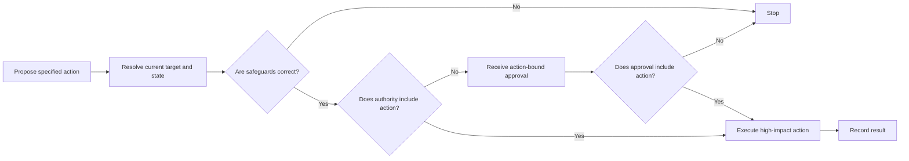

# P061 — Separate Decision from High-Impact Execution

## Definition

Make a decision for a high-impact action independently of the execution mechanism.
At execution, do a new check of authorization, scope, target, parameters, and necessary approval.
Before a destructive, privileged, persistent, financial, administrative, or public effect, complete
these checks.

**Aliases:** decision/execution separation, execution-time authorization, two-stage action.

## Provenance

**Classification:** Athena synthesis.

No verified source specifies this rule. The rule uses separation-of-duties controls,
transaction authorization, and current guidance for human-AI oversight. The rule does not make two
persons necessary for each operation.

## Decision rule

A proposal does not give sufficient authority for a high-impact action. Immediately before
execution, resolve the specified action. Validate its authority and safeguards against the current
state.

## How to apply

- Before the side effect, make a reviewable action description.
- Bind validation to the resolved target, operation, parameters, identity, and current revision.
- When possible, remove the high-impact capability from plan and dry-run phases.
- Find state changes between the decision and execution. After a change, validate the action again.
- When an audit trail is applicable, record the actor, authorization basis, action, and result.

## Diagram



## Language examples

The two examples validate the resolved target and authorization at the execution boundary.

```python
def execute(plan, current, authorize):
    same_action = (
        plan.target == current.target
        and plan.revision == current.revision
        and plan.action_digest == current.action_digest
    )
    if not same_action or not authorize(plan, current):
        raise PermissionError("execution rejected")
    current.apply(plan)
```

```rust
fn execute(plan: &Plan, current: &mut State) -> Result<(), Error> {
    let same_action = plan.target == current.target
        && plan.revision == current.revision
        && plan.action_digest == current.action_digest;
    if !same_action || !authorize(plan, current) {
        return Err(Error::Rejected);
    }
    current.apply(plan);
    Ok(())
}
```

## Boundaries and tensions

This principle does not make a second person or more than one confirmation necessary for each
reversible action. An authorized operation can continue after execution-time validation unless
policy specifies a second gate.
[P062 Human Approval](p062-human-approval-for-irreversible-or-high-risk-actions.md)
specifies that approval gate. [P052 Separation of Duties](p052-separation-of-duties.md) can specify
different actors for sensitive work. A ceremonial confirmation with missing or stale details does
not satisfy this principle.

## Examples

**Positive:** A deployment plan specifies an immutable release digest and target environment. The
deployment step validates the digest, target, caller authority, necessary checks, and approval
before it changes production.

**Misuse:** An agent decides to delete a resource. The target and repository state then change. The
agent uses the stored command.

**Athena/agent workflow:** A skill can examine a proposed GitHub change without write authority. The
executor resolves the repository and target again. It validates current authorization immediately
before the external change.

## Related principles

- [P052 Separation of Duties](p052-separation-of-duties.md)
- [P058 Bounded Agent Authority](p058-bounded-agent-authority.md)
- [P062 Human Approval for Irreversible or High-Risk Actions](p062-human-approval-for-irreversible-or-high-risk-actions.md)
- [P083 Irreversible Actions Last](p083-irreversible-actions-last.md)

## References

### Source information

- [NIST SP 800-53 Rev. 5, control AC-5](https://doi.org/10.6028/NIST.SP.800-53r5) includes
  separation of duties as a security control. It agrees with this rule but does not contain the full
  Athena rule.

### Applicable information

- [OWASP Transaction Authorization Cheat Sheet](https://cheatsheetseries.owasp.org/cheatsheets/Transaction_Authorization_Cheat_Sheet.html)
  states that the authorizer must see important transaction data. It also protects the sequence from
  authorization to execution.
- [NIST AI RMF 1.0](https://doi.org/10.6028/NIST.AI.100-1) recommends clear roles,
  responsibilities, and oversight for human-AI configurations.

### More information

- [OWASP LLM06:2025 Excessive Agency](https://genai.owasp.org/llmrisk/llm062025-excessive-agency/)
  gives information about transaction safeguards and independent approval for high-impact agent
  actions.

[Back to the engineering principles catalog](../README.md#p061)
