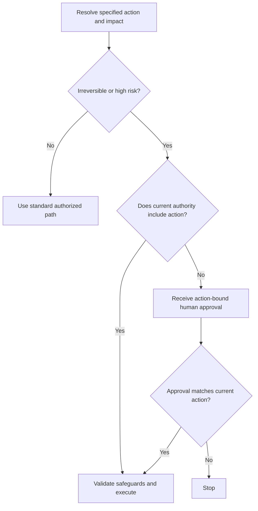

# P062 — Human Approval for Irreversible or High-Risk Actions

## Definition

Before an unauthorized action can cause an irreversible or high-risk effect, receive action-bound
human approval. Such effects include data loss, production changes, privilege changes, secret
exposure, external communication, and high cost. The approval must identify the material action.
General trust in an actor or tool is not approval for that action.

**Aliases:** human-in-the-loop approval, confirmation gate, approval-bound execution.

## Provenance

**Classification:** Athena synthesis.

No verified source specifies this rule. The rule adapts transaction authorization, safety
interlocks, and current guidance about excessive agent authority.

## Decision rule

When specified authority does not include the specified action, stop before the action causes an
irreversible or high-risk effect. Before execution resumes, receive approval for the target, scope,
and material parameters.

## How to apply

- Classify impact from the destination, data, privilege, cost, and reversibility.
- Show the approver the specified action and important parameters in clear terms.
- When the target, scope, material parameters, or risk changes, receive new approval.
- Protect approval credentials and execution state against substitution or replay.
- Pair approval with technical safeguards. Approval without these safeguards does not make a
  dangerous action safe.

## Diagram



## Language examples

Each trusted verifier uses an atomic operation to authenticate the human issuer and validate target,
digest, freshness, nonce, and replay state.

```python
def deploy(plan, token, trusted_verifier, replay):
    trusted_verifier.verify_human_once(
        token=token,
        target=plan.target,
        digest=plan.digest,
        replay=replay,
        now=trusted_now(),
    )
    plan.execute()
```

```rust
fn deploy(
    plan: &Plan,
    token: &ApprovalToken,
    verifier: &TrustedApprovalVerifier,
    replay: &mut ReplayStore,
) -> Result<(), Error> {
    verifier.verify_human_once(
        token, &plan.target, &plan.digest, replay, trusted_now(),
    )?;
    plan.execute();
    Ok(())
}
```

## Boundaries and tensions

Do not make prompts that are not necessary. When the user and task authorize the scope, Athena
authorizes constructive Git, GitHub, and Hephaestus actions. Public visibility does not make a second
approval necessary. Action-bound approval is necessary for destructive, privileged, production,
secret-exposure, high-cost, or unauthorized high-risk actions. Repository policy can specify a
stricter gate. Approval cannot override a higher-priority instruction or security control.

## Examples

**Positive:** Before deletion of a production dataset, the system shows the environment, dataset
identifier, retention result, and recovery status. It executes only after approval for those
details.

**Misuse:** An access checkbox without a specified limit grants resource management. The system uses
that checkbox as permanent approval for each future deletion or deployment.

**Athena/agent workflow:** A user request for a named GitHub issue authorizes that scoped,
constructive write. Approval is necessary before removal of a worktree with uncommitted changes
because removal can cause data loss.

## Related principles

- [P050 Least Privilege](p050-least-privilege.md)
- [P058 Bounded Agent Authority](p058-bounded-agent-authority.md)
- [P061 Separate Decision from High-Impact Execution](p061-separate-decision-from-high-impact-execution.md)
- [P083 Irreversible Actions Last](p083-irreversible-actions-last.md)

## References

### Source information

- [OWASP Transaction Authorization Cheat Sheet](https://cheatsheetseries.owasp.org/cheatsheets/Transaction_Authorization_Cheat_Sheet.html)
  documents the established practice that binds authorization to important transaction data. It
  is not the initial source for the full Athena rule.

### Applicable information

- [OWASP LLM06:2025 Excessive Agency](https://genai.owasp.org/llmrisk/llm062025-excessive-agency/)
  recommends human approval before high-impact agent actions. It also recommends limits for
  available extensions and permissions.
- [NIST AI RMF 1.0, Appendix C](https://airc.nist.gov/airmf-resources/airmf/appendices/app-c-ai-risk-management-and-human-ai-interaction/)
  gives information about human roles and oversight that agree with system context and risk.

### More information

- [NIST AI RMF Core](https://airc.nist.gov/airmf-resources/airmf/5-sec-core/) gives risk-based
  governance outcomes for different oversight responsibilities.

[Back to the engineering principles catalog](../README.md#p062)
