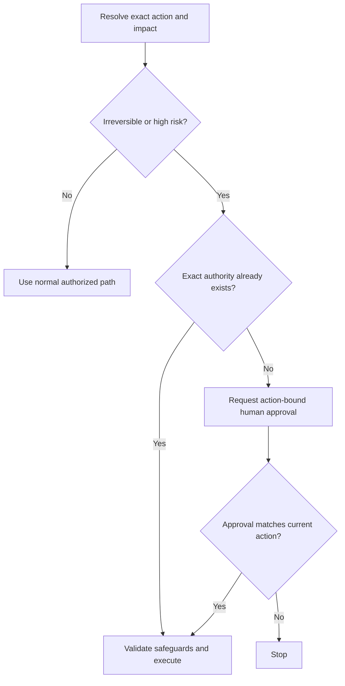

# P062 — Human Approval for Irreversible or High-Risk Actions

## Definition

Obtain explicit human approval before an unauthorized action can cause an irreversible or high-risk
effect. Such effects include data loss, production changes, privilege changes, secret exposure,
external communication, and substantial cost. The approval must identify the material action.
General trust in an actor or tool is not approval for that action.

**Aliases:** human-in-the-loop approval, confirmation gate, approval-bound execution.

## Provenance

**Classification:** Athena synthesis.

No verified source defines this exact rule. The rule adapts transaction authorization, safety
interlocks, and current guidance about excessive agent authority.

## Decision rule

Stop before an irreversible or high-risk effect when explicit authority does not cover the exact
action. Obtain approval for the target, scope, and material parameters.

## How to apply

- Classify impact from the real destination, data, privilege, cost, and reversibility.
- Show the approver the exact action and important parameters in clear terms.
- Ask again when the target, scope, material parameters, or risk changes after approval.
- Protect approval credentials and execution state against substitution or replay.
- Pair approval with technical safeguards. Approval alone does not make an unsafe action safe.

## Diagram



## Language examples

The two examples require human approval that matches the exact target and release digest.

```python
def deploy(plan, approval):
    if not approval.human_confirmed:
        raise PermissionError("human approval is absent")
    if approval.target != plan.target:
        raise PermissionError("target was not approved")
    if approval.digest != plan.digest:
        raise PermissionError("release was not approved")
    plan.execute()
```

```rust
fn deploy(plan: &Plan, approval: &Approval) -> Result<(), Error> {
    if !approval.human_confirmed {
        return Err(Error::HumanApprovalAbsent);
    }
    if approval.target != plan.target || approval.digest != plan.digest {
        return Err(Error::ApprovalMismatch);
    }
    plan.execute();
    Ok(())
}
```

## Boundaries and tensions

Do not create redundant prompts. Athena permits scoped constructive Git, GitHub, and Hephaestus
actions that the user and task already authorize. Public visibility alone does not require a second
approval. Destructive, privileged, production, secret-exposure, costly, or unauthorized high-risk
actions still require explicit approval. Repository policy can require a stricter gate. Approval
never permits an action that a higher-priority instruction or security control prohibits.

## Examples

**Positive:** Before deletion of a production dataset, the system presents the environment, dataset
identifier, retention result, and recovery status. It executes only after approval for those details.

**Misuse:** A generic access checkbox grants broad resource management. The system treats the broad
checkbox as permanent approval for each future deletion or deployment.

**Athena/agent workflow:** A direct request to create a named GitHub issue authorizes that scoped,
constructive write. A worktree with uncommitted changes still requires approval before removal
because removal can destroy data.

## Related principles

- [P050 Least Privilege](p050-least-privilege.md)
- [P058 Bounded Agent Authority](p058-bounded-agent-authority.md)
- [P061 Separate Decision from High-Impact Execution](p061-separate-decision-from-high-impact-execution.md)
- [P083 Irreversible Actions Last](p083-irreversible-actions-last.md)

## References

### Origin/history

- [OWASP Transaction Authorization Cheat Sheet](https://cheatsheetseries.owasp.org/cheatsheets/Transaction_Authorization_Cheat_Sheet.html)
  documents the established practice that binds authorization to important transaction data. It
  does not establish one origin for the broader Athena rule.

### Current guidance

- [OWASP LLM06:2025 Excessive Agency](https://genai.owasp.org/llmrisk/llm062025-excessive-agency/)
  recommends human approval before high-impact agent actions. It also recommends limits for
  available extensions and permissions.
- [NIST AI RMF 1.0, Appendix C](https://airc.nist.gov/airmf-resources/airmf/appendices/app-c-ai-risk-management-and-human-ai-interaction/)
  describes human roles and oversight that reflect system context and risk.

### Further reading

- [NIST AI RMF Core](https://airc.nist.gov/airmf-resources/airmf/5-sec-core/) provides risk-based
  governance outcomes for distinct oversight responsibilities.

[Back to the engineering principles catalog](../README.md#p062)
