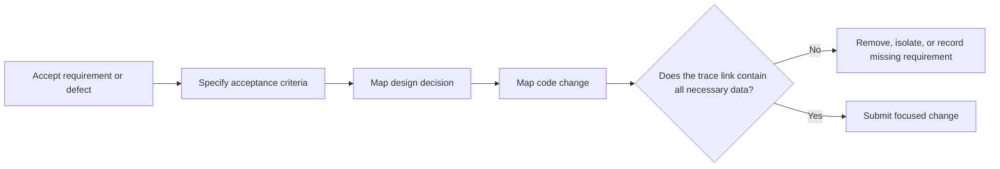

# P063 — Requirement-to-Code Traceability

## Definition

Each important code or artifact change must trace to a requirement, acceptance criterion, defect,
invariant, or necessary implementation dependency. A reviewer must find the applicable trace link.
Standard work does not make a large traceability matrix necessary.

**Aliases:** requirements traceability, change-to-requirement map, implementation provenance.

## Provenance

**Classification:** established principle.

Requirements traceability developed across systems and software engineering. No verified inventor
owns the practice. Formal standards frequently specify bidirectional links between requirements,
design, code, and verification. Athena applies the same discipline in proportion to risk.

## Decision rule

For each important change, identify its accepted requirement or documented dependency. If there is
no link, do one of these actions:

- Remove the change.
- Isolate the work.
- Before implementation, record the missing requirement.

## How to apply

- Before implementation, state the requirement and acceptance criteria.
- Keep each change narrow. Make its issue, plan, or pull-request rationale clear.
- Map important design and code decisions to their requirements.
- Identify migrations, compatibility work, and other support changes as recorded dependencies.
- When requirements or implementation ownership change, update the trace links.

## Diagram



## Language examples

The two examples associate the function with REQ-17 and implement the accepted REQ-17 rule.

```python
def normalize_email(value):
    """REQ-17: Return a lowercase email address without outer spaces."""
    normalized = value.strip().lower()
    return normalized
```

```rust
/// REQ-17: Return a lowercase email address without outer spaces.
fn normalize_email(value: &str) -> String {
    value.trim().to_lowercase()
}
```

## Boundaries and tensions

Traceability proves the link between a requirement and the intent. It does not make a comment or
ticket ID necessary on each line.
Mechanical edits, generated artifacts, and refactors can inherit the rationale of one coherent
parent change. Security or correctness work can be necessary when the initial request omits it.
Then, record the dependency. Do not use traceability to keep an incorrect
implementation or to bypass
[P072 Technical Evidence](p072-technical-evidence-over-preference.md).

## Examples

**Positive:** A schema field, migration, compatibility reader, and removal trigger all reference the
same data-transition requirement that the project accepted.

**Misuse:** A feature pull request includes a dependency update and large refactor that the feature
does not make necessary. No requirement makes the dependency update or the refactor necessary.

**Athena/agent workflow:** A plan assigns an acceptance criterion to each implementation step. It
omits files and process artifacts that have no demonstrated product consumer.

## Related principles

- [P010 Scope Fidelity](p010-scope-fidelity.md)
- [P011 Minimal Coherent Change](p011-minimal-coherent-change.md)
- [P064 Requirement-to-Test Traceability](p064-requirement-to-test-traceability.md)
- [P072 Technical Evidence Over Preference](p072-technical-evidence-over-preference.md)

## References

### Source information

- [NASA SWE-064: Bidirectional Traceability Between Software Design and Software Code](https://swehb.nasa.gov/spaces/7150/pages/16450496/SWE-064%2B-%2BBidirectional%2BTraceability%2BBetween%2BSoftware%2BDesign%2Band%2BSoftware%2BCode)
  documents an established systems-engineering treatment of code traceability. This page does not
  identify the initial source.

### Applicable information

- [NASA SWE-050: Software Requirements](https://swehb.nasa.gov/spaces/SWEHBVD/pages/102695421/SWE-050%2B-%2BSoftware%2BRequirements)
  lists requirement properties and bidirectional lifecycle traceability in the current Software
  Engineering Handbook.
- [NIST SSDF 1.1](https://csrc.nist.gov/pubs/sp/800/218/final) links secure design and code practices
  to documented security requirements and release evidence.

### More information

- [Google Engineering Practices: Small CLs](https://google.github.io/eng-practices/review/developer/small-cls.html)
  shows why reviewers can more easily understand one self-contained conceptual change.

[Back to the engineering principles catalog](../README.md#p063)
