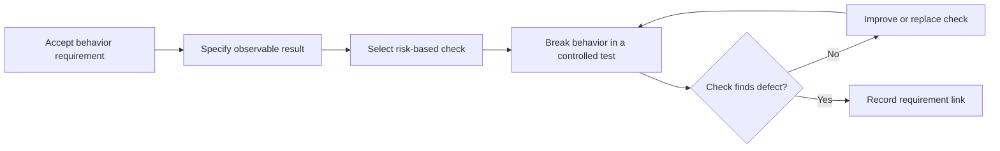

# P064 — Requirement-to-Test Traceability

## Definition

Each behavior change must have verification for its requirement, acceptance criterion, defect, or
invariant. Evidence can include a behavior test, property, integration check, type rule, static
analysis, build check, or a different risk-based method.

**Aliases:** requirements-to-verification traceability, test coverage traceability.

## Provenance

**Classification:** established principle.

Systems and safety engineering use bidirectional requirements-to-test traceability. No verified
inventor owns the practice. Athena uses "test" to include applicable executable verification. The
evidence must exercise the changed behavior.

## Decision rule

For each behavior change, identify evidence that fails when the necessary behavior fails. If
evidence is missing, add it. If a risk-based alternative applies, record its evidence.

## How to apply

- Turn acceptance criteria and invariants into observable verification targets.
- Select the lowest-cost test level that proves the contract.
- When the risk makes boundary integration tests necessary, add them.
- Record the requirement for each non-obvious test or verification group.
- Do a check of failure paths, boundaries, and representative success cases.
- When the accepted contract changes, update the requirement and its tests.

## Diagram



## Language examples

The two examples link REQ-24 to a test that verifies one charge for duplicate requests.

```python
def test_req_24_duplicate_key_creates_one_charge():
    store = ChargeStore()
    charge(store, "key-1")
    charge(store, "key-1")
    assert store.count() == 1
```

```rust
#[test]
fn req_24_duplicate_key_creates_one_charge() {
    let mut store = ChargeStore::new();
    charge(&mut store, "key-1");
    charge(&mut store, "key-1");
    assert_eq!(store.count(), 1);
}
```

## Boundaries and tensions

Traceability is not line coverage or one test for each requirement sentence. It does not make a
manual matrix in each repository. Static checks can prove properties that they fully enforce.

User workflows can make end-to-end evidence necessary. A test gives no evidence when a defect cannot
make the test fail. Before you change its tests, resolve a stale requirement. Apply
[P067 No Test Cheating](p067-no-test-cheating.md).

## Examples

**Positive:** A requirement states that duplicate requests cause one charge. Its integration test
uses one idempotency key again and verifies one stored effect.

**Misuse:** A pull request cites its total coverage percentage. No test exercises the new path for
an authorization failure.

**Athena/agent workflow:** A skill change maps its success and dependency-failure contracts to the
validator or behavior tests. It does not add brittle assertions for prose text.

## Related principles

- [P022 Test Behavior, Not Implementation](p022-test-behavior-not-implementation.md)
- [P026 Regression Before Repair](p026-regression-before-repair.md)
- [P028 Test Failure Paths](p028-test-failure-paths.md)
- [P063 Requirement-to-Code Traceability](p063-requirement-to-code-traceability.md)
- [P067 No Test Cheating](p067-no-test-cheating.md)

## References

### Source information

- [NASA SWE-072: Bidirectional Traceability Between Test Procedures and Requirements](https://swehb.nasa.gov/spaces/7150/pages/16449898/SWE-072%2B-%2BBidirectional%2BTraceability%2BBetween%2BSoftware%2BTest%2BProcedures%2Band%2BSoftware%2BRequirements)
  records the established requirements-to-test practice. This page does not identify the initial
  publication.

### Applicable information

- [NASA SWE-194: Delivery Requirements Verification](https://swehb.nasa.gov/spaces/SWEHBVD/pages/102695529/SWE-194%2B-%2BDelivery%2BRequirements%2BVerification)
  links delivery evidence and test results to individual requirements.
- [NIST SSDF 1.1](https://csrc.nist.gov/pubs/sp/800/218/final) specifies pre-release verification
  practices for human-readable and executable code.

### More information

- [Google Engineering Practices: Tests in small CLs](https://google.github.io/eng-practices/review/developer/small-cls.html#keep-related-test-code-in-the-same-cl)
  shows why behavior changes and their tests belong in the same change.

[Back to the engineering principles catalog](../README.md#p064)
