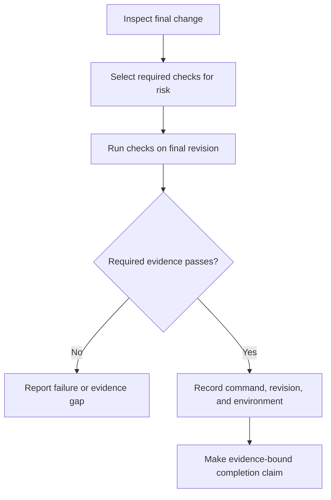

# P065 — Verify Before Claiming Completion

## Definition

Inspect the final change before any completion claim. Run the relevant checks that the repository
defines. Report the command, revision, environment, result, and any unavailable material
verification.

**Aliases:** evidence-backed completion, validation before a success claim.

## Provenance

**Classification:** Athena synthesis.

This rule combines established verification practice with reproducible software-delivery evidence.
No verified source establishes one historical origin. Athena's evidence-integrity policy requires
truthful and reproducible reports.

## Decision rule

Do not convert an expectation into a completion claim. Inspect the delivered state and obtain fresh,
risk-appropriate evidence. Limit the claim to facts that the evidence proves.

## How to apply

- Review the final diff and all generated, staged, and untracked artifacts in scope.
- Run the required tests, build checks, type checks, lint checks, static checks, security checks, and
  package checks.
- Use the final revision and relevant environment. Do not use stale results.
- Record commands, exit status, revision, environment, and meaningful limitations.
- Report failures, skips, unavailable dependencies, and timeouts. Do not invent a substitute success.

## Diagram



## Language examples

The two examples issue a completion result only after they evaluate every recorded check.

```python
def completion_report(revision, checks):
    failed = [name for name, passed in checks.items() if not passed]
    return {
        "revision": revision,
        "complete": not failed,
        "failed": failed,
    }
```

```rust
fn completion_report(revision: &str, checks: &[Check]) -> Report {
    let failed = checks
        .iter()
        .filter(|check| !check.passed)
        .map(|check| check.name.clone())
        .collect();
    Report::new(revision, failed)
}
```

## Boundaries and tensions

Use evidence that is proportional to the risk. Documentation, configuration, and production changes
need different evidence. Successful checks cannot prove requirements that the checks do not
exercise.

Cost does not make an unverified claim true. If a required check cannot run, report the gap. Also
report the command or environment that can provide the absent evidence. Never bypass the gate under
[P068 No Validation Bypass](p068-no-validation-bypass.md).

## Examples

**Positive:** An author inspects the final diff and runs the required gate at the current commit. The
report identifies one unavailable platform test and does not claim that all tests pass.

**Misuse:** A developer changes code after a successful test. The developer cites that stale result
as proof for the new revision.

**Athena/agent workflow:** Before completion, an agent runs `just all` and reports the command
result.
If the full gate cannot finish, the agent identifies each narrower check.

## Related principles

- [P012 Evidence Before Modification](p012-evidence-before-modification.md)
- [P047 Observability Is Part of Correctness](p047-observability-is-part-of-correctness.md)
- [P064 Requirement-to-Test Traceability](p064-requirement-to-test-traceability.md)
- [P068 No Validation Bypass](p068-no-validation-bypass.md)
- [P072 Technical Evidence Over Preference](p072-technical-evidence-over-preference.md)

## References

### Origin/history

- [NIST IR 8397, Guidelines on Minimum Standards for Developer Verification of Software](https://doi.org/10.6028/NIST.IR.8397)
  records a modern consensus set of broad verification techniques. Athena does not treat it as the
  single origin of this rule.

### Current guidance

- [NIST SSDF 1.1](https://csrc.nist.gov/pubs/sp/800/218/final) defines review, analysis, and testing
  practices for software verification before release.
- [Google Engineering Practices: What to look for in a code review](https://google.github.io/eng-practices/review/reviewer/looking-for.html)
  requires reviewers to assess function, tests, design, and the full change context.

### Further reading

- [Athena evidence integrity policy](../../policies/evidence-integrity.md) defines the repository's
  reproducibility and truthful report contract for completion evidence.

[Back to the engineering principles catalog](../README.md#p065)
