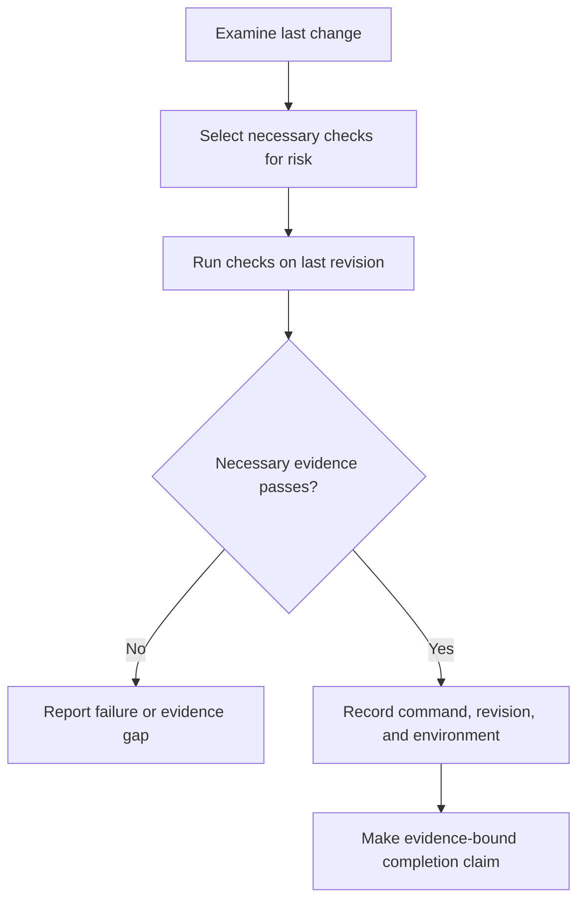

# P065 — Verify Before Claiming Completion

## Definition

Before a completion claim, examine the last change. Run the applicable checks that the repository
specifies. Report the command, revision, environment, result, and important verification gaps.

**Aliases:** evidence-backed completion, validation before a success claim.

## Provenance

**Classification:** Athena synthesis.

This rule uses established verification practice and evidence from software delivery. No verified
source owns this rule. Athena's evidence-integrity policy specifies accurate reports with recorded
commands, revisions, and environments.

## Decision rule

Do not report an expectation as a completion claim. Examine the delivered state. Use current,
risk-based evidence. Limit the claim to facts that the evidence proves.

## How to apply

- Review the last diff and all generated, staged, and untracked artifacts in scope.
- Run the necessary tests, build checks, type checks, lint checks, static checks, security checks,
  and package checks.
- Use the last revision and applicable environment. Do not use stale results.
- Record commands, exit status, revision, environment, and important limitations.
- Report failures, skips, unavailable dependencies, and timeouts. Do not report a pass result
  without evidence.

## Diagram



## Language examples

The two examples issue a completion result only after they examine each recorded check.

```python
def completion_report(revision, checks):
    failed = [name for name, passed in checks.items() if not passed]
    return {
        "revision": revision,
        "complete": not failed,
        "failed": failed,
    }
```

```rust
fn completion_report(revision: &str, checks: &[Check]) -> Report {
    let failed = checks
        .iter()
        .filter(|check| !check.passed)
        .map(|check| check.name.clone())
        .collect();
    Report::new(revision, failed)
}
```

## Boundaries and tensions

Use risk-based evidence. Documentation, configuration, and production changes use different
evidence. Checks that pass cannot prove requirements that the checks do not
exercise.

Cost does not supply evidence for an unverified claim. If a necessary check cannot run, report the
gap. Also report the command or environment that can give the missing evidence. Do not bypass the
gate.
[P068 No Validation Bypass](p068-no-validation-bypass.md) specifies this rule.

## Examples

**Positive:** An author examines the last diff and runs the necessary gate at the current commit.
The report identifies one unavailable platform test and does not claim that all tests pass.

**Misuse:** A developer changes code after a test passes. The developer cites that stale result
as proof for the new revision.

**Athena/agent workflow:** Before completion, an agent runs `just all` and reports the command
result.
If the full gate cannot complete, the agent identifies each narrower check.

## Related principles

- [P012 Evidence Before Modification](p012-evidence-before-modification.md)
- [P047 Observability Is Part of Correctness](p047-observability-is-part-of-correctness.md)
- [P064 Requirement-to-Test Traceability](p064-requirement-to-test-traceability.md)
- [P068 No Validation Bypass](p068-no-validation-bypass.md)
- [P072 Technical Evidence Over Preference](p072-technical-evidence-over-preference.md)

## References

### Source information

- [NIST IR 8397, Guidelines on Minimum Standards for Developer Verification of Software](https://doi.org/10.6028/NIST.IR.8397)
  records a current consensus set of verification techniques. Athena does not identify it as the
  initial source for this rule.

### Applicable information

- [NIST SSDF 1.1](https://csrc.nist.gov/pubs/sp/800/218/final) specifies review, analysis, and testing
  practices for software verification before release.
- [Google Engineering Practices: What to look for in a code review](https://google.github.io/eng-practices/review/reviewer/looking-for.html)
  states that reviewers must examine function, tests, design, and the full change context.

### More information

- [Athena evidence integrity policy](../../policies/evidence-integrity.md) specifies the
  repository's contract for accurate completion-evidence reports with recorded commands, revisions,
  and environments.

[Back to the engineering principles catalog](../README.md#p065)
