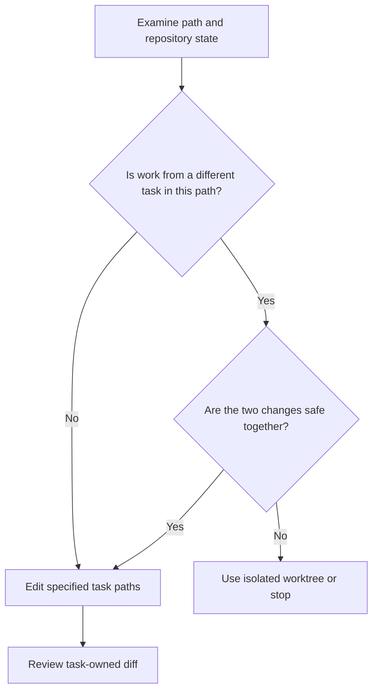

# P066 — Preserve Existing Work

## Definition

Do not revert, overwrite, reformat, regenerate, delete, or remove work from a different task.
Identify earlier modifications. Isolate task-owned edits from them. When you cannot keep the two
sets of work together, stop the task. Before you continue, isolate the task.

**Aliases:** worktree preservation, noninterference with earlier changes.

## Provenance

**Classification:** Athena synthesis.

No verified source specifies this rule. The rule uses version-control safety,
narrow-change practice, and collaborative ownership. The rule gives agents a clear contract for a
shared workspace.

## Decision rule

Before an edit or removal, identify if the path contains work from a different task. If you cannot
keep that work, do not discard or overwrite it without specified authority. Use safe isolation.
If safe isolation is not possible, tell the user that direction is necessary.

## How to apply

- Before an edit or cleanup, examine working-tree, index, branch, and worktree state.
- Attribute changes from the initial state, task scope, and current diff.
- Edit only specified paths. Stage only specified pathsets.
- When concurrent changes cannot be safe together, use an isolated branch or linked worktree.
- Report conflicts or ownership that is not clear. Do not use deletion to resolve them.

## Diagram



## Language examples

The two examples change the task-owned field and keep all other fields.

```python
def update_owned_field(record, value):
    result = record.copy()
    result["owned"] = value
    return result
```

```rust
fn update_owned_field(record: &Record, value: String) -> Record {
    let mut result = record.clone();
    result.owned = value;
    result
}
```

## Boundaries and tensions

Preservation does not make earlier changes immutable. The user can specify a modification,
replacement, or removal. A scoped task can make careful edits to a modified file necessary. A
generated product artifact can also make coherent regeneration necessary.

The rule does not authorize data loss without a report or churn that is not part of the task. It
does not prevent authorized collaboration. A clean repository has no priority over its uncommitted
work.

## Examples

**Positive:** An agent finds edits from a different task in the primary checkout. The agent uses a
new linked worktree and stages only the feature paths.

**Misuse:** A formatter rewrites the full repository to simplify review of one patch. A reset also
removes modifications with ownership that is not known.

**Athena/agent workflow:** A delegated writer finds a second agent on the same skill. The writer
does not edit the overlapping skill file and reports the overlap to the coordinator.

## Related principles

- [P010 Scope Fidelity](p010-scope-fidelity.md)
- [P011 Minimal Coherent Change](p011-minimal-coherent-change.md)
- [P021 Evolutionary and Reversible Design](p021-evolutionary-and-reversible-design.md)
- [P083 Irreversible Actions Last](p083-irreversible-actions-last.md)

## References

### Source information

- [Git worktree documentation](https://git-scm.com/docs/git-worktree) gives information about linked
  worktrees. Its example isolates a high-priority change from active work. It is not the initial
  source for this full principle.

### Applicable information

- [Git status documentation](https://git-scm.com/docs/git-status) specifies inspection of staged,
  unstaged, and untracked working-tree state before an action.
- [Google Engineering Practices: Small CLs](https://google.github.io/eng-practices/review/developer/small-cls.html)
  recommends a different change for a refactor. It also recommends a narrow conceptual focus for
  each change.

### More information

- [Git restore documentation](https://git-scm.com/docs/git-restore) states that restoration
  can replace working-tree content or remove paths. This result makes earlier target resolution
  necessary.

[Back to the engineering principles catalog](../README.md#p066)
