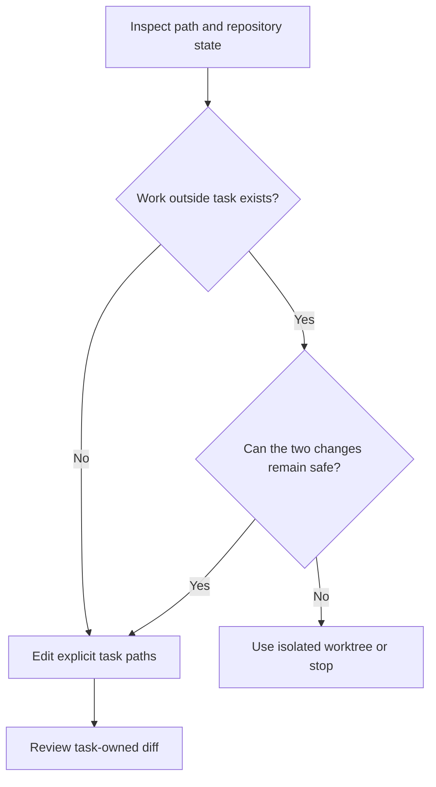

# P066 — Preserve Existing Work

## Definition

Do not revert, overwrite, reformat, regenerate, delete, or remove unrelated work to simplify the
current change. Identify prior modifications and keep task-owned edits distinct. Stop or isolate the
task when you cannot preserve the two sets of work.

**Aliases:** worktree preservation, noninterference with prior changes.

## Provenance

**Classification:** Athena synthesis.

No verified source defines this exact rule. The rule combines version-control safety, narrow-change
practice, and collaborative ownership. It gives agents an explicit contract for a shared workspace.

## Decision rule

Before an edit or removal, determine whether the path contains work outside the current task. If you
cannot preserve that work, do not discard or overwrite it without explicit authority. Use safe
isolation or request direction.

## How to apply

- Inspect working-tree, index, branch, and worktree state before any edit or cleanup.
- Attribute changes from the initial state, task scope, and current diff.
- Edit only intentional paths and stage explicit pathsets.
- Use an isolated branch or linked worktree if concurrent changes overlap unsafely.
- Report conflicts or ambiguous ownership. Do not use deletion to resolve them.

## Diagram



## Language examples

The two examples change the task-owned field and preserve all other fields.

```python
def update_owned_field(record, value):
    result = record.copy()
    result["owned"] = value
    return result
```

```rust
fn update_owned_field(record: &Record, value: String) -> Record {
    let mut result = record.clone();
    result.owned = value;
    result
}
```

## Boundaries and tensions

Preservation does not make prior changes immutable. The user can request a modification, replacement,
or removal. A scoped task can require careful edits to an already modified file. A real generated
product artifact can also require coherent regeneration.

The rule forbids silent loss and unrelated churn. It does not forbid authorized collaboration. A
clean repository is not more valuable than its uncommitted work.

## Examples

**Positive:** An agent finds unrelated edits in the primary checkout. The agent uses a new linked
worktree and stages only the feature paths.

**Misuse:** A formatter rewrites the entire repository to simplify review of one patch. A reset also
removes modifications with unknown ownership.

**Athena/agent workflow:** A delegated writer detects another agent on the same skill. The writer
avoids the overlapping skill file and reports the overlap to the coordinator.

## Related principles

- [P010 Scope Fidelity](p010-scope-fidelity.md)
- [P011 Minimal Coherent Change](p011-minimal-coherent-change.md)
- [P021 Evolutionary and Reversible Design](p021-evolutionary-and-reversible-design.md)
- [P083 Irreversible Actions Last](p083-irreversible-actions-last.md)

## References

### Origin/history

- [Git worktree documentation](https://git-scm.com/docs/git-worktree) describes linked worktrees and
  gives an example that isolates an urgent change from active work. It is not the origin of this
  broader principle.

### Current guidance

- [Git status documentation](https://git-scm.com/docs/git-status) defines inspection of staged,
  unstaged, and untracked working-tree state before an action.
- [Google Engineering Practices: Small CLs](https://google.github.io/eng-practices/review/developer/small-cls.html)
  recommends separate refactors and a narrow conceptual focus for each change.

### Further reading

- [Git restore documentation](https://git-scm.com/docs/git-restore) makes explicit that restoration
  can replace working-tree content or remove paths. This result makes prior target resolution
  necessary.

[Back to the engineering principles catalog](../README.md#p066)
