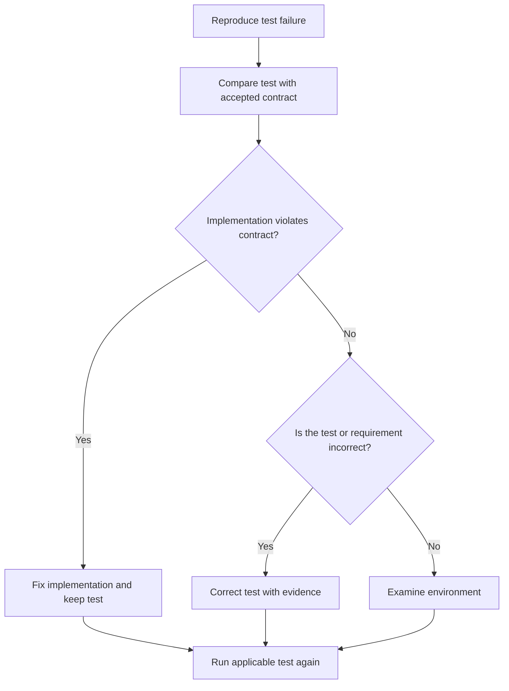

# P067 — No Test Cheating

## Definition

When an implementation violates its intended contract, fix the implementation. Do not decrease
evidence quality.

Do not delete or skip a correct test. Do not change assertions to accept incorrect results. Do not
add mocks with a large scope. Do not report a failure as expected without contract evidence. Do not
change expected values only to make the test pass.

**Aliases:** preserve test integrity, no false success.

## Provenance

**Classification:** Athena synthesis.

This phrase is an Athena rule with no verified initial source. The rule formalizes a property of
tests that give applicable evidence. Such a test rejects defective behavior and agrees with the
accepted contract.

## Decision rule

When a test fails, identify if the implementation, test, environment, or requirement is incorrect.
Only when evidence proves an error in the test contract, setup, or assertion, change the test. An
accepted requirement change can also make a test change necessary. A delivery schedule problem does
not make the change necessary.

## How to apply

- Reproduce the failure. Make sure that the test observes the specified behavior.
- Compare the expectation with current requirements and public contracts.
- When the implementation is incorrect, fix product behavior. Keep the regression test.
- Repair intermittent setup failures, invalid fixtures, or stale expectations with recorded
  evidence.
- Keep mocks narrow to exercise integration and failure behavior.

## Diagram



## Language examples

The two examples keep a specified denial contract for a guest request.

```python
def test_guest_cannot_delete():
    request = DeleteRequest(role="guest")
    response = delete_resource(request)
    assert response.status == 403
```

```rust
#[test]
fn guest_cannot_delete() {
    let request = DeleteRequest::new(Role::Guest);
    let response = delete_resource(request);
    assert_eq!(response.status, 403);
}
```

## Boundaries and tensions

Tests can contain defects and do not automatically specify the contract. An accepted contract change
can make a test change necessary. Repair obsolete or nondeterministic tests. Do not keep them only
to satisfy a process requirement.

Repository policy can authorize a narrow, documented skip for an unsupported environment. The skip
does not prove a pass result for the missing test. Use evidence from
[P072](p072-technical-evidence-over-preference.md) for the contract decision.

## Examples

**Positive:** A regression test shows a missing authorization check. The author fixes the
implementation and keeps the test. The test fails if the defect returns.

**Misuse:** An author changes a failed assertion from a specified denied status to one that accepts
all responses. No requirement makes the change necessary. The author does not correct the defect.

**Athena/agent workflow:** An agent examines a validator contract failure. The agent corrects the
validator or a fixture that evidence proves incorrect. The agent does not change prose or delete the
case only to pass
`just test`.

## Related principles

- [P022 Test Behavior, Not Implementation](p022-test-behavior-not-implementation.md)
- [P026 Regression Before Repair](p026-regression-before-repair.md)
- [P064 Requirement-to-Test Traceability](p064-requirement-to-test-traceability.md)
- [P068 No Validation Bypass](p068-no-validation-bypass.md)
- [P072 Technical Evidence Over Preference](p072-technical-evidence-over-preference.md)

## References

### Source information

- [Google Engineering Practices: What to look for in tests](https://google.github.io/eng-practices/review/reviewer/looking-for.html#tests)
  states that tests must be correct and give applicable evidence. Tests must also fail when code is
  defective. Athena does not claim this source as the initial source for its label.

### Applicable information

- [NIST SSDF 1.1](https://csrc.nist.gov/pubs/sp/800/218/final) lists code review, analysis, and
  executable tests as software verification controls before release.
- [Google Engineering Practices: Tests in small CLs](https://google.github.io/eng-practices/review/developer/small-cls.html#keep-related-test-code-in-the-same-cl)
  states that logic changes must have applicable tests. It also states that refactors must have test
  coverage.

### More information

- [pytest documentation: How to use skip and xfail](https://docs.pytest.org/en/stable/how-to/skipping.html)
  documents permitted uses and results for skipped or expected-failure tests. These markers report a
  limitation, not a test pass.

[Back to the engineering principles catalog](../README.md#p067)
