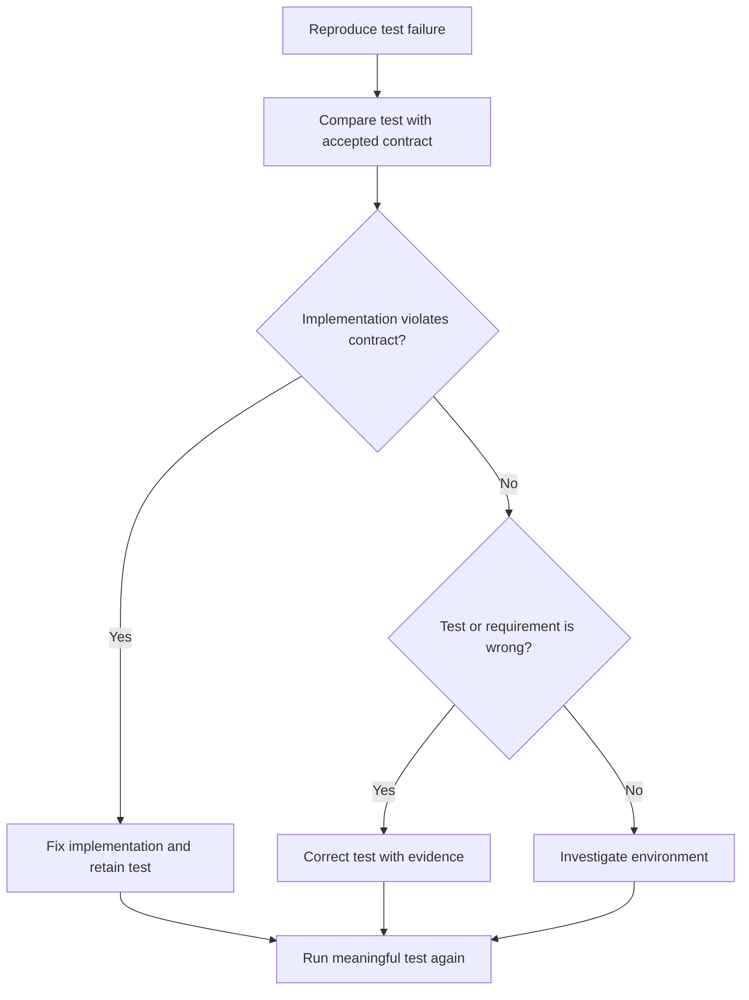

# P067 — No Test Cheating

## Definition

When an implementation violates its intended contract, fix the implementation. Do not weaken the
evidence. Do not delete or skip a valid test. Do not loosen assertions, add broad mocks, mark a real
failure as expected, or change expected values only to obtain a successful status.

**Aliases:** preserve test integrity, no false success.

## Provenance

**Classification:** Athena synthesis.

This phrase is an Athena rule with no verified single origin. The rule formalizes a property of
useful tests. A useful test rejects defective behavior and stays consistent with the accepted
contract.

## Decision rule

When a test fails, identify whether the implementation, test, environment, or requirement is wrong.
Change the test only when evidence proves an error in the test contract, setup, or assertion. An
accepted requirement change can also require a test change. A delivery delay alone does not justify
the change.

## How to apply

- Reproduce the failure and confirm what behavior the test observes.
- Compare the expectation with current requirements and public contracts.
- Fix product behavior when the implementation is wrong and retain the regression test.
- Repair flaky setup, invalid fixtures, or stale expectations with an explicit rationale.
- Keep mocks narrow so tests still exercise integration and failure behavior.

## Diagram



## Language examples

The two examples retain an exact denial contract for a guest request.

```python
def test_guest_cannot_delete():
    request = DeleteRequest(role="guest")
    response = delete_resource(request)
    assert response.status == 403
```

```rust
#[test]
fn guest_cannot_delete() {
    let request = DeleteRequest::new(Role::Guest);
    let response = delete_resource(request);
    assert_eq!(response.status, 403);
}
```

## Boundaries and tensions

Tests can contain defects and are not automatically authoritative. An accepted contract change can
require a test change. Repair obsolete or nondeterministic tests. Do not preserve them only for
ceremony.

Repository policy can permit a narrow, documented skip for an unsupported environment. The skip
does not prove a successful result for the absent test. Requirement evidence under
[P072](p072-technical-evidence-over-preference.md) decides the contract.

## Examples

**Positive:** A regression test exposes an absent authorization check. The author fixes the
implementation and retains the test. The test fails if the defect returns.

**Misuse:** An author changes a failed assertion from an exact denied status to "any response." No
requirement supports the change, and the defect remains.

**Athena/agent workflow:** An agent investigates a validator contract failure. The agent corrects the
validator or a provably wrong fixture. The agent does not change prose or delete the case only to pass
`just test`.

## Related principles

- [P022 Test Behavior, Not Implementation](p022-test-behavior-not-implementation.md)
- [P026 Regression Before Repair](p026-regression-before-repair.md)
- [P064 Requirement-to-Test Traceability](p064-requirement-to-test-traceability.md)
- [P068 No Validation Bypass](p068-no-validation-bypass.md)
- [P072 Technical Evidence Over Preference](p072-technical-evidence-over-preference.md)

## References

### Origin/history

- [Google Engineering Practices: What to look for in tests](https://google.github.io/eng-practices/review/reviewer/looking-for.html#tests)
  states that tests must be valid and useful. Tests must also fail when code is defective. Athena
  does not claim this source as the origin of its label.

### Current guidance

- [NIST SSDF 1.1](https://csrc.nist.gov/pubs/sp/800/218/final) treats code review, analysis, and
  executable tests as software verification controls before release.
- [Google Engineering Practices: Tests in small CLs](https://google.github.io/eng-practices/review/developer/small-cls.html#keep-related-test-code-in-the-same-cl)
  requires relevant tests for logic changes. It also requires test coverage for refactors.

### Further reading

- [pytest documentation: How to use skip and xfail](https://docs.pytest.org/en/stable/how-to/skipping.html)
  documents valid uses and results for skipped or expected-failure tests. These markers report a
  limitation, not a successful test.

[Back to the engineering principles catalog](../README.md#p067)
