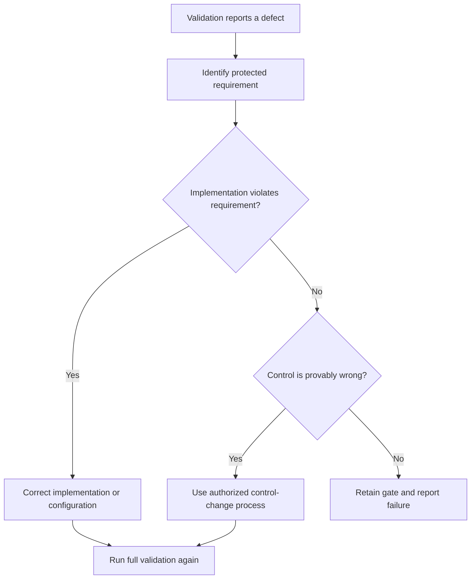

# P068 — No Validation Bypass

## Definition

Do not disable, evade, or misreport a validator because it exposes a problem. Validators include
type checks, lint rules, compiler warnings, security controls, CI gates, authorization checks, and
runtime checks. Fix the cause. An exception must be narrow, justified, and part of the repository's
authorized process.

**Aliases:** no gate bypass, preserve validation integrity.

## Provenance

**Classification:** Athena synthesis.

No verified source defines this exact rule. The rule combines secure-development verification,
defense in depth, and protected-branch practice. It gives contributors a clear constraint.

## Decision rule

Treat a validation failure as evidence that requires investigation. Do not reduce control coverage
or enforcement unless evidence proves that the control is wrong. An authorized correction or
exception must preserve the intended protection.

## How to apply

- Reproduce the validation result and identify the requirement the control enforces.
- Correct the implementation, configuration, dependency, or test that violates that requirement.
- Use the normal ownership and review process to change a defective rule.
- Keep unavoidable suppressions local, explained, reviewable, and removable when practical.
- Report each check that did not run or had a skip. Never present absence of failure as success.

## Diagram



## Language examples

The two examples stop publication when the validator reports an error.

```python
def publish(change):
    errors = validate(change)
    if errors:
        raise ValidationError(errors)
    repository.publish(change)
```

```rust
fn publish(change: &Change) -> Result<(), Error> {
    validate(change)?;
    repository::publish(change)?;
    Ok(())
}
```

## Boundaries and tensions

Validation mechanisms can produce false positives or conflict with a new accepted requirement. They
can also be unavailable. A correction is not a bypass when the protection remains effective and the
change follows repository policy. An emergency path is valid only when it already exists, preserves
required safeguards, and records the exception. Administrative ability to bypass a gate does not
give authority to use the bypass.

## Examples

**Positive:** A linter exposes an unsafe shell command. The author corrects the command and keeps the
rule active.

**Misuse:** A pull request adds a broad suppression or disables a required check. The author wants to
avoid a delay from correction of the reported defect.

**Athena/agent workflow:** When `just all` fails, the agent investigates and reports the real result.
The agent never uses `--no-verify` or edits expected output. It does not describe a narrower
successful command as the full gate.

## Related principles

- [P020 Executable Architecture](p020-executable-architecture.md)
- [P054 Defense in Depth](p054-defense-in-depth.md)
- [P065 Verify Before Claiming Completion](p065-verify-before-claiming-completion.md)
- [P067 No Test Cheating](p067-no-test-cheating.md)
- [P072 Technical Evidence Over Preference](p072-technical-evidence-over-preference.md)

## References

### Origin/history

- [NIST SP 800-218, Secure Software Development Framework 1.1](https://doi.org/10.6028/NIST.SP.800-218)
  combines established secure review, analysis, and test practices. Athena does not claim it as the
  single origin of this rule.

### Current guidance

- [GitHub: About protected branches](https://docs.github.com/en/repositories/configuring-branches-and-merges-in-your-repository/managing-protected-branches/about-protected-branches)
  documents enforceable review gates, status-check gates, and explicit bypass controls.
- [NIST SSDF 1.1](https://csrc.nist.gov/pubs/sp/800/218/final) requires verification of human-
  readable and executable code. It also requires correction of known vulnerabilities before release.

### Further reading

- [OWASP Application Security Verification Standard](https://owasp.org/www-project-application-security-verification-standard/)
  provides a maintained basis for security verification requirements. It does not support ad hoc
  gate removal.

[Back to the engineering principles catalog](../README.md#p068)
