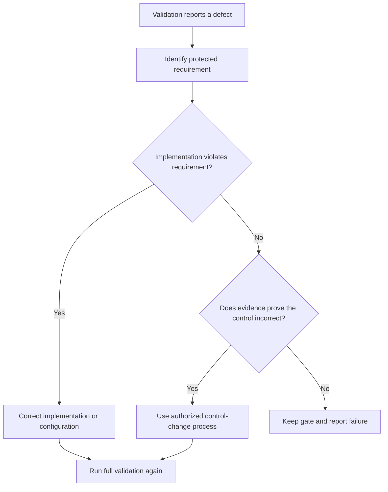

# P068 — No Validation Bypass

## Definition

When a validator finds a problem, do not disable or bypass the validator. Do not report an incorrect
validation result.

Validators include type checks, lint rules, compiler warnings, security controls, CI gates,
authorization checks, and runtime checks. Fix the cause. An exception must be narrow. Evidence must
show its necessity. The repository's authorized process must include it.

**Aliases:** no gate bypass, preserve validation integrity.

## Provenance

**Classification:** Athena synthesis.

No verified source specifies this rule. The rule uses secure-development verification,
defense in depth, and protected-branch practice. It gives contributors a clear constraint.

## Decision rule

When validation fails, use the result as evidence. Examine the cause. If evidence does not prove
that the control is incorrect, do not decrease control coverage or enforcement. When the repository
process authorizes a correction or exception, keep the intended protection.

## How to apply

- Reproduce the validation result. Identify the requirement that the control enforces.
- Correct the implementation, configuration, dependency, or test that violates that requirement.
- Use the standard ownership and review process to change a defective rule.
- Keep a necessary suppression local. Record its cause. Make its review and removal easy.
- If a check did not run or had a skip, report it. If no check ran, do not report a pass.

## Diagram



## Language examples

The two examples stop publication when the validator reports an error.

```python
def publish(change):
    errors = validate(change)
    if errors:
        raise ValidationError(errors)
    repository.publish(change)
```

```rust
fn publish(change: &Change) -> Result<(), Error> {
    validate(change)?;
    repository::publish(change)?;
    Ok(())
}
```

## Boundaries and tensions

Validation mechanisms can give false positives or conflict with a new accepted requirement. They
can also be unavailable. When the protection operates correctly and the change obeys repository
policy, a correction is not a bypass. Before use, the repository must specify an emergency path.
That path must keep necessary safeguards and record the exception. Administrative permission to
bypass a gate does not give authority to use the bypass.

## Examples

**Positive:** A linter finds a dangerous shell command. The author corrects the command and keeps
the rule active.

**Misuse:** A pull request adds a suppression with a large scope or disables a necessary check. The
author wants to complete the correction in less time.

**Athena/agent workflow:** When `just all` fails, the agent examines and reports the result. The
agent does not use `--no-verify` or edit expected output. It does not report a narrower command that
passed as the full gate.

## Related principles

- [P020 Executable Architecture](p020-executable-architecture.md)
- [P054 Defense in Depth](p054-defense-in-depth.md)
- [P065 Verify Before Claiming Completion](p065-verify-before-claiming-completion.md)
- [P067 No Test Cheating](p067-no-test-cheating.md)
- [P072 Technical Evidence Over Preference](p072-technical-evidence-over-preference.md)

## References

### Source information

- [NIST SP 800-218, Secure Software Development Framework 1.1](https://doi.org/10.6028/NIST.SP.800-218)
  includes established secure review, analysis, and test practices. Athena does not claim it as the
  initial source for this rule.

### Applicable information

- [GitHub: About protected branches](https://docs.github.com/en/repositories/configuring-branches-and-merges-in-your-repository/managing-protected-branches/about-protected-branches)
  documents enforceable review gates, status-check gates, and specified bypass controls.
- [NIST SSDF 1.1](https://csrc.nist.gov/pubs/sp/800/218/final) states that personnel must verify
  human-readable and executable code. It also states that personnel must correct known
  vulnerabilities before release.

### More information

- [OWASP Application Security Verification Standard](https://owasp.org/www-project-application-security-verification-standard/)
  gives a maintained basis for security verification requirements. It does not authorize gate
  removal without approval.

[Back to the engineering principles catalog](../README.md#p068)
