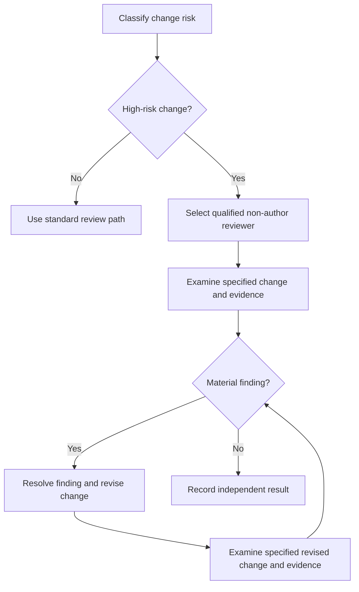

# P069 — Independent Review for High-Risk Changes

## Definition

An independent reviewer must examine each security-critical or availability-critical change. The
review depth must match the risk. The reviewer must know the affected domain. The reviewer must
examine the specified change and evidence. Agreement with the author's result is not sufficient.

**Aliases:** independent technical review, qualified second review.

## Provenance

**Classification:** established principle.

Michael Fagan documented independent software inspection at IBM during the 1970s. Code-review and
secure-development guidance specify independent, domain-qualified assessment in proportion to risk.

## Decision rule

Before acceptance of a high-risk change, receive a review from a qualified reviewer who did not
author the change. The reviewer must examine assumptions. The reviewer must examine evidence. The
reviewer must report findings independently. Author agreement is not necessary.

## How to apply

- Classify risk from the changed trust boundaries, data, concurrency, migration, or operations.
- Select reviewers for specialized areas such as security, privacy, cryptography, concurrency,
  infrastructure, or the applicable domain.
- Give the reviewer the requirements, specified revision, full diff, tests, and known limitations.
- Record the author and reviewer conclusions independently.
- Clearly record the resolution of material findings.
- When impact and uncertainty increase, increase review independence and depth.

## Diagram



## Language examples

The two examples use one immutable digest of the same change, author independence, and domain
qualification before acceptance.

```python
def accept(change, review):
    if review.change_digest != change.digest:
        raise ValueError("review does not match change")
    if review.author == change.author:
        raise ValueError("reviewer is not independent")
    if change.domain not in review.qualifications:
        raise ValueError("reviewer is not qualified")
    return review.approved
```

```rust
fn accept(change: &Change, review: &Review) -> Result<bool, Error> {
    if review.change_digest != change.digest {
        return Err(Error::StaleReview);
    }
    if review.author == change.author {
        return Err(Error::SameAuthor);
    }
    if !review.qualifications.contains(&change.domain) {
        return Err(Error::UnqualifiedReviewer);
    }
    Ok(review.approved)
}
```

## Boundaries and tensions

A human reviewer is not always necessary for independent review. A qualified agent or specialist
can do a new, bounded review. Repository policy can specify a human, Code Owner, regulated role, or
approval count.
Automated analysis can add evidence to a review but usually does not supply all contextual
judgment. A non-author agreement without analysis is not an independent review. Low-risk work does
not make a large review process necessary.

## Examples

**Positive:** A security specialist did not author an authorization change. The specialist reviews
the specified commit, threat boundary, negative tests, and release behavior before acceptance.

**Misuse:** A team member approves cryptographic code without an inspection or knowledge of the
primitive. The approval only satisfies a necessary count.

**Athena/agent workflow:** A coordinator assigns a high-risk diff to an independent review agent.
The task has specified criteria. The criteria do not tell the reviewer to agree with the author's
result.
The coordinator reports unresolved findings to the user.

## Related principles

- [P052 Separation of Duties](p052-separation-of-duties.md)
- [P054 Defense in Depth](p054-defense-in-depth.md)
- [P061 Separate Decision from High-Impact Execution](p061-separate-decision-from-high-impact-execution.md)
- [P065 Verify Before Claiming Completion](p065-verify-before-claiming-completion.md)

## References

### Source information

- [Fagan, "Design and Code Inspections to Reduce Errors in Program Development" (1976)](https://doi.org/10.1147/sj.153.0182)
  is a primary account of structured software inspection with specified roles.

### Applicable information

- [Google Engineering Practices: What to look for in a code review](https://google.github.io/eng-practices/review/reviewer/looking-for.html)
  states that authors must involve qualified reviewers for complex areas. Examples include security,
  privacy, and concurrency.
- [NIST SSDF 1.1](https://csrc.nist.gov/pubs/sp/800/218/final) lists code review and analysis as
  practices that identify vulnerabilities before release.

### More information

- [OWASP Secure Code Review Cheat Sheet](https://cheatsheetseries.owasp.org/cheatsheets/Secure_Code_Review_Cheat_Sheet.html)
  gives information about risk-based manual review and context that automated tools can miss.

[Back to the engineering principles catalog](../README.md#p069)
