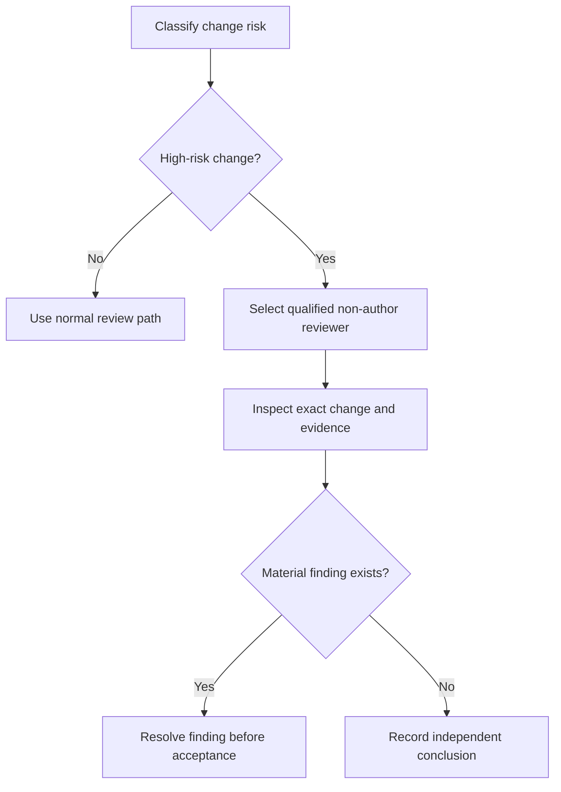

# P069 — Independent Review for High-Risk Changes

## Definition

An independent reviewer must assess each security-critical or availability-critical change. The
review depth must match the risk. The reviewer must know the affected domain and examine the actual
change and evidence. An endorsement of the author's conclusion is not sufficient.

**Aliases:** independent technical review, qualified second review.

## Provenance

**Classification:** established principle.

Michael Fagan documented independent software inspection at IBM during the 1970s. Modern code review
and secure-development guidance require independent, domain-qualified assessment in proportion to
risk.

## Decision rule

Before acceptance of a high-risk change, obtain a review from a qualified reviewer who did not
author the change. The reviewer must challenge assumptions, inspect evidence, and report findings
without pressure to agree with the author.

## How to apply

- Classify risk from the changed trust boundaries, data, concurrency, migration, or operations.
- Assign specialized areas to reviewers who know security, privacy, cryptography, concurrency,
  infrastructure, or the relevant domain.
- Give the reviewer the requirements, exact revision, full diff, tests, and known limitations.
- Keep author and reviewer conclusions distinguishable and resolve material findings explicitly.
- Increase independence and depth as consequence and uncertainty increase.

## Diagram



## Language examples

The two examples require a matching immutable change digest, author independence, and domain
qualification before acceptance.

```python
def accept(change, review):
    if review.change_digest != change.digest:
        raise ValueError("review does not match change")
    if review.author == change.author:
        raise ValueError("reviewer is not independent")
    if change.domain not in review.qualifications:
        raise ValueError("reviewer is not qualified")
    return review.approved
```

```rust
fn accept(change: &Change, review: &Review) -> Result<bool, Error> {
    if review.change_digest != change.digest {
        return Err(Error::StaleReview);
    }
    if review.author == change.author {
        return Err(Error::SameAuthor);
    }
    if !review.qualifications.contains(&change.domain) {
        return Err(Error::UnqualifiedReviewer);
    }
    Ok(review.approved)
}
```

## Boundaries and tensions

Independent does not always mean human. A separate qualified agent or specialist can perform a
fresh, bounded review. Repository policy can instead require a human, Code Owner, regulated role, or
approval count. Automated analysis can support a review but rarely supplies all contextual judgment.
A non-author endorsement without analysis is not an independent review. Low-risk routine work does
not require a large review process.

## Examples

**Positive:** A security specialist did not author an authorization change. The specialist reviews
the exact commit, threat boundary, negative tests, and release behavior before acceptance.

**Misuse:** A teammate approves cryptographic code without an inspection or knowledge of the
primitive. The approval only satisfies a required count.

**Athena/agent workflow:** A coordinator assigns a high-risk diff to a separate review agent. The
task has explicit criteria and does not request confirmation of the author's result. The coordinator
reports unresolved findings to the user.

## Related principles

- [P052 Separation of Duties](p052-separation-of-duties.md)
- [P054 Defense in Depth](p054-defense-in-depth.md)
- [P061 Separate Decision from High-Impact Execution](p061-separate-decision-from-high-impact-execution.md)
- [P065 Verify Before Claiming Completion](p065-verify-before-claiming-completion.md)

## References

### Origin/history

- [Fagan, "Design and Code Inspections to Reduce Errors in Program Development" (1976)](https://doi.org/10.1147/sj.153.0182)
  is a foundational primary account of structured, role-based software inspection.

### Current guidance

- [Google Engineering Practices: What to look for in a code review](https://google.github.io/eng-practices/review/reviewer/looking-for.html)
  directs authors to involve qualified reviewers for complex areas. Examples include security,
  privacy, and concurrency.
- [NIST SSDF 1.1](https://csrc.nist.gov/pubs/sp/800/218/final) includes code review and analysis
  among the practices that identify vulnerabilities before release.

### Further reading

- [OWASP Secure Code Review Cheat Sheet](https://cheatsheetseries.owasp.org/cheatsheets/Secure_Code_Review_Cheat_Sheet.html)
  explains risk-based manual review and the context that automated tools can miss.

[Back to the engineering principles catalog](../README.md#p069)
