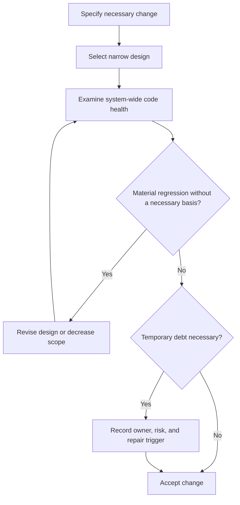

# P070 — Code Health Must Not Regress

## Definition

A correct local result does not prove the quality of the full change. Without a necessary technical
basis, a change must not decrease clarity, maintenance quality, test quality, operation
quality, adaptability, or security. Use incremental improvement. Prevent code decay. Do not make
perfection necessary.

**Aliases:** leave the codebase no worse, continuous code-health improvement.

## Provenance

**Classification:** practitioner heuristic.

This rule agrees with Google's published code-review standard. Many practitioners use related
"leave it better" heuristics. No verified source has exclusive ownership of the full heuristic.

## Decision rule

When a change completes necessary work without a material loss of code health, accept it although
it is not perfect. When a design has an unnecessary code-health cost that is more than its scoped
benefit, revise it. If a revision cannot remove that cost, reject the design. Examine maintenance,
complexity, test quality, operation, and security costs.

## How to apply

- Examine design, complexity, tests, naming, documentation, operation, and security in context.
- Prevent a system-wide decrease in code health from a sequence of small local compromises.
- Distinguish necessary corrections from optional style changes. Identify optional suggestions
  clearly.
- Use small, coherent changes that are easy to review, revert, and make better.
- When you accept debt, document its necessity, owner, risk, and repair trigger.

## Diagram



## Language examples

The two examples add one clear data transformation with clear names and no new framework.

```python
def visible_tasks(tasks):
    eligible = [task for task in tasks if task.active]
    ordered = sorted(eligible, key=lambda task: task.priority)
    return [task.title for task in ordered]
```

```rust
fn visible_tasks(tasks: &[Task]) -> Vec<&str> {
    let mut eligible: Vec<_> = tasks.iter().filter(|task| task.active).collect();
    eligible.sort_by_key(|task| task.priority);
    eligible.iter().map(|task| task.title.as_str()).collect()
}
```

## Boundaries and tensions

This principle does not authorize cleanup that is not part of the task or style changes that are not
necessary. It does not make perfect code necessary before delivery.
[P010 Scope Fidelity](p010-scope-fidelity.md) continues to limit the change. An emergency can make a
recorded temporary compromise necessary. A local convention does not authorize extension of a known
defect. Repository-wide repair can belong to a different task.

## Examples

**Positive:** A small feature uses the established interface and adds focused tests. It also makes
one name in the changed area clearer without a large refactor.

**Misuse:** A second copy duplicates security policy because a change to the canonical component has
a larger scope.

**Athena/agent workflow:** A reviewer separates a necessary contract-drift finding from an optional
preference. This distinction protects the skill corpus without an expansion of task scope.

## Related principles

- [P010 Scope Fidelity](p010-scope-fidelity.md)
- [P011 Minimal Coherent Change](p011-minimal-coherent-change.md)
- [P065 Verify Before Claiming Completion](p065-verify-before-claiming-completion.md)
- [P071 Consistency Over Personal Preference](p071-consistency-over-personal-preference.md)
- [P072 Technical Evidence Over Preference](p072-technical-evidence-over-preference.md)

## References

### Source information

- [Google Engineering Practices: The standard of code review](https://google.github.io/eng-practices/review/reviewer/standard.html)
  is the primary practitioner source for code health as the primary review purpose. This page
  does not identify all earlier sources.

### Applicable information

- [Google Engineering Practices: What to look for in a code review](https://google.github.io/eng-practices/review/reviewer/looking-for.html)
  applies code health to design, function, complexity, tests, names, comments, style, and
  documentation.

### More information

- [Google Engineering Practices: Small CLs](https://google.github.io/eng-practices/review/developer/small-cls.html)
  shows that narrow changes increase review depth and design quality. Narrow changes also make
  reversal and maintenance easier.

[Back to the engineering principles catalog](../README.md#p070)
