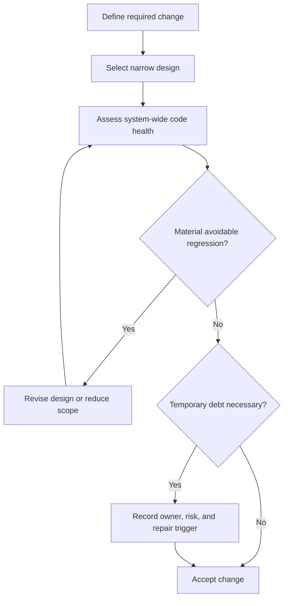

# P070 — Code Health Must Not Regress

## Definition

A correct local result does not make a change acceptable. The change must not cause an unnecessary
loss of system clarity, maintenance quality, test quality, operation quality, adaptability, or
security. Prefer incremental improvement to gradual decay or impossible perfection.

**Aliases:** leave the codebase no worse, continuous code-health improvement.

## Provenance

**Classification:** practitioner heuristic.

This rule closely aligns with Google's published code-review standard. Related "leave it better"
heuristics are common. No verified source has exclusive ownership of the broader heuristic.

## Decision rule

Accept an imperfect change when it makes required progress without a material loss of code health.
Reject or revise a shortcut when its avoidable cost exceeds its scoped benefit. Assess maintenance,
complexity, test quality, operation, and security costs.

## How to apply

- Evaluate design, complexity, tests, naming, documentation, operation, and security in context.
- Prevent systemic decay from a sequence of small local compromises.
- Distinguish required corrections from optional polish. Label optional suggestions clearly.
- Prefer small, coherent changes that are easy to review, revert, and improve further.
- Document accepted debt only when its need, owner, risk, and repair trigger are concrete.

## Diagram



## Language examples

The two examples add one clear data transformation with explicit names and no new framework.

```python
def visible_tasks(tasks):
    eligible = [task for task in tasks if task.active]
    ordered = sorted(eligible, key=lambda task: task.priority)
    return [task.title for task in ordered]
```

```rust
fn visible_tasks(tasks: &[Task]) -> Vec<&str> {
    let mut eligible: Vec<_> = tasks.iter().filter(|task| task.active).collect();
    eligible.sort_by_key(|task| task.priority);
    eligible.iter().map(|task| task.title.as_str()).collect()
}
```

## Boundaries and tensions

This principle does not permit unrelated cleanup, excess polish, or a demand for perfect code before
delivery. [P010 Scope Fidelity](p010-scope-fidelity.md) still limits the change. An emergency can
require an explicit temporary compromise. A local convention does not justify extension of a known
defect. Repository-wide repair can belong to a separate task.

## Examples

**Positive:** A small feature uses the established interface and adds focused tests. It also makes
one nearby name clearer without a broad refactor.

**Misuse:** A shortcut duplicates security policy in a second location because a change to the
canonical component needs more time.

**Athena/agent workflow:** A reviewer separates a required contract-drift finding from an optional
preference. This distinction protects the skill corpus without an expansion of task scope.

## Related principles

- [P010 Scope Fidelity](p010-scope-fidelity.md)
- [P011 Minimal Coherent Change](p011-minimal-coherent-change.md)
- [P065 Verify Before Claiming Completion](p065-verify-before-claiming-completion.md)
- [P071 Consistency Over Personal Preference](p071-consistency-over-personal-preference.md)
- [P072 Technical Evidence Over Preference](p072-technical-evidence-over-preference.md)

## References

### Origin/history

- [Google Engineering Practices: The standard of code review](https://google.github.io/eng-practices/review/reviewer/standard.html)
  is the direct practitioner source for overall code health as the primary review purpose. This page
  does not assign broader antecedents to one origin.

### Current guidance

- [Google Engineering Practices: What to look for in a code review](https://google.github.io/eng-practices/review/reviewer/looking-for.html)
  applies code health to design, function, complexity, tests, names, comments, style, and
  documentation.

### Further reading

- [Google Engineering Practices: Small CLs](https://google.github.io/eng-practices/review/developer/small-cls.html)
  explains how narrow changes improve review depth, design quality, reversal, and maintenance.

[Back to the engineering principles catalog](../README.md#p070)
