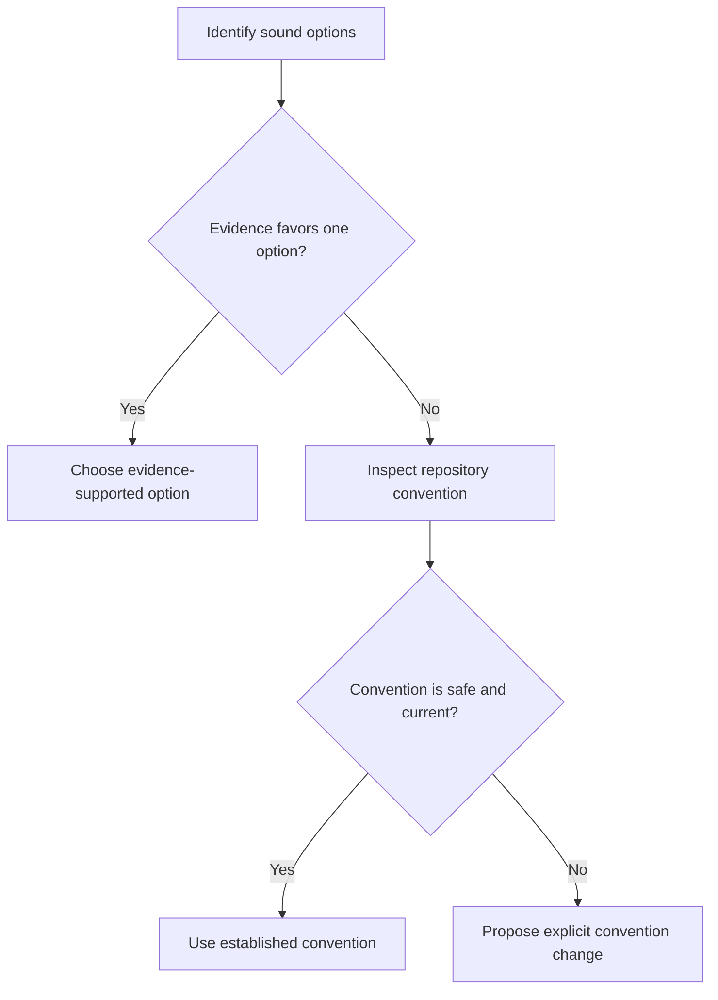

# P071 — Consistency Over Personal Preference

## Definition

Follow established repository conventions, style guides, patterns, terms, and architecture when
multiple sound choices exist. Do not rewrite correct code only because another valid style is more
familiar or attractive.

**Aliases:** local consistency, convention over individual taste.

## Provenance

**Classification:** practitioner heuristic.

Language and project style guides have long emphasized consistency. No verified source owns the
practice. This rule uses consistency to select between equivalent choices. Consistency does not give
authority to preserve defects.

## Decision rule

When multiple approaches satisfy the same requirements, first compare the technical evidence. If the
evidence shows no material difference, use the repository's established approach. If evidence shows
a material difference, apply [P072 Technical Evidence](p072-technical-evidence-over-preference.md).

## How to apply

- Read repository instructions, nearby code, public contracts, and active architecture decisions.
- Use established terminology, layout, error conventions, test style, and extension mechanisms.
- Separate broad modernization or formatting from a feature change unless the feature requires
  modernization or formatting.
- Propose convention changes explicitly and apply them coherently once accepted.
- Record the technical reason for a convention exception.

## Diagram



## Language examples

The two examples use the established `api_response` helper and its standard envelope.

```python
def create_user(request):
    user = User.from_request(request)
    payload = user.to_dict()
    return api_response(payload, status=201)
```

```rust
fn create_user(request: Request) -> Response {
    let user = User::from_request(request);
    let payload = user.to_map();
    api_response(payload, Status::Created)
}
```

## Boundaries and tensions

Correctness, security, accessibility, explicit requirements, and measured evidence have precedence
over consistency. Do not reproduce a known vulnerability or invalid pattern because it is common
nearby. A repository can have an active transition between conventions. In that case, follow the
documented direction instead of the most common style. Consistency protects reader expectations. It
does not require visual uniformity at any cost.

## Examples

**Positive:** Two serialization approaches are equally correct. A new endpoint therefore uses the
repository serializer and error envelope.

**Misuse:** A contributor rewrites an entire module with a preferred name and format style during one
small behavior change.

**Athena/agent workflow:** A skill author follows Athena's host-neutral terms and section
conventions. The author does not introduce vendor-specific terms for the same capability.

## Related principles

- [P006 Principle of Least Astonishment](p006-principle-of-least-astonishment.md)
- [P014 Preserve Unrequested Behavior](p014-preserve-unrequested-behavior.md)
- [P015 Architecture Conformance](p015-architecture-conformance.md)
- [P070 Code Health Must Not Regress](p070-code-health-must-not-regress.md)
- [P072 Technical Evidence Over Preference](p072-technical-evidence-over-preference.md)

## References

### Origin/history

- [PEP 8: A Foolish Consistency Is the Hobgoblin of Little Minds](https://peps.python.org/pep-0008/#a-foolish-consistency-is-the-hobgoblin-of-little-minds)
  is a long-standing language guide that values project consistency and permits justified
  exceptions. This page does not claim it as the origin of the broader heuristic.

### Current guidance

- [Google Go Style Guide: Local consistency](https://google.github.io/styleguide/go/guide.html#local-consistency)
  uses nearby convention to select between equal options. It rejects consistency that extends a
  defect or violates a stronger rule.
- [Google Engineering Practices: The standard of code review](https://google.github.io/eng-practices/review/reviewer/standard.html)
  places style guides above personal taste. It places technical facts above style guides and personal
  taste.

### Further reading

- [Google JavaScript Style Guide: Reformatting existing code](https://google.github.io/styleguide/jsguide.html#policies-reformatting-existing-code)
  explains the trade-off between consistency, code churn, and change focus.

[Back to the engineering principles catalog](../README.md#p071)
