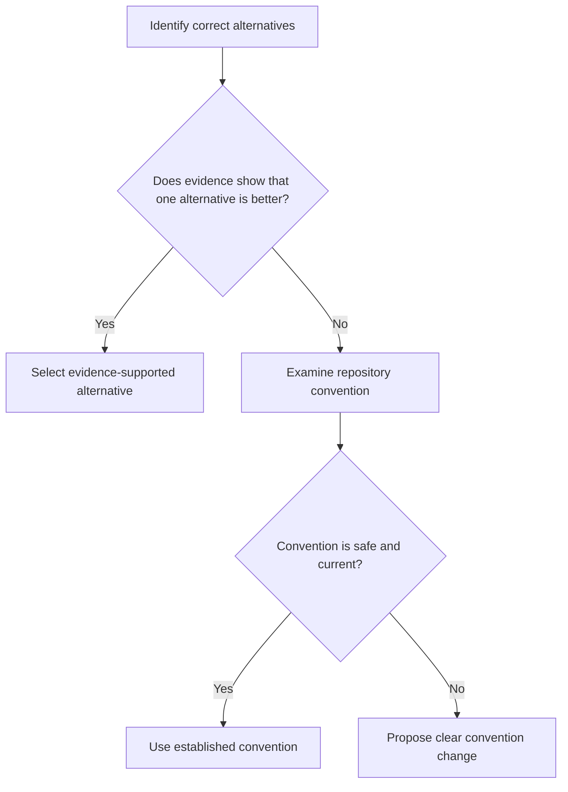

# P071 — Consistency Over Personal Preference

## Definition

When more than one correct alternative is available, obey established repository conventions,
style guides, patterns, terms, and architecture. If a different correct style is only a personal
preference, do not rewrite correct code.

**Aliases:** local consistency, convention over personal preference.

## Provenance

**Classification:** practitioner heuristic.

Language and project style guides use consistency rules. No verified source owns the practice. This
rule uses consistency to select between equivalent alternatives. Consistency does not give authority
to keep defects.

## Decision rule

When more than one method satisfies the same requirements, first compare the technical evidence.
If the evidence shows no material difference, use the repository's established method. If
evidence shows a material difference, apply
[P072 Technical Evidence](p072-technical-evidence-over-preference.md).

## How to apply

- Read repository instructions, code in the same area, public contracts, and active architecture
  decisions.
- Use established terminology, layout, error conventions, test style, and extension mechanisms.
- When the feature does not make modernization or formatting necessary, put that work in a
  different change.
- Propose clear convention changes. Apply accepted changes to all applicable code.
- Record the technical basis for a convention exception.

## Diagram



## Language examples

The two examples use the established `api_response` helper and its standard envelope.

```python
def create_user(request):
    user = User.from_request(request)
    payload = user.to_dict()
    return api_response(payload, status=201)
```

```rust
fn create_user(request: Request) -> Response {
    let user = User::from_request(request);
    let payload = user.to_map();
    api_response(payload, Status::Created)
}
```

## Boundaries and tensions

Correctness, security, accessibility, specified requirements, and measured evidence have higher
priority than consistency. When code in the same area contains a known vulnerability or invalid
pattern, do not reproduce it. A repository can have an active transition between conventions.
Then, obey the documented direction, not the style that occurs most frequently. Consistency protects
reader expectations. It does not make the same appearance necessary at all costs.

## Examples

**Positive:** Two serialization approaches are equally correct. Thus, a new endpoint uses the
repository serializer and error envelope.

**Misuse:** A contributor rewrites a full module with a different name and format style in one
small behavior change.

**Athena/agent workflow:** A skill author obeys Athena's host-neutral terms and section
conventions. The author does not introduce vendor-specific terms for the same capability.

## Related principles

- [P006 Principle of Least Astonishment](p006-principle-of-least-astonishment.md)
- [P014 Preserve Unrequested Behavior](p014-preserve-unrequested-behavior.md)
- [P015 Architecture Conformance](p015-architecture-conformance.md)
- [P070 Code Health Must Not Regress](p070-code-health-must-not-regress.md)
- [P072 Technical Evidence Over Preference](p072-technical-evidence-over-preference.md)

## References

### Source information

- [PEP 8: A Foolish Consistency Is the Hobgoblin of Little Minds](https://peps.python.org/pep-0008/#a-foolish-consistency-is-the-hobgoblin-of-little-minds)
  is a language guide with a long history. It gives priority to project consistency and gives rules
  for exceptions with technical evidence. This page does not claim it as the initial source for the
  full heuristic.

### Applicable information

- [Google Go Style Guide: Local consistency](https://google.github.io/styleguide/go/guide.html#local-consistency)
  uses local convention to select between equal alternatives. It rejects consistency that extends a
  defect or violates a stronger rule.
- [Google Engineering Practices: The standard of code review](https://google.github.io/eng-practices/review/reviewer/standard.html)
  gives style guides higher priority than personal preference. The guide gives technical facts
  higher priority than style guides and personal preference.

### More information

- [Google JavaScript Style Guide: Reformatting existing code](https://google.github.io/styleguide/jsguide.html#policies-reformatting-existing-code)
  shows the trade-off between consistency, code churn, and change focus.

[Back to the engineering principles catalog](../README.md#p071)
