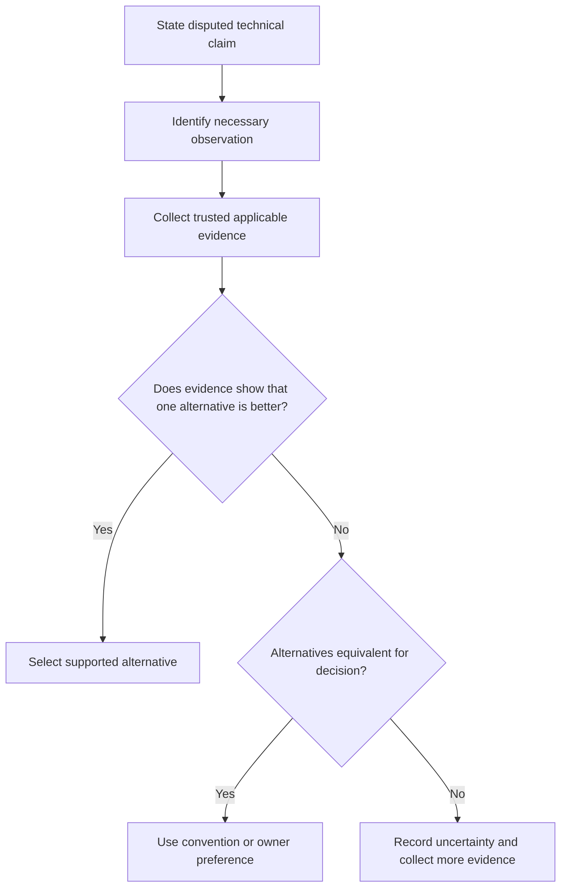

# P072 — Technical Evidence Over Preference

## Definition

Use requirements, specifications, measurements, tests, profiles, architecture, and established
engineering principles to resolve technical decisions. When applicable evidence shows that one
alternative is better, do not use personal preference. Personal preference can select between
alternatives that the evidence shows are equivalent for the decision.

**Aliases:** facts over opinions, evidence-based engineering judgment.

## Provenance

**Classification:** practitioner heuristic.

Evidence-based decisions have scientific and engineering roots in many fields. No verified software
source owns the idea. Google's code-review guidance states the rule for review disputes. Athena
applies the rule to plans, implementation, validation, and review.

## Decision rule

When approaches conflict, identify applicable evidence. Examine its quality. Select the alternative
that agrees with trusted requirements and technical evidence. If there are equivalent
alternatives, use established convention or the responsible author's preference.

## How to apply

- State the disputed claim and the observation that can distinguish the alternatives.
- Compare evidence for relevance, trustworthiness, reproducibility, and applicability to the
  workload.
- Use accepted requirements and specifications, not reports without evidence or author preference.
- When the environment changes behavior, use representative tests, benchmarks, and production data.
- For use in a future decision, record important evidence and uncertainty.

## Diagram



## Language examples

The two examples select a parser from measurements of representative samples.

```python
def choose_parser(samples):
    results = [
        (measure(parser, samples), parser) for parser in PARSERS
    ]
    return min(results, key=lambda item: item[0])[1]
```

```rust
fn choose_parser(samples: &[Input]) -> &'static Parser {
    let measured: Vec<_> = PARSERS
        .iter()
        .map(|parser| (measure(parser, samples), parser))
        .collect();
    measured
        .into_iter()
        .min_by_key(|(cost, _)| *cost)
        .expect("PARSERS is not empty").1
}
```

## Boundaries and tensions

Measurements and tests can be stale, biased, or applicable to an incorrect contract. Measurements
can also have missing data. Examine evidence quality, not evidence quantity. Architecture and
principles give a basis for judgment but do not override a specified higher-priority requirement.
When stronger evidence does not show that one alternative is better, use
[P071 Consistency](p071-consistency-over-personal-preference.md). If there is no data, risk is
possible.

## Examples

**Positive:** Representative profiles identify serialization as the latency bottleneck. The team
optimizes that path, not a low-cost component.

**Misuse:** A reviewer blocks a correct, established implementation because a different syntax
"feels cleaner." The reviewer gives no contract, measurement, or design effect.

**Athena/agent workflow:** An agent finds a conflict between repository prose and executable
behavior. Before the agent proposes a change, it examines history, validators, tests, and current
policy.

## Related principles

- [P012 Evidence Before Modification](p012-evidence-before-modification.md)
- [P063 Requirement-to-Code Traceability](p063-requirement-to-code-traceability.md)
- [P065 Verify Before Claiming Completion](p065-verify-before-claiming-completion.md)
- [P071 Consistency Over Personal Preference](p071-consistency-over-personal-preference.md)
- [P073 Optimize Only With Evidence](p073-optimize-only-with-evidence.md)

## References

### Source information

- [Google Engineering Practices: The standard of code review](https://google.github.io/eng-practices/review/reviewer/standard.html)
  states that technical facts and data have higher priority than opinions and personal preferences.
  This page does not claim it as the initial source.

### Applicable information

- [NASA SWE-194: Delivery Requirements Verification](https://swehb.nasa.gov/spaces/SWEHBVD/pages/102695529/SWE-194%2B-%2BDelivery%2BRequirements%2BVerification)
  links acceptance evidence to requirements, test results, and recorded verification.
- [NIST SSDF 1.1](https://csrc.nist.gov/pubs/sp/800/218/final) gives risk-based secure-development
  and verification practices with specified outcomes.

### More information

- [Athena evidence integrity policy](../../policies/evidence-integrity.md) specifies how repository
  evidence claims must identify reproducible commands, revisions, environments, and recorded output.

[Back to the engineering principles catalog](../README.md#p072)
