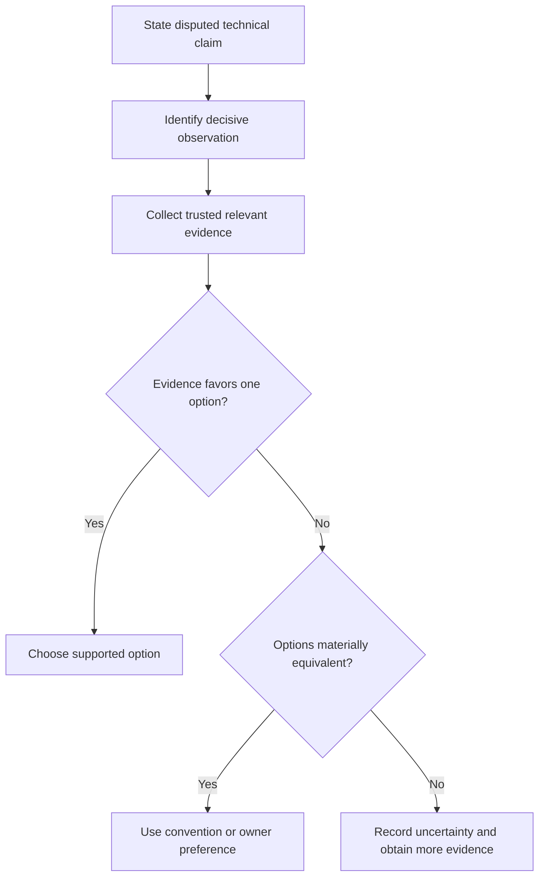

# P072 — Technical Evidence Over Preference

## Definition

Use requirements, specifications, measurements, tests, profiles, architecture, and established
engineering principles to resolve technical choices. Do not use subjective taste when relevant
evidence favors one option. Personal preference can select between options that the evidence shows
as materially equivalent.

**Aliases:** facts over opinions, evidence-based engineering judgment.

## Provenance

**Classification:** practitioner heuristic.

Evidence-based decisions have broad scientific and engineering roots. No verified software source
owns the idea. Google's code-review guidance states the rule for review disputes. Athena applies the
rule to plans, implementation, validation, and review.

## Decision rule

When approaches conflict, identify relevant evidence and assess its quality. Choose the option that
trusted requirements and technical evidence support. If equivalent options remain, use established
convention or the responsible author's preference.

## How to apply

- State the disputed claim and the observation that can distinguish the options.
- Rank evidence by relevance, trustworthiness, reproducibility, and applicability to the workload.
- Prefer accepted requirements and specifications over anecdotes or familiarity.
- Use representative tests, benchmarks, and production data where behavior depends on environment.
- Record important evidence and uncertainty so a future decision can use them.

## Diagram



## Language examples

The two examples select a parser from measurements of representative samples.

```python
def choose_parser(samples):
    results = [
        (measure(parser, samples), parser) for parser in PARSERS
    ]
    return min(results, key=lambda item: item[0])[1]
```

```rust
fn choose_parser(samples: &[Input]) -> &'static Parser {
    PARSERS
        .iter()
        .min_by_key(|parser| measure(parser, samples))
        .expect("PARSERS is not empty")
}
```

## Boundaries and tensions

Measurements and tests can be stale, biased, incomplete, or relevant to the wrong contract. Assess
evidence quality instead of evidence quantity. Architecture and principles guide judgment but do not
override an explicit higher-priority requirement. Use
[P071 Consistency](p071-consistency-over-personal-preference.md) only when stronger evidence does not
favor one option. Absence of data does not prove absence of risk.

## Examples

**Positive:** Representative profiles identify serialization as the latency bottleneck. The team
optimizes that path instead of a low-cost component.

**Misuse:** A reviewer blocks a correct, conventional implementation because another syntax "feels
cleaner." The reviewer provides no contract, measurement, or design consequence.

**Athena/agent workflow:** Repository prose and executable behavior appear inconsistent. An agent
inspects history, validators, tests, and current policy before it recommends a change to either
authority.

## Related principles

- [P012 Evidence Before Modification](p012-evidence-before-modification.md)
- [P063 Requirement-to-Code Traceability](p063-requirement-to-code-traceability.md)
- [P065 Verify Before Claiming Completion](p065-verify-before-claiming-completion.md)
- [P071 Consistency Over Personal Preference](p071-consistency-over-personal-preference.md)
- [P073 Optimize Only With Evidence](p073-optimize-only-with-evidence.md)

## References

### Origin/history

- [Google Engineering Practices: The standard of code review](https://google.github.io/eng-practices/review/reviewer/standard.html)
  states that technical facts and data have precedence over opinions and personal preferences. This
  page does not claim it as the first origin.

### Current guidance

- [NASA SWE-194: Delivery Requirements Verification](https://swehb.nasa.gov/spaces/SWEHBVD/pages/102695529/SWE-194%2B-%2BDelivery%2BRequirements%2BVerification)
  links acceptance evidence to requirements, test results, and recorded verification.
- [NIST SSDF 1.1](https://csrc.nist.gov/pubs/sp/800/218/final) provides risk-based secure-development
  and verification practices with concrete outcomes.

### Further reading

- [Athena evidence integrity policy](../../policies/evidence-integrity.md) defines how repository
  evidence claims must identify reproducible commands, revisions, environments, and real output.

[Back to the engineering principles catalog](../README.md#p072)
