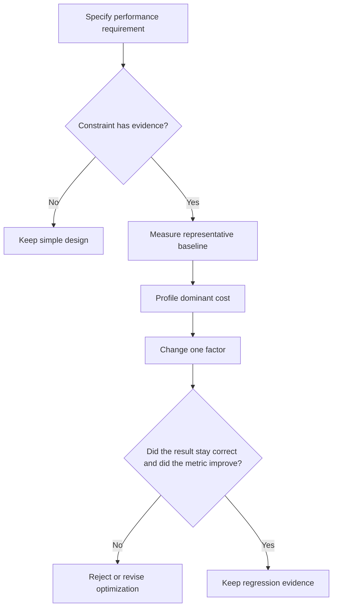

# P073 — Optimize Only With Evidence

## Definition

If evidence does not identify an applicable constraint, do not add a cache, concurrency, batch
process, or specialized data structure. Apply this rule to low-level tuning and architecture
complexity. Measure a representative baseline. Find the bottleneck. Optimize that bottleneck. Then
verify the improvement and correctness.

**Aliases:** measurement before optimization, evidence-driven optimization.

## Provenance

**Classification:** established principle.

Donald Knuth discussed premature optimization in 1974. No one author owns the general discipline or
the Athena text. Performance tools and frameworks apply the rule with representative
measurements.

## Decision rule

When an accepted requirement or trusted measurement shows an important constraint, add optimization
complexity. Before-and-after evidence must show an improvement and must show that the result
continues to satisfy the requirement.

## How to apply

- Specify the performance objective, workload, environment, and permitted trade-offs.
- Record a reproducible baseline with representative data and end-to-end metrics.
- Use a profile to find the dominant cost, not code appearance.
- When possible, change one factor. Compare measurements from three or more runs.
- Keep regression protection or monitoring for the optimized behavior.

## Diagram



## Language examples

The two examples select the candidate only after proof of equal results and a lower measured cost.

```python
def select_parser(samples):
    if outputs(parse, samples) != outputs(cached_parse, samples):
        raise ValueError("candidate changes parser output")
    baseline = measure(parse, samples)
    candidate = measure(cached_parse, samples)
    return cached_parse if candidate < baseline else parse
```

```rust
fn select_parser(samples: &[Input]) -> Parser {
    assert_eq!(outputs(parse, samples), outputs(cached_parse, samples));
    let baseline = measure(parse, samples);
    let candidate = measure(cached_parse, samples);
    if candidate < baseline { cached_parse } else { parse }
}
```

## Boundaries and tensions

Specified latency, memory, cost, or capacity requirements can give evidence. A team can act before a
production incident. Known algorithmic hazards and hard real-time constraints can make design work
necessary before implementation. The team must specify the assumptions. The team must test them.

When its workload differs from the target workload, a microbenchmark can give an incorrect result.
If an optimization decreases correctness, security, clarity, or operation, a higher metric does not
make the optimization correct.

## Examples

**Positive:** A representative profile shows that many parses dominate request latency. A bounded
cache decreases that cost. Load tests verify latency, memory use, and correctness at the target
scale.

**Misuse:** A team adds concurrency, a cache, and a new service to a low-volume tool.
No requirement, baseline, profile, or post-change measurement gives evidence for these additions.

**Athena/agent workflow:** An agent proposes parallel subagents only for independent tasks with
permitted coordination cost. Before a claim that maximum concurrency is faster, the agent uses
evidence.

## Related principles

- [P001 KISS](p001-kiss.md)
- [P002 YAGNI](p002-yagni.md)
- [P012 Evidence Before Modification](p012-evidence-before-modification.md)
- [P072 Technical Evidence Over Preference](p072-technical-evidence-over-preference.md)
- [P080 Make Concurrency Deliberate](p080-make-concurrency-deliberate.md)

## References

### Source information

- [Knuth, "Structured Programming with go to Statements" (1974)](https://doi.org/10.1145/356635.356640)
  is a primary source for the important discussion of premature optimization and critical code
  paths. It is not the only source for performance measurement.

### Applicable information

- [Go diagnostics documentation](https://go.dev/doc/diagnostics) gives profiling and tracing as tools
  that find high-cost code and measure performance behavior.
- [AWS Well-Architected Performance Efficiency Pillar](https://docs.aws.amazon.com/wellarchitected/latest/performance-efficiency-pillar/welcome.html)
  states that teams must use performance indicators, monitoring, load tests, and regular
  measurement-driven review.

### More information

- [Go profile-guided optimization](https://go.dev/doc/pgo) states that representative production
  profiles give more applicable evidence. It also shows how narrow microbenchmarks can give
  incorrect optimization input.

[Back to the engineering principles catalog](../README.md#p073)
