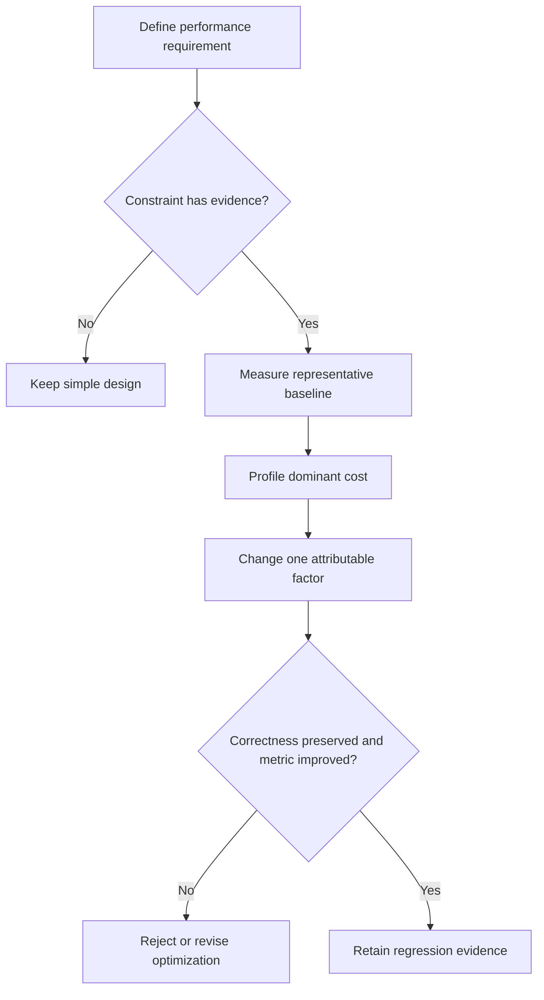

# P073 — Optimize Only With Evidence

## Definition

Do not add a cache, concurrency, a batch process, a specialized data structure, low-level tuning, or
architecture complexity without evidence of a relevant constraint. Measure a representative
baseline and locate the bottleneck. Optimize that bottleneck. Then verify the gain and correctness.

**Aliases:** measurement before optimization, evidence-driven optimization.

## Provenance

**Classification:** established principle.

Donald Knuth's 1974 discussion made caution about premature optimization popular. Neither the general
discipline nor Athena's exact text belongs to one author. Modern profile and performance frameworks
apply the rule with representative measurements.

## Decision rule

Add optimization complexity only when an accepted requirement or credible measurement shows an
important constraint. Before-and-after evidence must show an improvement without unacceptable
regressions.

## How to apply

- Define the performance objective, workload, environment, and acceptable trade-offs.
- Establish a reproducible baseline with representative data and end-to-end metrics.
- Use a profile to find the dominant cost, not code appearance.
- Change one attributable factor when practical and compare repeated measurements.
- Retain regression protection or monitoring for the optimized behavior.

## Diagram



## Language examples

The two examples select the candidate only after proof of equal results and a lower measured cost.

```python
def select_parser(samples):
    if outputs(parse, samples) != outputs(cached_parse, samples):
        raise ValueError("candidate changes parser output")
    baseline = measure(parse, samples)
    candidate = measure(cached_parse, samples)
    return cached_parse if candidate < baseline else parse
```

```rust
fn select_parser(samples: &[Input]) -> Parser {
    assert_eq!(outputs(parse, samples), outputs(cached_parse, samples));
    let baseline = measure(parse, samples);
    let candidate = measure(cached_parse, samples);
    if candidate < baseline { cached_parse } else { parse }
}
```

## Boundaries and tensions

An explicit latency, memory, cost, or capacity requirement can provide evidence. A team can act
before a production incident. Known algorithmic hazards and hard real-time constraints can
justify early design work. The assumptions must be concrete and testable. A microbenchmark can
mislead when it does not represent the real workload. A higher metric does not justify an
optimization that harms correctness, security, clarity, or operation.

## Examples

**Positive:** A representative profile shows that repeated parses dominate request latency. A bounded
cache reduces that cost. Load tests confirm latency, memory use, and correctness at the target scale.

**Misuse:** A team adds concurrency, a cache, and a new service to a low-volume tool. No requirement,
baseline, profile, or post-change measurement supports these additions.

**Athena/agent workflow:** An agent proposes parallel subagents only for independent tasks with
acceptable coordination cost. The agent does not assume that maximum concurrency is faster.

## Related principles

- [P001 KISS](p001-kiss.md)
- [P002 YAGNI](p002-yagni.md)
- [P012 Evidence Before Modification](p012-evidence-before-modification.md)
- [P072 Technical Evidence Over Preference](p072-technical-evidence-over-preference.md)
- [P080 Make Concurrency Deliberate](p080-make-concurrency-deliberate.md)

## References

### Origin/history

- [Knuth, "Structured Programming with go to Statements" (1974)](https://doi.org/10.1145/356635.356640)
  is a primary source for the influential discussion of premature optimization and critical code
  paths. It is not the sole origin of performance measurement.

### Current guidance

- [Go diagnostics documentation](https://go.dev/doc/diagnostics) explains profiling and tracing as
  tools that locate expensive code and evaluate performance behavior.
- [AWS Well-Architected Performance Efficiency Pillar](https://docs.aws.amazon.com/wellarchitected/latest/performance-efficiency-pillar/welcome.html)
  requires performance indicators, monitoring, load tests, and regular measurement-driven review.

### Further reading

- [Go profile-guided optimization](https://go.dev/doc/pgo) explains why representative production
  profiles are preferable. It also explains how narrow microbenchmarks can provide inaccurate
  optimization input.

[Back to the engineering principles catalog](../README.md#p073)
