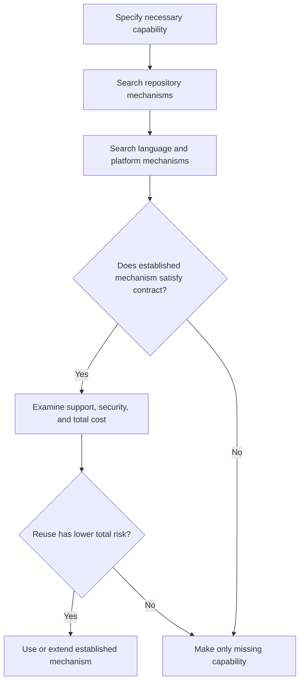

# P074 — Prefer Existing Mechanisms

## Definition

Before you make a utility, abstraction, parser, serializer, retry framework, cache, or
synchronization primitive, search for an applicable mechanism. Before you make a security
mechanism, dependency, or service, search for an applicable mechanism. The repository, language,
framework, platform, or standard library can supply it.

**Aliases:** reuse before a new build, use established mechanisms first.

## Provenance

**Classification:** practitioner heuristic.

Reuse of established components is a software practice with a long history. No verified source owns
the practice. This rule gives priority to local and standard mechanisms. The rule continues to
make a fitness and security assessment necessary because reuse does not always decrease risk.

## Decision rule

When the target environment supports an established mechanism and the mechanism satisfies the
contract, use it. Its total correctness, security, maintenance, and operation cost must be lower
than a new mechanism. As the default, make only the missing capability, not a second framework.

## How to apply

- Search repository code, documentation, dependency manifests, and architecture decisions first.
- Then, examine the language and framework standard facilities.
- Compare semantics, failure behavior, maintenance, provenance, licensing, and migration cost.
- Add a small, coherent extension at the interface that the established mechanism supplies.
- When available mechanisms do not satisfy the contract, document why a new mechanism is necessary.

## Diagram



## Language examples

The two examples use an established SHA-256 implementation. They return the same lowercase
hexadecimal digest for the same bytes.

```python
from hashlib import sha256

def digest(payload: bytes) -> str:
    value = sha256(payload)
    return value.hexdigest()
```

```rust
use sha2::{Digest, Sha256};

fn digest(payload: &[u8]) -> String {
    let value = Sha256::digest(payload);
    format!("{value:x}")
}
```

## Boundaries and tensions

An established mechanism does not always satisfy the task contract or security requirements. Its
owner can stop maintenance. If its contract does not include the work, do not use the mechanism. Do
not use private internals. Do not keep a known vulnerability only to prevent new code. A third-party
dependency can increase the supply-chain and attack surfaces.

Thus, a small local implementation can be safer. Reuse must keep local analysis and clear
ownership.

## Examples

**Positive:** A command uses the URL parser from the standard library and the repository error envelope. It
does not make two replacements with small differences.

**Misuse:** A custom retry loop duplicates the bounded retry in the repository client. The duplicate
causes nested attempts and inconsistent delay intervals.

**Athena/agent workflow:** An author invokes the documented CLI for a tested skill-local helper.
The author does not add a second parser to a Markdown code block.

## Related principles

- [P003 DRY](p003-dry.md)
- [P013 AHA](p013-avoid-hasty-abstractions.md)
- [P057 Supply-Chain Integrity](p057-supply-chain-integrity.md)
- [P078 Single Source of Truth](p078-single-source-of-truth.md)
- [P084 Prefer Local Reasoning](p084-prefer-local-reasoning.md)

## References

### Source information

- [Python tutorial: Batteries included](https://docs.python.org/3/tutorial/stdlib.html#batteries-included)
  documents one important language philosophy for standard-library mechanisms. This page does not
  claim that it is the initial source for the full reuse heuristic.

### Applicable information

- [Google Engineering Practices: What to look for in a code review](https://google.github.io/eng-practices/review/reviewer/looking-for.html)
  states that reviewers must identify the correct owner for a change. Reviewers must also verify
  that the change agrees with the system.
- [NIST SSDF 1.1](https://csrc.nist.gov/pubs/sp/800/218/final) states that organizations must manage
  and protect internal and third-party software components.

### More information

- [Google Engineering Practices: Small CLs](https://google.github.io/eng-practices/review/developer/small-cls.html)
  shows how APIs that no code uses can decrease change focus. Framework work that is not part of the
  task can have the same effect.

[Back to the engineering principles catalog](../README.md#p074)
