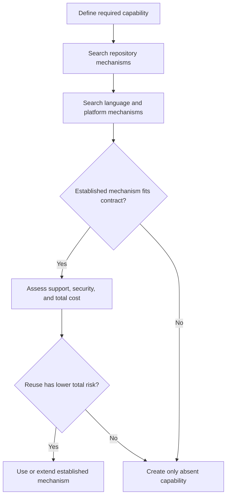

# P074 — Prefer Existing Mechanisms

## Definition

Before creation of a utility, abstraction, parser, serializer, retry framework, cache,
synchronization primitive, security mechanism, dependency, or service, search for an appropriate
mechanism. The repository, language, framework, platform, or standard library can already supply it.

**Aliases:** reuse before a new build, use established mechanisms first.

## Provenance

**Classification:** practitioner heuristic.

Reuse of established components is a long-standing software practice. No verified source owns the
practice. This rule gives priority to local and standard mechanisms. It still requires a fitness and
security assessment because reuse does not always help.

## Decision rule

Use an established mechanism when it satisfies the contract and has support in the target
environment. Its total correctness, security, maintenance, and operation cost must be lower than a
new mechanism. By default, create only the absent capability instead of a rival framework.

## How to apply

- Search repository code, documentation, dependency manifests, and architecture decisions first.
- Check the language and framework standard facilities next.
- Compare semantics, failure behavior, maintenance, provenance, licensing, and migration cost.
- Add a small, coherent extension at the interface that the established mechanism provides.
- Document why a new mechanism is necessary when available options do not meet the contract.

## Diagram



## Language examples

The two examples use an established URL parser and reject a URL without a host.

```python
from urllib.parse import urlparse

def host(value):
    parsed = urlparse(value)
    if not parsed.hostname:
        raise ValueError("URL has no host")
    return parsed.hostname
```

```rust
use url::Url;

fn host(value: &str) -> Result<String, &'static str> {
    let parsed = Url::parse(value).map_err(|_| "invalid URL")?;
    parsed.host_str().map(str::to_owned).ok_or("URL has no host")
}
```

## Boundaries and tensions

An established mechanism is not always correct, secure, maintained, or suitable. Do not force a
mechanism beyond its contract. Do not depend on private internals or retain a known vulnerability
only to avoid new code. A third-party dependency can enlarge the supply-chain and attack surfaces.
A small local implementation can therefore be safer. Reuse must preserve local analysis and explicit
ownership.

## Examples

**Positive:** A command uses the standard library URL parser and the repository error envelope. It
does not create two replacements with small differences.

**Misuse:** A custom retry loop duplicates the bounded retry in the repository client. The duplicate
causes nested attempts and inconsistent delay intervals.

**Athena/agent workflow:** An author invokes a tested skill-local helper through its documented CLI.
The author does not add a second parser to a Markdown code block.

## Related principles

- [P003 DRY](p003-dry.md)
- [P013 AHA](p013-avoid-hasty-abstractions.md)
- [P057 Supply-Chain Integrity](p057-supply-chain-integrity.md)
- [P078 Single Source of Truth](p078-single-source-of-truth.md)
- [P084 Prefer Local Reasoning](p084-prefer-local-reasoning.md)

## References

### Origin/history

- [Python tutorial: Batteries included](https://docs.python.org/3/tutorial/stdlib.html#batteries-included)
  documents one influential language philosophy for robust common mechanisms. This page does not
  claim that it originated the broader reuse heuristic.

### Current guidance

- [Google Engineering Practices: What to look for in a code review](https://google.github.io/eng-practices/review/reviewer/looking-for.html)
  asks whether the codebase or a library must own a change. It also asks whether the change fits the
  system.
- [NIST SSDF 1.1](https://csrc.nist.gov/pubs/sp/800/218/final) requires organizations to manage and
  protect internal and third-party software components.

### Further reading

- [Google Engineering Practices: Small CLs](https://google.github.io/eng-practices/review/developer/small-cls.html)
  explains how unused APIs and unrelated framework work can reduce the focus of a change.

[Back to the engineering principles catalog](../README.md#p074)
