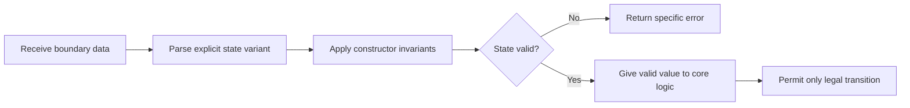

# P075 — Make Invalid States Hard to Represent

## Definition

Use types, schemas, constructors, validation, encapsulation, and state machines to prevent invalid
data combinations. Reject invalid data at creation, or make its representation unavailable to
ordinary program paths. Core logic must receive values that satisfy important structural invariants.

**Aliases:** make illegal states unrepresentable, encode invariants in the model.

## Provenance

**Classification:** practitioner heuristic.

The aphorism has broad provenance in typed functional programs and domain models. This page does not
assign it to one author. Algebraic data types, abstract data types, design by contract, and schema
validation supply established technical foundations.

## Decision rule

When a state combination is always invalid, design construction so normal callers cannot create that
combination. Use repeated runtime checks only when the boundary or representation cannot enforce the
invariant more clearly.

## How to apply

- Replace correlated booleans and nullable fields with explicit variants when states are exclusive.
- Use validated constructors or factories that return a valid value or a specific error.
- Keep fields private when unrestricted mutation could violate invariants.
- Express units, identifiers, required fields, and legal transitions in types or schemas.
- Revalidate facts from external mutable state at the responsible boundary.

## Diagram



## Language examples

The two examples represent exclusive payment states as variants with state-specific data.

```python
from dataclasses import dataclass

@dataclass(frozen=True)
class Pending:
    request_id: str

@dataclass(frozen=True)
class Settled:
    receipt_id: str

Payment = Pending | Settled
```

```rust
enum Payment {
    Pending { request_id: String },
    Settled { receipt_id: String },
}
```

## Boundaries and tensions

No type system can prove every temporal, distributed, authorization, or business invariant. External
data remains untrusted. It still requires [P053 boundary validation](p053-validate-at-trust-boundaries.md)
and [P076 parse-validate-operate](p076-parse-then-validate-then-operate.md). Avoid wrappers, generics,
or type-level mechanisms when their complexity exceeds the prevented risk. Representations must
remain clear, adaptable, and compatible with required serialization contracts.

## Examples

**Positive:** One enum represents a payment state with variant-specific data. The payment cannot have
the `settled` and `failed` states at the same time. The interface exposes only legal transitions.

**Misuse:** Three booleans and two nullable time stamps represent workflow state. Each caller must
identify and reject the invalid combinations again.

**Athena/agent workflow:** A constructor for a review contract requires a revision, scope, and active
principle content. The restricted reviewer therefore cannot receive a partial contract.

## Related principles

- [P019 Explicit Contracts](p019-explicit-contracts.md)
- [P053 Validate at Trust Boundaries](p053-validate-at-trust-boundaries.md)
- [P076 Parse, Then Validate, Then Operate](p076-parse-then-validate-then-operate.md)
- [P079 Explicit Ownership and Lifetimes](p079-explicit-ownership-and-lifetimes.md)
- [P084 Prefer Local Reasoning](p084-prefer-local-reasoning.md)

## References

### Origin/history

- [Liskov and Zilles, "Programming with Abstract Data Types" (1974)](https://doi.org/10.1145/800233.807045)
  is a foundational primary source for abstract types that control representation and operations.
  The later aphorism has no verified single origin.

### Current guidance

- [The Rust Programming Language: Defining an Enum](https://doc.rust-lang.org/book/ch06-01-defining-an-enum.html)
  shows how variants and exhaustive matches let a compiler distinguish and check valid cases.
- [Microsoft C#: Nullable reference types](https://learn.microsoft.com/en-us/dotnet/csharp/fundamentals/null-safety/nullable-reference-types)
  documents type annotations and flow analysis that detect states outside declared null contracts.

### Further reading

- [Meyer, "Applying Design by Contract"](https://www.kth.se/social/files/59526bfb56be5b4f17000807/meyer-92-contracts.pdf)
  presents preconditions, postconditions, and invariants as complementary runtime contract tools.

[Back to the engineering principles catalog](../README.md#p075)
