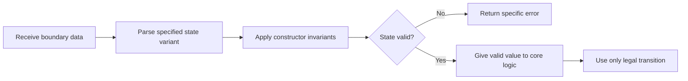

# P075 — Make Invalid States Hard to Represent

## Definition

Use types, schemas, constructors, validation, encapsulation, and state machines to prevent invalid
data combinations. Reject invalid data at the constructor boundary. As an alternative, make its
representation unavailable to standard program paths. Core logic must receive values that satisfy
important structural invariants.

**Aliases:** make illegal states unrepresentable, encode invariants in the model.

## Provenance

**Classification:** practitioner heuristic.

This rule has provenance in typed functional programs and domain models. This page does not name one
author. Algebraic data types, abstract data types, design by contract, and schema
validation supply established technical foundations.

## Decision rule

When a state combination is always invalid, use a construction that does not let standard callers
make that combination. Only when the boundary or representation cannot enforce the invariant more
clearly, use runtime checks at more than one location.

## How to apply

- When states are exclusive, replace correlated booleans and nullable fields with specified
  variants.
- Use validated constructors or factories that return a value that satisfies the invariant or a
  specified error.
- When unrestricted mutation can violate invariants, give field access only with operations that
  enforce invariants.
- Express units, identifiers, necessary fields, and legal transitions in types or schemas.
- Revalidate facts from external mutable state at the responsible boundary.

## Diagram



## Language examples

The two examples represent exclusive payment states as variants with state-specific data.

```python
from dataclasses import dataclass

@dataclass(frozen=True)
class Pending:
    request_id: str

@dataclass(frozen=True)
class Settled:
    receipt_id: str

Payment = Pending | Settled
```

```rust
enum Payment {
    Pending { request_id: String },
    Settled { receipt_id: String },
}
```

## Boundaries and tensions

No type system can prove all temporal, distributed, authorization, or business invariants. External
data is untrusted. Also use
[P053 boundary validation](p053-validate-at-trust-boundaries.md) and
[P076 parse-validate-operate](p076-parse-then-validate-then-operate.md). When the complexity of
wrappers, generics, or type-level mechanisms is more than the risk reduction, do not use these
mechanisms.
Representations must be clear, easy to change, and compatible with necessary serialization
contracts.

## Examples

**Positive:** One enum represents a payment state with variant-specific data.
The payment cannot have the `settled` and `failed` states at the same time. The interface contains
only legal transitions.

**Misuse:** Three booleans and two nullable time stamps represent workflow state. Each caller must
identify the invalid combinations. Each caller must reject them again.

**Athena/agent workflow:** A constructor for a review contract must contain a revision, scope, and
active principle content. Thus, the restricted reviewer cannot receive a contract with missing
necessary data.

## Related principles

- [P019 Explicit Contracts](p019-explicit-contracts.md)
- [P053 Validate at Trust Boundaries](p053-validate-at-trust-boundaries.md)
- [P076 Parse, Then Validate, Then Operate](p076-parse-then-validate-then-operate.md)
- [P079 Explicit Ownership and Lifetimes](p079-explicit-ownership-and-lifetimes.md)
- [P084 Prefer Local Reasoning](p084-prefer-local-reasoning.md)

## References

### Source information

- [Liskov and Zilles, "Programming with Abstract Data Types" (1974)](https://doi.org/10.1145/800233.807045)
  is a primary source for abstract types that control representation and operations.
  The rule has no verified initial source.

### Applicable information

- [The Rust Programming Language: Defining an Enum](https://doc.rust-lang.org/book/ch06-01-defining-an-enum.html)
  shows how variants and exhaustive matches let a compiler distinguish cases. The compiler can
  verify that code handles all variants.
- [Microsoft C#: Nullable reference types](https://learn.microsoft.com/en-us/dotnet/csharp/fundamentals/null-safety/nullable-reference-types)
  documents type annotations and flow analysis that find states that do not agree with declared null
  contracts.

### More information

- [Meyer, "Applying Design by Contract"](https://www.kth.se/social/files/59526bfb56be5b4f17000807/meyer-92-contracts.pdf)
  gives preconditions, postconditions, and invariants as runtime tools that enforce one contract.

[Back to the engineering principles catalog](../README.md#p075)
