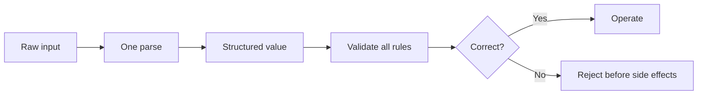

# P076 — Parse, Then Validate, Then Operate

## Definition

**Parse, Then Validate, Then Operate** is a boundary sequence. First, change an external
representation into a specified internal structure. Then, validate the internal structure for syntax, meaning, security, and task
limits. Operate only on the validated value. Core logic receives structured values and does not
interpret the raw input again.

**Aliases:** none. *Parse, Don't Validate* is a different rule.

## Provenance

**Classification:** Athena synthesis.

This sequence uses the *Parse, Don't Validate* type guidance. The two rules are not the same. The
*Parse, Don't Validate* guidance uses types that cannot contain incorrect values. Athena
includes validation because a parsed value can be incorrect for a domain rule, authority rule,
invariant, or state precondition.

## Decision rule

Change boundary data to one canonical structure. Validate that structure fully. After the validator
completes all input validation, the system can start a side effect.

## How to apply

- Find the trust boundary and the internal type for accepted data.
- Parse the input. Reject it if it does not match a specified grammar or if its meaning is not clear.
- Normalize only transformations with one specified meaning.
- Validate ranges, relationships, invariants, authority, and state preconditions at operation time.
- Make the operation accept only the validated structure.
- Keep safe diagnostic context. Do not keep secrets or raw input that is not necessary.

## Diagram

The diagram shows one safe transition from raw data to an operation.



## Language examples

Before the operation starts, each example validates the port.

### Python

```python
def parse_port(text: str) -> int:
    if not text.isascii() or not text.isdecimal():
        raise ValueError("invalid port")
    port = int(text)
    if not 1 <= port <= 65_535:
        raise ValueError("invalid port")
    return port


server.bind(parse_port(raw_port))
```

### Rust

```rust
fn parse_port(text: &str) -> Result<u16, String> {
    if text.is_empty() || !text.bytes().all(|byte| byte.is_ascii_digit()) {
        return Err("invalid port".into());
    }
    let port = text.parse::<u16>().map_err(|_| "invalid port")?;
    if port == 0 {
        return Err("invalid port".into());
    }
    Ok(port)
}

let port = parse_port(raw_port)?;
server.bind(port)?;
```

## Boundaries and tensions

Parsing is not sanitization. Validation is not authorization. Examine mutable facts again immediately
before the operation. This check prevents time-of-check and time-of-use defects.

Keep validation at the boundary. Validate a boundary value for each context after the boundary. Use types
for stable invariants. Keep policy checks explicit.

## Examples

**Positive:** A boundary parser changes a deployment request into a typed target and version. A
validator examines the permitted environment and the release state at validation time. The deployer receives only the
validated request.

**Misuse:** A parser returns an object with missing fields. The executor creates external resources.
After the side effect, a check finds an incorrect field.

**Athena/agent workflow:** An agent parses issue fields and file paths. The agent validates the
fields and paths for compliance with the task and repository scope. The agent uses tools only with
validated targets.

## Related principles

- [P053 Validate at Trust Boundaries](p053-validate-at-trust-boundaries.md)
- [P059 Data Is Not Instruction](p059-data-is-not-instruction.md)
- [P075 Make Invalid States Hard to Represent](p075-make-invalid-states-hard-to-represent.md)
- [P083 Irreversible Actions Last](p083-irreversible-actions-last.md)

## References

### Source information

- [Parse, Don't Validate](https://lexi-lambda.github.io/blog/2019/11/05/parse-don-t-validate/)
  gives the type-oriented formulation. Types that cannot contain incorrect values give more information than Boolean checks.

### Applicable information

- [OWASP Input Validation Cheat Sheet](https://cheatsheetseries.owasp.org/cheatsheets/Input_Validation_Cheat_Sheet.html)
  gives the difference between syntactic and semantic validation. Before operation, the guidance tells
  authors to validate untrusted data.

### More information

- [OWASP REST Security Cheat Sheet](https://cheatsheetseries.owasp.org/cheatsheets/REST_Security_Cheat_Sheet.html)
  gives guidance about secure parsers, strong input types, and content constraints. It tells
  authors to reject input that is not in the API contract.

[Back to the engineering principles catalog](../README.md#p076)
