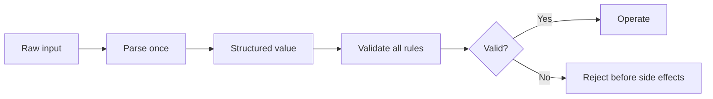

# P076 — Parse, Then Validate, Then Operate

## Definition

**Parse, Then Validate, Then Operate** is a boundary sequence. First, convert an external
representation into a defined internal form. Then, validate its syntax, meaning, security, and task
limits. Operate only on the validated value. Core logic receives structured values and does not
interpret the raw input again.

**Aliases:** none in common use. *Parse, Don't Validate* names a distinct rule.

## Provenance

**Classification:** Athena synthesis.

Type guidance such as *Parse, Don't Validate* informs this sequence. The two rules are not the
same. That guidance uses types that cannot contain invalid values. Athena names validation because
a parsed value can still violate a domain rule, authority rule, invariant, or state precondition.

## Decision rule

Convert boundary data to one canonical form. Validate that form fully. Do not start a side
effect while the input has only partial validation.

## How to apply

- Identify the trust boundary and the internal type accepted beyond it.
- Parse the input strictly. Reject an ambiguous value.
- Normalize only transformations with one documented meaning.
- Validate ranges, relationships, invariants, authority, and current-state preconditions.
- Make the operation accept only the validated form.
- Preserve safe diagnostic context, but do not retain secrets or unnecessary raw input.

## Diagram

The diagram shows one safe transition from raw data to an operation.



## Language examples

The two examples validate the port before they start the operation.

### Python

```python
def parse_port(text: str) -> int:
    if not text.isascii() or not text.isdecimal():
        raise ValueError("invalid port")
    port = int(text)
    if not 1 <= port <= 65_535:
        raise ValueError("invalid port")
    return port


server.bind(parse_port(raw_port))
```

### Rust

```rust
fn parse_port(text: &str) -> Result<u16, String> {
    if text.is_empty() || !text.bytes().all(|byte| byte.is_ascii_digit()) {
        return Err("invalid port".into());
    }
    let port = text.parse::<u16>().map_err(|_| "invalid port")?;
    if port == 0 {
        return Err("invalid port".into());
    }
    Ok(port)
}

let port = parse_port(raw_port)?;
server.bind(port)?;
```

## Boundaries and tensions

Parsing is not sanitization. Validation is not authorization. Check mutable facts again immediately
before use. This check prevents time-of-check and time-of-use defects.

Keep validation at the boundary. Do not treat an untrusted value as safe for every later context.
Use types for stable invariants. Keep policy checks explicit.

## Examples

**Positive:** A boundary parser converts a deployment request into a typed target and version. A
validator checks the allowed environment and current release state. The deployer receives only the
validated request.

**Misuse:** A parser returns a partially populated object, the executor creates external resources,
and a later field check discovers that the request was invalid.

**Athena/agent workflow:** An agent parses issue fields and file paths. It validates them against the
task and repository scope. It invokes tools only with validated targets.

## Related principles

- [P053 Validate at Trust Boundaries](p053-validate-at-trust-boundaries.md)
- [P059 Data Is Not Instruction](p059-data-is-not-instruction.md)
- [P075 Make Invalid States Hard to Represent](p075-make-invalid-states-hard-to-represent.md)
- [P083 Irreversible Actions Last](p083-irreversible-actions-last.md)

## References

### Origin/history

- [Parse, Don't Validate](https://lexi-lambda.github.io/blog/2019/11/05/parse-don-t-validate/)
  presents the influential type-oriented formulation and explains why parsing into informative
  types is stronger than repeated boolean checks.

### Current guidance

- [OWASP Input Validation Cheat Sheet](https://cheatsheetseries.owasp.org/cheatsheets/Input_Validation_Cheat_Sheet.html)
  distinguishes syntactic from semantic validation and recommends early validation of untrusted
  data.

### Further reading

- [OWASP REST Security Cheat Sheet](https://cheatsheetseries.owasp.org/cheatsheets/REST_Security_Cheat_Sheet.html)
  connects secure parsing, strong types, content constraints, and rejection of unexpected input at
  API boundaries.

[Back to the engineering principles catalog](../README.md#p076)
