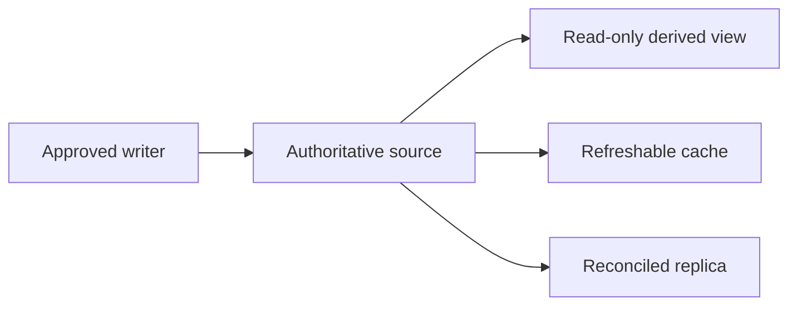

# P078 — Single Source of Truth

## Definition

**Single Source of Truth** (SSOT) gives each authoritative mutable fact or policy one declared owner
and one write path. Other representations are derived views, caches, replicas, or exports. Their
source and synchronization rules are explicit.

**Aliases:** SSOT, authoritative source, canonical owner.

## Provenance

**Classification:** practitioner heuristic.

The phrase is common in data, configuration, and software design. No reliable single origin is
known. The rule relates to database normalization and DRY. It applies specifically to authority and
divergence, not to all duplication.

## Decision rule

For each mutable fact, identify the authoritative representation and its approved writers. Define
how each other representation becomes consistent with it.

## How to apply

- Assign an authoritative owner and supported write interface for each domain fact.
- Generate or project secondary representations when practical.
- Mark caches and replicas as non-authoritative and define freshness expectations.
- Record the source, version, and reconciliation rules across asynchronous boundaries.
- Move authority explicitly. Do not permit two writers to disagree without a signal.
- Detect drift when independent copies are unavoidable.

## Diagram

The authoritative source supplies each derived representation.



## Language examples

The two examples derive a client timeout from one authoritative configuration value.

### Python

```python
@dataclass(frozen=True)
class Config:
    timeout_seconds: int


def client_timeout(config: Config) -> timedelta:
    return timedelta(seconds=config.timeout_seconds)
```

### Rust

```rust
struct Config {
    timeout_seconds: u64,
}

fn client_timeout(config: &Config) -> Duration {
    Duration::from_secs(config.timeout_seconds)
}
```

## Boundaries and tensions

SSOT does not mean one database, one service, or one global system owner. Different bounded contexts
can own different facts. Distributed replicas can support availability. Derived copies are valid
when their authority and consistency model are clear. Central control is not useful if it causes a
bottleneck or false agreement.

## Examples

**Positive:** One schema owns an API shape. Generated clients and documentation identify their
schema version. Authors do not edit these derived artifacts independently.

**Misuse:** A timeout default appears separately in code, deployment configuration, and a runbook,
with no precedence rule when the values diverge.

**Athena/agent workflow:** The principles catalog owns IDs and decision rules. Detail pages explain
them. Skills link to the catalog and do not keep duplicate definitions.

## Related principles

- [P018 Information Hiding](p018-information-hiding.md)
- [P020 Executable Architecture](p020-executable-architecture.md)
- [P077 Separate Policy from Mechanism](p077-separate-policy-from-mechanism.md)
- [P084 Prefer Local Reasoning](p084-prefer-local-reasoning.md)
- [P089 Delete Obsolete Configuration and Dependencies](p089-delete-obsolete-configuration-and-dependencies.md)

## References

### Origin/history

- No primary source identifies one original coinage. Treat the term as a practitioner label without
  attribution to one author.
- [On the Criteria To Be Used in Decomposing Systems into Modules](https://doi.org/10.1145/361598.361623)
  supplies the related historical foundation for authoritative module boundaries.

### Current guidance

- [Microsoft Azure Architecture Center: Data considerations for microservices](https://learn.microsoft.com/en-us/azure/architecture/microservices/design/data-considerations)
  recommends one authoritative service when a system requires strong consistency. It permits explicit
  non-authoritative eventual copies.

### Further reading

- [NASA: A PPE Use Case on Configuration Management Approach for MBSE](https://ntrs.nasa.gov/citations/20230000079)
  describes a model that serves as the controlled source for derived engineering artifacts.
- [USENIX SREcon: There Is No Single Source of Truth](https://www.usenix.org/conference/srecon24emea/presentation/burke)
  provides a useful counterpoint about ambiguity and domain-specific authority in real systems.

[Back to the engineering principles catalog](../README.md#p078)
