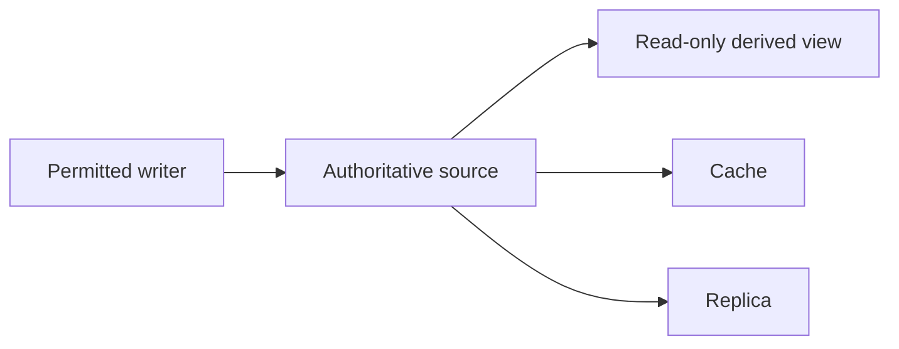

# P078 — Single Source of Truth

## Definition

**Single Source of Truth** (SSOT) gives each authoritative mutable fact or policy one declared owner
and one write path. Other representations are derived views, caches, replicas, or exports. The
source and synchronization rules for each representation are explicit.

**Aliases:** SSOT, authoritative source, canonical owner.

## Provenance

**Classification:** practitioner heuristic.

The phrase occurs in data, configuration, and software design. No source records where the phrase
first occurred. The rule uses concepts from database normalization and DRY. The rule is only about
authority and divergence, not all duplication.

## Decision rule

For each mutable fact, record the authoritative representation and the permitted writers. Record how
all other representations receive the same data from the authoritative representation.

## How to apply

- Give each domain fact an authoritative owner and specified write interface.
- If policy accepts the cost, make secondary representations from authoritative data.
- Give caches and replicas a non-authoritative status. Record freshness limits.
- Record the source, version, and reconciliation rules for asynchronous boundaries.
- Use an explicit operation to move authority. Do not let two writers give different values without a signal.
- When authors can change copies independently, find differences.

## Diagram

The authoritative source supplies each derived representation.



## Language examples

The two examples derive one timeout from the authoritative configuration and reject values that are
not in the `u64` domain.

### Python

```python
@dataclass(frozen=True)
class Config:
    timeout_seconds: str

def client_timeout(config: Config) -> int:
    text = config.timeout_seconds
    if not text.isascii() or not text.isdecimal():
        raise ValueError("timeout must be a u64")
    seconds = int(text)
    if seconds > 2**64 - 1:
        raise ValueError("timeout must be a u64")
    return seconds
```

### Rust

```rust
struct Config {
    timeout_seconds: String,
}

fn client_timeout(config: &Config) -> Result<u64, &'static str> {
    let text = &config.timeout_seconds;
    if text.is_empty() || !text.bytes().all(|byte| byte.is_ascii_digit()) {
        return Err("timeout must be a u64");
    }
    text.parse::<u64>().map_err(|_| "timeout must be a u64")
}
```

## Boundaries and tensions

SSOT is not a rule for one database, one service, or one global system owner. Different bounded contexts
can own different facts. Distributed replicas can increase availability. When the authority and
consistency model of each copy are clear, derived copies are permitted in the specified model.
When control causes a bottleneck or incorrect agreement, central control is incorrect.

## Examples

**Positive:** One schema owns an API shape. Generated clients and documentation show the schema
version. Authors do not change derived artifacts independently.

**Misuse:** Code, deployment configuration, and a runbook give timeout defaults that authors can
change independently. No precedence rule selects one of the different values.

**Athena/agent workflow:** The principles catalog owns IDs and decision rules. Detail pages give more
information. Skills refer to the catalog and do not keep duplicate definitions.

## Related principles

- [P018 Information Hiding](p018-information-hiding.md)
- [P020 Executable Architecture](p020-executable-architecture.md)
- [P077 Separate Policy from Mechanism](p077-separate-policy-from-mechanism.md)
- [P084 Prefer Local Reasoning](p084-prefer-local-reasoning.md)
- [P089 Delete Obsolete Configuration and Dependencies](p089-delete-obsolete-configuration-and-dependencies.md)

## References

### Source information

- No primary source records the first occurrence of the phrase. Use the phrase as a practitioner term without
  attribution to one author.
- [On the Criteria To Be Used in Decomposing Systems into Modules](https://doi.org/10.1145/361598.361623)
  gives a historical foundation for authoritative module boundaries.

### Applicable information

- [Microsoft Azure Architecture Center: Data considerations for microservices](https://learn.microsoft.com/en-us/azure/architecture/microservices/design/data-considerations)
  tells architects to use one authoritative service for necessary strong consistency. The guidance
  lets a system use non-authoritative copies with explicit eventual consistency.

### More information

- [NASA: A PPE Use Case on Configuration Management Approach for MBSE](https://ntrs.nasa.gov/citations/20230000079)
  gives a model that is the controlled source for derived engineering artifacts.
- [USENIX SREcon: There Is No Single Source of Truth](https://www.usenix.org/conference/srecon24emea/presentation/burke)
  gives information about ambiguity and authority for each domain in production systems.

[Back to the engineering principles catalog](../README.md#p078)
