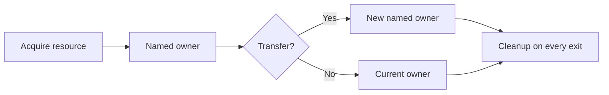

# P079 — Explicit Ownership and Lifetimes

## Definition

**Explicit Ownership and Lifetimes** gives each resource and work unit a clear owner and a defined
lifetime. The principle also defines transfer, cleanup, and termination. Resources include memory,
files, locks, transactions, connections, callbacks, processes, tasks, and temporary artifacts.

**Aliases:** none in common use. RAII and ownership types are related implementation families.

## Provenance

**Classification:** established principle.

The general rule has no single origin. Structured programs, C++ Resource Acquisition Is
Initialization (RAII), ownership types, scope cleanup, and structured concurrency apply it. These
mechanisms differ. Each mechanism makes responsibility and lifetime visible.

## Decision rule

Before resource acquisition, identify its owner and lifetime. Define each ownership transfer. Define
cleanup for success, failure, timeout, and cancellation.

## How to apply

- Prefer scope-bound resource handles, context managers, or equivalent cleanup constructs.
- Make ownership transfer visible in types, names, or interface contracts.
- Tie child tasks to a parent scope unless a durable owner explicitly adopts them.
- Define shutdown order and wait behavior for concurrent work.
- Track temporary artifacts and partial state until an owner records their final disposition.
- Test exceptional exits as well as the normal release path.

## Diagram

The owner controls the resource through its full lifetime.



## Language examples

The two examples bind file cleanup to a visible scope and report an empty file.

### Python

```python
def first_line(path: Path) -> str:
    with path.open(encoding="utf-8") as stream:
        line = stream.readline()
        if line == "":
            raise EOFError("empty file")
        return line.rstrip("\r\n")
```

### Rust

```rust
fn first_line(path: &Path) -> io::Result<String> {
    let file = File::open(path)?;
    let mut lines = BufReader::new(file).lines();
    lines.next().transpose()?.ok_or_else(|| io::ErrorKind::UnexpectedEof.into())
}
```

## Boundaries and tensions

Garbage collection does not close files, release locks, cancel requests, or settle transactions.
Shared ownership and long work can be valid. Their final owner and shutdown protocol must stay
explicit. A lifetime does not have to match a lexical scope. Leases and durable workflows can define
longer lifetimes.

## Examples

**Positive:** A transaction object owns its lock and connection. It performs one commit or rollback
and releases each resource on every exit path.

**Misuse:** A helper launches a detached task that uses a request-scoped credential after the request
ends. The task has no cancellation contract or supervisor.

**Athena/agent workflow:** A coordinator records each subagent, its deadline, expected output, and
terminal disposition. The coordinator collects or cancels every child. It then reports completion.

## Related principles

- [P039 Bounded Waiting](p039-bounded-waiting.md)
- [P046 Resumability](p046-resumability.md)
- [P080 Make Concurrency Deliberate](p080-make-concurrency-deliberate.md)
- [P082 Design for Cancellation](p082-design-for-cancellation.md)
- [P083 Irreversible Actions Last](p083-irreversible-actions-last.md)

## References

### Origin/history

- [Bjarne Stroustrup's C++ glossary](https://stroustrup.com/glossary.html) records RAII as a
  technique that binds resource management to object construction and destruction.

### Current guidance

- [The Rust Programming Language: What Is Ownership?](https://doc.rust-lang.org/stable/book/ch04-01-what-is-ownership.html)
  demonstrates compiler-enforced ownership and scope rules.
- [Go: Contexts and structs](https://go.dev/blog/context-and-structs) explains how a visible request
  lifetime at each call prevents confused cancellation and deadlines.

### Further reading

- [Standard C++ FAQ: Exceptions and RAII](https://isocpp.org/wiki/faq/exceptions/1000) explains
  deterministic cleanup across success and exception paths.

[Back to the engineering principles catalog](../README.md#p079)
