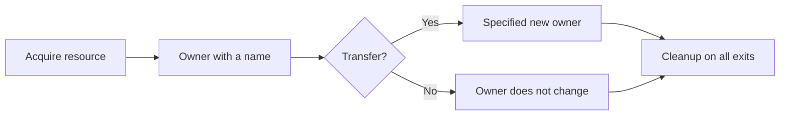

# P079 — Explicit Ownership and Lifetimes

## Definition

**Explicit Ownership and Lifetimes** gives each resource and work unit a clear owner and a specified
lifetime. The principle also gives transfer, cleanup, and termination rules. Resources include memory,
files, locks, transactions, connections, callbacks, processes, tasks, and temporary artifacts.

**Aliases:** none. Resource Acquisition Is Initialization (RAII) and ownership types are
implementation families for this principle.

## Provenance

**Classification:** principle with source evidence.

No source records an initial author of the general rule. Structured programs, C++ RAII, ownership
types, scope cleanup, and structured concurrency use this rule. These mechanisms are different.
Each mechanism makes responsibility and lifetime clear.

## Decision rule

Before resource acquisition, record the resource owner and lifetime. Record each ownership
transfer. Give cleanup rules for success, failure, timeout, and cancellation.

## How to apply

- Use scope-bound resource handles, context managers, or equivalent cleanup constructs.
- Make ownership transfer clear in types, names, or interface contracts.
- If no durable owner accepts ownership, connect child tasks to a parent scope.
- Give the shutdown order and wait behavior for concurrent work.
- Until the owner records the terminal disposition of each item, record temporary artifacts and state.
- Do tests of failure exits and the standard release path.

## Diagram

The owner controls the resource for the full resource lifetime.



## Language examples

The two examples connect file cleanup to a clear scope, accept line-feed (LF) and
carriage-return/line-feed (CRLF) endings, and give an error for an empty file.

### Python

```python
def first_line(path: Path) -> str:
    with path.open("rb") as stream:
        line = stream.readline()
    if line == b"":
        raise EOFError("empty file")
    if line.endswith(b"\r\n"):
        line = line[:-2]
    elif line.endswith(b"\n"):
        line = line[:-1]
    return line.decode("utf-8")
```

### Rust

```rust
fn first_line(path: &Path) -> io::Result<String> {
    let file = File::open(path)?;
    let mut lines = BufReader::new(file).lines();
    lines.next().transpose()?.ok_or_else(|| io::ErrorKind::UnexpectedEof.into())
}
```

## Boundaries and tensions

Garbage collection does not close files, release locks, cancel requests, or complete transactions.
Shared ownership and long work can follow the principle. The last owner of each resource and the
shutdown protocol must stay explicit. A lifetime does not have to be the same as a lexical scope.
Leases and durable workflows can have longer lifetimes.

## Examples

**Positive:** A transaction object owns the lock and connection. The object does one commit or rollback
and releases each resource on all exit paths.

**Misuse:** A helper starts a detached task. After the request stops, the task uses a request-scoped
credential. The task has no cancellation contract or supervisor.

**Athena/agent workflow:** A coordinator records each subagent, the subagent deadline, the specified
output, and the terminal disposition. The coordinator collects or cancels all children. The
coordinator then records completion.

## Related principles

- [P039 Bounded Waiting](p039-bounded-waiting.md)
- [P046 Resumability](p046-resumability.md)
- [P080 Make Concurrency Deliberate](p080-make-concurrency-deliberate.md)
- [P082 Design for Cancellation](p082-design-for-cancellation.md)
- [P083 Irreversible Actions Last](p083-irreversible-actions-last.md)

## References

### Source information

- [Bjarne Stroustrup's C++ glossary](https://stroustrup.com/glossary.html) records RAII as a
  method that binds resource management to object construction and destruction.

### Applicable information

- [The Rust Programming Language: What Is Ownership?](https://doc.rust-lang.org/stable/book/ch04-01-what-is-ownership.html)
  gives compiler-enforced ownership and scope rules.
- [Go: Contexts and structs](https://go.dev/blog/context-and-structs) gives information about a clear
  request lifetime at each call. This per-call lifetime makes cancellation and deadlines clear.

### More information

- [Standard C++ FAQ: Exceptions and RAII](https://isocpp.org/wiki/faq/exceptions/1000) gives
  information about deterministic cleanup for success and exception paths.

[Back to the engineering principles catalog](../README.md#p079)
