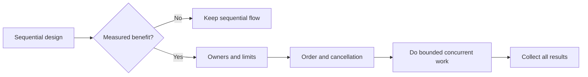

# P080 — Make Concurrency Deliberate

## Definition

Measurements must first give proof of a benefit. **Make Concurrency Deliberate** then lets a design
use parallel or asynchronous execution. The design gives the full coordination model. The model includes shared state,
synchronization, order, cancellation, deadlines, error collection, and capacity limits.

**Aliases:** none.

## Provenance

**Classification:** principle with source evidence.

No source gives this text. The rule uses research on processes, synchronization, messages,
structured concurrency, and language memory models. This research gives evidence that concurrency
changes the correctness model. The design must include explicit analysis.

## Decision rule

Use sequential execution by default. Use concurrency only for a measured latency, throughput,
response, or isolation benefit. Select a model with testable safety and termination properties.

## How to apply

- Record the specified benefit. Measure the latency, throughput, response, or isolation change.
- Use the minimum shared mutable state. Use immutable messages or ownership transfer.
- Give order guarantees, synchronization, and permitted interleavings.
- Set limits for workers, queues, fan-out, and active work.
- Propagate deadlines and cancellation through the task tree.
- Give one result for failures and concurrent errors.
- Where applicable, use race detection, stress tests, and deterministic model tests.

## Diagram

After measurements give proof of a benefit, the design adds concurrency.



## Language examples

The two examples await two ordered operations, return each result, and cancel child operations when the caller stops.

### Python

```python
FetchResult = bytes | BaseException

async def fetch_pair(urls: tuple[str, str]) -> tuple[FetchResult, FetchResult]:
    results = await asyncio.gather(
        fetch(urls[0]), fetch(urls[1]), return_exceptions=True
    )
    return results[0], results[1]
```

### Rust

```rust
type FetchResult = Result<Body, Error>;

async fn fetch_pair(urls: [&str; 2]) -> (FetchResult, FetchResult) {
    let results = tokio::join!(fetch(urls[0]), fetch(urls[1]));
    results
}
```

## Boundaries and tensions

When concurrent callers or external systems use sequential code, the code can have races. Concurrency is
necessary in some domains. The principle gives a specified model and lets a design use concurrency.
If measured speed benefits increase correctness risk or operation cost, reject the benefits. An asynchronous
interface must not cause concurrency in other layers.

## Examples

**Positive:** A bounded operation starts two reads that operate independently with a shared deadline. The
reads have no shared mutable state. The result order is deterministic.

**Misuse:** A loop starts one worker for each input without a limit. The loop discards failures, and
the caller cannot cancel the work.

**Athena/agent workflow:** A coordinator delegates only subtasks that can operate independently. The
coordinator gives each worker bounded scope. Before the coordinator accepts shared conclusions, the
coordinator collects and compares all results.

## Related principles

- [P039 Bounded Waiting](p039-bounded-waiting.md)
- [P040 Bounded Resources](p040-bounded-resources.md)
- [P042 Fault Isolation / Bulkheads](p042-fault-isolation-bulkheads.md)
- [P079 Explicit Ownership and Lifetimes](p079-explicit-ownership-and-lifetimes.md)
- [P082 Design for Cancellation](p082-design-for-cancellation.md)

## References

### Source information

- [Communicating Sequential Processes](https://doi.org/10.1145/359576.359585) is C. A. R. Hoare's
  1978 primary paper that gives a process-and-message model without implicit shared-state
  coordination.

### Applicable information

- [Google Engineering Practices: What to look for in a code review](https://google.github.io/eng-practices/review/reviewer/looking-for.html)
  includes concurrency as a complexity and correctness area for careful inspection.
- [The Rust Programming Language: Fearless Concurrency](https://doc.rust-lang.org/book/ch16-00-concurrency.html)
  gives examples of ownership and types that prevent many concurrency errors.

### More information

- [Go Concurrency Patterns: Context](https://go.dev/blog/context) gives information about explicit
  propagation of deadlines and cancellation across concurrent request work.

[Back to the engineering principles catalog](../README.md#p080)
